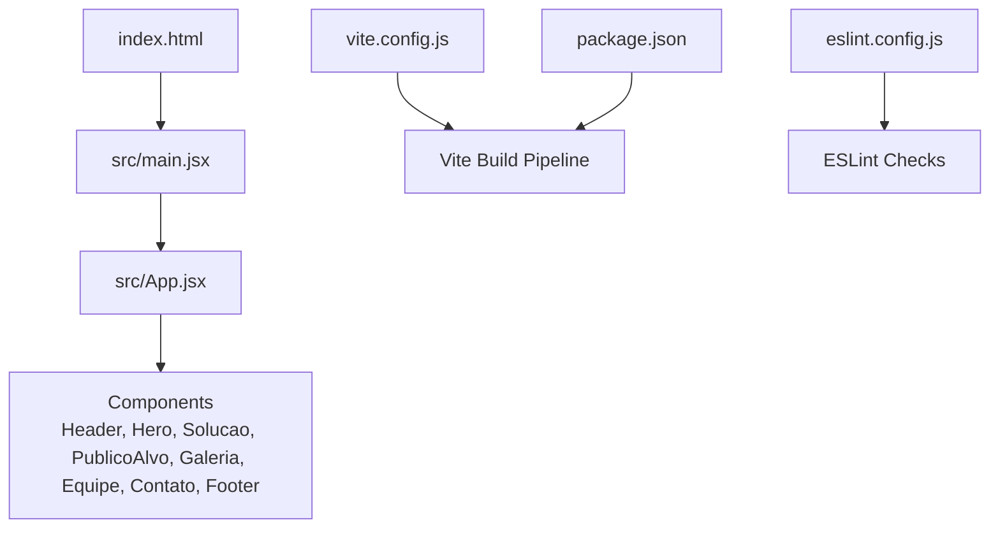
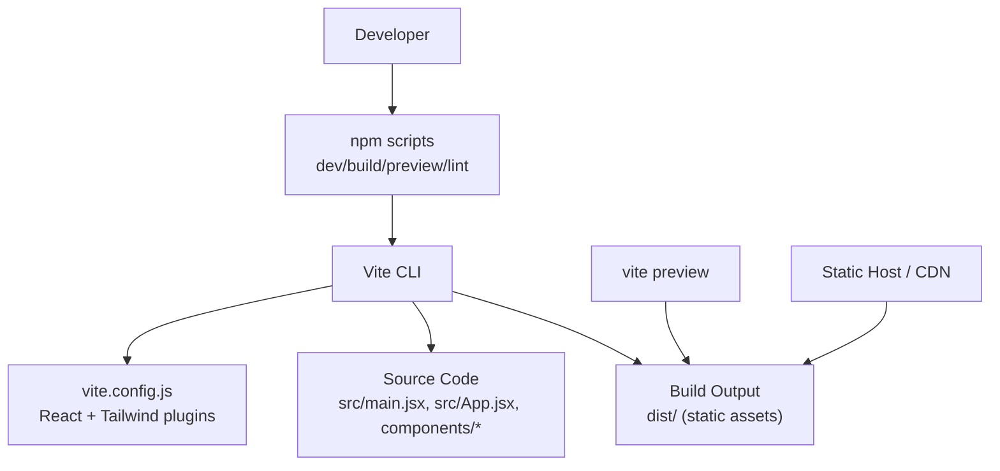
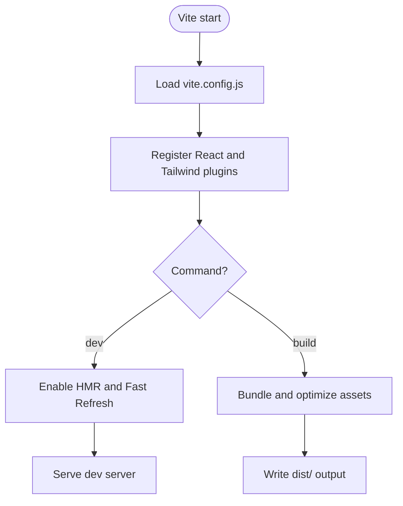
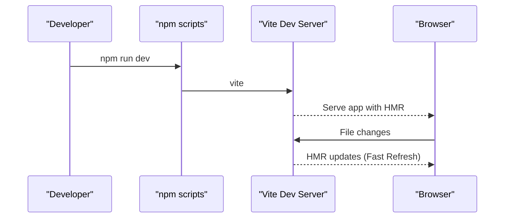
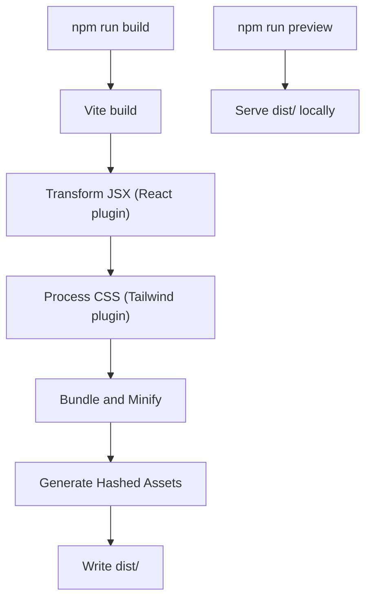
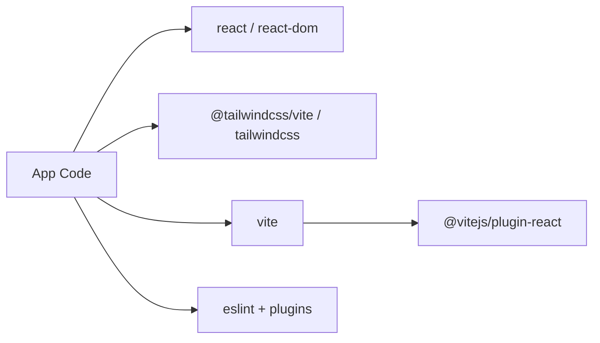
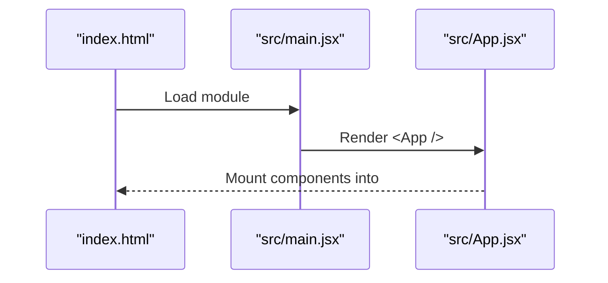

# Build & Deployment

<cite>
**Referenced Files in This Document**
- [vite.config.js](file://vite.config.js)
- [package.json](file://package.json)
- [eslint.config.js](file://eslint.config.js)
- [index.html](file://index.html)
- [src/main.jsx](file://src/main.jsx)
- [src/App.jsx](file://src/App.jsx)
- [README.md](file://README.md)
</cite>

## Table of Contents
1. [Introduction](#introduction)
2. [Project Structure](#project-structure)
3. [Core Components](#core-components)
4. [Architecture Overview](#architecture-overview)
5. [Detailed Component Analysis](#detailed-component-analysis)
6. [Dependency Analysis](#dependency-analysis)
7. [Performance Considerations](#performance-considerations)
8. [Troubleshooting Guide](#troubleshooting-guide)
9. [Conclusion](#conclusion)
10. [Appendices](#appendices)

## Introduction
This document explains how the OptiCode project is built and deployed using Vite, with a focus on React plugin setup, Tailwind CSS integration, development workflow (HMR and ESLint), production build optimizations, environment variables, scripts, CI/CD integration, and troubleshooting strategies. It is designed for both developers and operators who need to understand the build pipeline and deployment targets.

## Project Structure
OptiCode is a minimal React + Vite application:
- Entry HTML: index.html
- Application entry: src/main.jsx
- Root component: src/App.jsx
- Styling: Tailwind CSS via @tailwindcss/vite
- Linting: ESLint flat config
- Build tooling: Vite with React and Tailwind plugins

**Diagram sources**
- [index.html:1-14](file://index.html#L1-L14)
- [src/main.jsx:1-11](file://src/main.jsx#L1-L11)
- [src/App.jsx:1-26](file://src/App.jsx#L1-L26)
- [vite.config.js:1-10](file://vite.config.js#L1-L10)
- [package.json:1-31](file://package.json#L1-L31)
- [eslint.config.js:1-22](file://eslint.config.js#L1-L22)

**Section sources**
- [index.html:1-14](file://index.html#L1-L14)
- [src/main.jsx:1-11](file://src/main.jsx#L1-L11)
- [src/App.jsx:1-26](file://src/App.jsx#L1-L26)
- [vite.config.js:1-10](file://vite.config.js#L1-L10)
- [package.json:1-31](file://package.json#L1-L31)
- [eslint.config.js:1-22](file://eslint.config.js#L1-L22)

## Core Components
- Vite configuration: Defines plugins for React and Tailwind CSS.
- Package scripts: Provide dev, build, preview, and lint commands.
- ESLint configuration: Flat config enabling recommended rules, React Hooks, and React Refresh.
- App bootstrap: Renders React app in StrictMode from main.jsx into the root element defined in index.html.

Key responsibilities:
- vite.config.js: Registers React and Tailwind plugins; default Vite behavior applies for bundling, minification, and asset handling.
- package.json: Exposes npm scripts for development, building, previewing, and linting.
- eslint.config.js: Enforces code quality and integrates with Vite’s React Refresh.
- src/main.jsx: Bootstraps the React app.

**Section sources**
- [vite.config.js:1-10](file://vite.config.js#L1-L10)
- [package.json:1-31](file://package.json#L1-L31)
- [eslint.config.js:1-22](file://eslint.config.js#L1-L22)
- [src/main.jsx:1-11](file://src/main.jsx#L1-L11)

## Architecture Overview
The build architecture centers around Vite orchestrating the React compilation and Tailwind CSS processing. The development server provides Hot Module Replacement (HMR). The production build outputs optimized static assets ready for any static hosting or CDN.

**Diagram sources**
- [package.json:6-11](file://package.json#L6-L11)
- [vite.config.js:1-10](file://vite.config.js#L1-L10)
- [src/main.jsx:1-11](file://src/main.jsx#L1-L11)
- [src/App.jsx:1-26](file://src/App.jsx#L1-L26)

## Detailed Component Analysis

### Vite Configuration and Plugins
- React plugin: Enables JSX transformation and Fast Refresh during development.
- Tailwind CSS plugin: Integrates Tailwind v4 with Vite for CSS processing.
- Default Vite behavior: Development server with HMR, production build with minification and asset optimization.

**Diagram sources**
- [vite.config.js:1-10](file://vite.config.js#L1-L10)
- [package.json:6-11](file://package.json#L6-L11)

**Section sources**
- [vite.config.js:1-10](file://vite.config.js#L1-L10)

### Development Workflow
- Hot Module Replacement: Enabled by default in Vite dev server; React Fast Refresh is provided by the React plugin.
- ESLint integration: Flat config includes recommended rules, React Hooks, and React Refresh plugin. Run lint checks locally or pre-commit.
- Debugging strategies:
  - Use browser DevTools for network timing and performance profiling.
  - Inspect source maps in dev and production builds.
  - Add console logs strategically; avoid heavy logging in hot paths.

**Diagram sources**
- [package.json:6-11](file://package.json#L6-L11)
- [vite.config.js:1-10](file://vite.config.js#L1-L10)

**Section sources**
- [package.json:6-11](file://package.json#L6-L11)
- [eslint.config.js:1-22](file://eslint.config.js#L1-L22)
- [README.md:1-17](file://README.md#L1-L17)

### Production Build Process
- Build command: Produces optimized static assets under dist/.
- Optimizations:
  - JS/CSS minification and tree-shaking.
  - Asset hashing and chunk splitting handled by Vite/Rollup defaults.
  - Image and font optimization via Vite’s asset pipeline.
- Preview: Local preview of the production build using vite preview.

**Diagram sources**
- [package.json:6-11](file://package.json#L6-L11)
- [vite.config.js:1-10](file://vite.config.js#L1-L10)

**Section sources**
- [package.json:6-11](file://package.json#L6-L11)
- [vite.config.js:1-10](file://vite.config.js#L1-L10)

### Environment Variables
- Vite supports environment variables prefixed with VITE_ at build time.
- Usage pattern:
  - Define variables in .env files (.env, .env.development, .env.production).
  - Access via import.meta.env.VITE_<NAME>.
- Best practices:
  - Keep secrets out of version control; use CI/CD secret management.
  - Validate required variables at runtime or build time.
  - Document all exposed variables for consumers.

Note: No .env files are present in this repository; add them as needed for your environment.

**Section sources**
- [package.json:1-31](file://package.json#L1-L31)
- [vite.config.js:1-10](file://vite.config.js#L1-L10)

### Build Scripts Defined in package.json
- dev: Starts the Vite development server with HMR.
- build: Runs the production build.
- preview: Serves the production build locally.
- lint: Runs ESLint across the project.

Recommendations:
- Add pre-publish hooks to ensure lint passes before packaging.
- Consider adding a health-check script for CI validation.

**Section sources**
- [package.json:6-11](file://package.json#L6-L11)

### CI/CD Pipeline Integration
Suggested steps:
- Install dependencies: npm ci
- Lint: npm run lint
- Build: npm run build
- Test: Add test scripts if applicable
- Deploy: Upload dist/ to a static host or CDN

Example stages:
- Lint stage: runs npm run lint
- Build stage: runs npm run build and archives dist/
- Deploy stage: uploads dist/ to hosting provider

Environment variables:
- Inject VITE_* variables through CI/CD secret managers.
- Avoid committing .env files.

[No sources needed since this section provides general guidance]

## Dependency Analysis
Top-level dependencies and their roles:
- react, react-dom: UI framework and DOM bindings.
- @tailwindcss/vite, tailwindcss: Tailwind CSS v4 integration with Vite.
- @vitejs/plugin-react: React support for Vite.
- vite: Build tool and dev server.
- eslint, @eslint/js, eslint-plugin-react-hooks, eslint-plugin-react-refresh, globals: Linting and React-specific rules.

**Diagram sources**
- [package.json:12-29](file://package.json#L12-L29)

**Section sources**
- [package.json:12-29](file://package.json#L12-L29)

## Performance Considerations
- Keep bundle size small:
  - Prefer dynamic imports for large components or routes.
  - Remove unused dependencies and features.
- Optimize images and fonts:
  - Use modern formats (WebP/AVIF) and appropriate sizes.
  - Leverage Vite’s asset pipeline for optimization.
- CSS strategy:
  - Rely on Tailwind’s purge/tree-shake to remove unused styles.
  - Avoid importing large third-party CSS libraries unless necessary.
- Monitoring:
  - Enable performance metrics in production (e.g., web vitals).
  - Monitor CDN cache hits and TTFB.

[No sources needed since this section provides general guidance]

## Troubleshooting Guide
Common issues and resolutions:
- Tailwind styles not applied:
  - Ensure @tailwindcss/vite is registered in vite.config.js.
  - Verify Tailwind directives are imported in CSS entry points.
- React Fast Refresh not working:
  - Confirm @vitejs/plugin-react is installed and configured.
  - Check that ESLint React Refresh plugin is enabled.
- Build fails due to lint errors:
  - Run npm run lint and fix reported issues.
  - Adjust eslint.config.js rules as needed.
- Environment variables missing:
  - Ensure variables are prefixed with VITE_.
  - Rebuild after changing .env files.
- Preview differs from production:
  - Always validate with npm run preview before deploying.
  - Check for environment-specific logic that may behave differently.

**Section sources**
- [vite.config.js:1-10](file://vite.config.js#L1-L10)
- [eslint.config.js:1-22](file://eslint.config.js#L1-L22)
- [package.json:6-11](file://package.json#L6-L11)

## Conclusion
OptiCode uses a straightforward Vite setup with React and Tailwind CSS. The default configuration provides a robust development experience with HMR and a production-ready build. By following the scripts, linting rules, and environment variable guidelines outlined here, teams can maintain high code quality, optimize performance, and deploy confidently to static hosts or CDNs.

[No sources needed since this section summarizes without analyzing specific files]

## Appendices

### Quick Commands
- Start development: npm run dev
- Build production: npm run build
- Preview production: npm run preview
- Lint code: npm run lint

**Section sources**
- [package.json:6-11](file://package.json#L6-L11)

### App Bootstrap Flow

**Diagram sources**
- [index.html:9-12](file://index.html#L9-L12)
- [src/main.jsx:6-10](file://src/main.jsx#L6-L10)
- [src/App.jsx:11-24](file://src/App.jsx#L11-L24)