# Component Architecture

<cite>
**Referenced Files in This Document**
- [App.jsx](file://src/App.jsx)
- [Header.jsx](file://src/components/Header.jsx)
- [HeaderLink.jsx](file://src/components/HeaderLink.jsx)
- [Hero.jsx](file://src/components/Hero.jsx)
- [HeroBenefico.jsx](file://src/components/HeroBenefico.jsx)
- [Solucao.jsx](file://src/components/Solucao.jsx)
- [SolucaoCard.jsx](file://src/components/SolucaoCard.jsx)
- [PublicoAlvo.jsx](file://src/components/PublicoAlvo.jsx)
- [PublicoAlvoCard.jsx](file://src/components/PublicoAlvoCard.jsx)
- [Galeria.jsx](file://src/components/Galeria.jsx)
- [GaleriaFotos.jsx](file://src/components/GaleriaFotos.jsx)
- [Equipe.jsx](file://src/components/Equipe.jsx)
- [EquipeCard.jsx](file://src/components/EquipeCard.jsx)
- [Contato.jsx](file://src/components/Contato.jsx)
- [ContatoItem.jsx](file://src/components/ContatoItem.jsx)
- [ContatoForm.jsx](file://src/components/ContatoForm.jsx)
- [Footer.jsx](file://src/components/Footer.jsx)
- [FooterColuna.jsx](file://src/components/FooterColuna.jsx)
- [FooterLink.jsx](file://src/components/FooterLink.jsx)
- [package.json](file://package.json)
</cite>

## Table of Contents
1. [Introduction](#introduction)
2. [Project Structure](#project-structure)
3. [Core Components](#core-components)
4. [Architecture Overview](#architecture-overview)
5. [Detailed Component Analysis](#detailed-component-analysis)
6. [Dependency Analysis](#dependency-analysis)
7. [Performance Considerations](#performance-considerations)
8. [Troubleshooting Guide](#troubleshooting-guide)
9. [Conclusion](#conclusion)

## Introduction
This document describes the OptiCode component architecture with a focus on React composition, prop-driven rendering, and unidirectional data flow. The application is structured as a single-page site where App.jsx composes major sections (Header, Hero, Solucao, PublicoAlvo, Galeria, Equipe, Contato, Footer). Each section renders smaller presentational components via props, keeping state local or absent for simplicity. Styling uses Tailwind CSS utilities, and icons are provided by react-icons.

## Project Structure
The project follows a feature-based layout under src/components, with each major section owning its own folder-like group of components:
- Layout shell: App.jsx
- Sections: Header, Hero, Solucao, PublicoAlvo, Galeria, Equipe, Contato, Footer
- Presentational primitives: HeaderLink, HeroBenefico, SolucaoCard, PublicoAlvoCard, GaleriaFotos, EquipeCard, ContatoItem, ContatoForm, FooterColuna, FooterLink

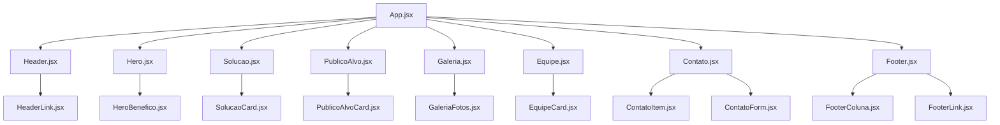

**Diagram sources**
- [App.jsx:1-26](file://src/App.jsx#L1-L26)
- [Header.jsx:1-77](file://src/components/Header.jsx#L1-L77)
- [Hero.jsx:1-67](file://src/components/Hero.jsx#L1-L67)
- [Solucao.jsx:1-74](file://src/components/Solucao.jsx#L1-L74)
- [PublicoAlvo.jsx:1-88](file://src/components/PublicoAlvo.jsx#L1-L88)
- [Galeria.jsx:1-55](file://src/components/Galeria.jsx#L1-L55)
- [Equipe.jsx:1-75](file://src/components/Equipe.jsx#L1-L75)
- [Contato.jsx:1-112](file://src/components/Contato.jsx#L1-L112)
- [Footer.jsx:1-127](file://src/components/Footer.jsx#L1-L127)

**Section sources**
- [App.jsx:1-26](file://src/App.jsx#L1-L26)

## Core Components
- App.jsx: Root container that composes all top-level sections. It does not manage global state; it orchestrates layout order.
- Header.jsx: Navigation bar composed of multiple HeaderLink items. Uses icon libraries via className attributes and anchors to page sections.
- Hero.jsx: Landing section with video background, call-to-action links, and benefit list rendered via HeroBenefico.
- Solucao.jsx: Feature grid using SolucaoCard to display solution highlights with icons and descriptions.
- PublicoAlvo.jsx: Audience-focused section with a hero card and three PublicoAlvoCard entries.
- Galeria.jsx: Photo gallery with one large image and several GaleriaFotos tiles.
- Equipe.jsx: Team roster using EquipeCard for each member.
- Contato.jsx: Contact area combining static info (ContatoItem) and a form built from ContatoForm.
- Footer.jsx: Site footer with columns (FooterColuna) and links (FooterLink), plus contact details.

Props pattern:
- Icon passing: Parent components pass icon components as props (e.g., Icone={...}) to child presentational cards.
- Text/content passing: Titles, descriptions, and labels are passed as string props.
- Media passing: Image src and alt text are passed to media components like GaleriaFotos and EquipeCard.

State management:
- No global state or context usage is observed. State, if any, would be local to components (not present in current files). Data flows downward via props.

Styling and icons:
- Tailwind CSS utility classes are used inline for consistent styling across components.
- Icons are imported from react-icons and rendered either directly or via props.

**Section sources**
- [App.jsx:1-26](file://src/App.jsx#L1-L26)
- [Header.jsx:1-77](file://src/components/Header.jsx#L1-L77)
- [Hero.jsx:1-67](file://src/components/Hero.jsx#L1-L67)
- [Solucao.jsx:1-74](file://src/components/Solucao.jsx#L1-L74)
- [PublicoAlvo.jsx:1-88](file://src/components/PublicoAlvo.jsx#L1-L88)
- [Galeria.jsx:1-55](file://src/components/Galeria.jsx#L1-L55)
- [Equipe.jsx:1-75](file://src/components/Equipe.jsx#L1-L75)
- [Contato.jsx:1-112](file://src/components/Contato.jsx#L1-L112)
- [Footer.jsx:1-127](file://src/components/Footer.jsx#L1-L127)

## Architecture Overview
OptiCode follows a unidirectional data flow:
- App.jsx composes sections without holding shared state.
- Section components render presentational children via props.
- Presentational components receive data (text, icons, media) and render UI.

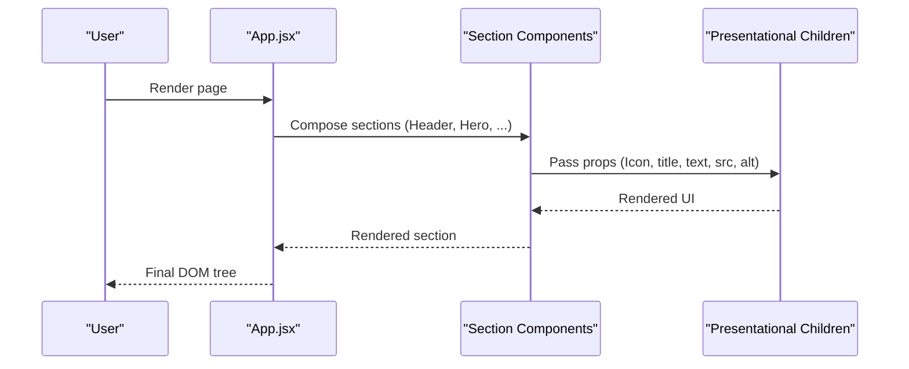

**Diagram sources**
- [App.jsx:11-23](file://src/App.jsx#L11-L23)
- [Hero.jsx:41-58](file://src/components/Hero.jsx#L41-L58)
- [Solucao.jsx:25-68](file://src/components/Solucao.jsx#L25-L68)
- [PublicoAlvo.jsx:54-80](file://src/components/PublicoAlvo.jsx#L54-L80)
- [Galeria.jsx:21-49](file://src/components/Galeria.jsx#L21-L49)
- [Equipe.jsx:23-69](file://src/components/Equipe.jsx#L23-L69)
- [Contato.jsx:25-106](file://src/components/Contato.jsx#L25-L106)

## Detailed Component Analysis

### App.jsx (Root Container)
Responsibilities:
- Imports and composes all major sections.
- Provides no global state; acts as a layout orchestrator.

Composition pattern:
- Direct child composition of sections.
- No prop drilling beyond section boundaries.

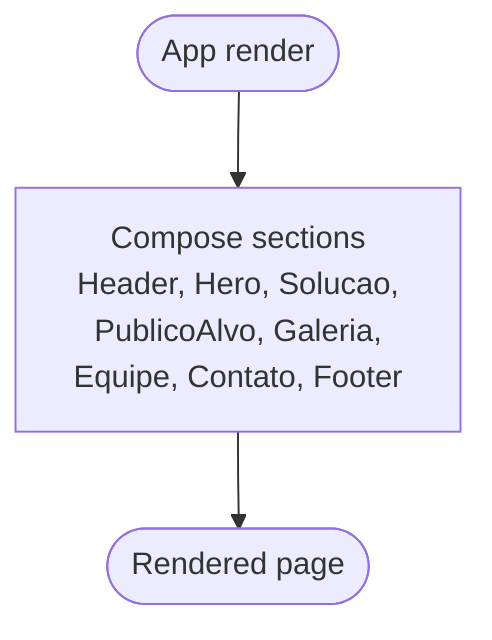

**Diagram sources**
- [App.jsx:11-23](file://src/App.jsx#L11-L23)

**Section sources**
- [App.jsx:1-26](file://src/App.jsx#L1-L26)

### Header and HeaderLink
Responsibilities:
- Header renders navigation structure and multiple HeaderLink items.
- HeaderLink renders a single nav item with href and texto.

Data flow:
- Header passes href and texto to HeaderLink.

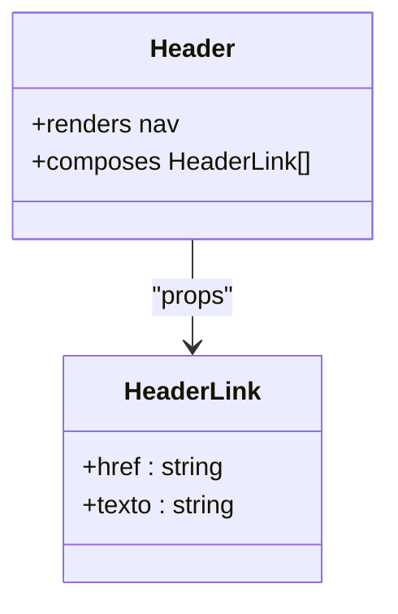

**Diagram sources**
- [Header.jsx:24-67](file://src/components/Header.jsx#L24-L67)
- [HeaderLink.jsx:1-14](file://src/components/HeaderLink.jsx#L1-L14)

**Section sources**
- [Header.jsx:1-77](file://src/components/Header.jsx#L1-L77)
- [HeaderLink.jsx:1-14](file://src/components/HeaderLink.jsx#L1-L14)

### Hero and HeroBenefico
Responsibilities:
- Hero displays hero content, CTAs, and a benefits list.
- HeroBenefico renders a single benefit item with an icon and text.

Data flow:
- Hero passes Icone and texto to HeroBenefico.

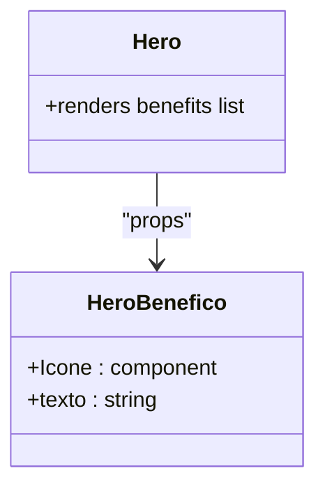

**Diagram sources**
- [Hero.jsx:41-58](file://src/components/Hero.jsx#L41-L58)
- [HeroBenefico.jsx:1-12](file://src/components/HeroBenefico.jsx#L1-L12)

**Section sources**
- [Hero.jsx:1-67](file://src/components/Hero.jsx#L1-L67)
- [HeroBenefico.jsx:1-12](file://src/components/HeroBenefico.jsx#L1-L12)

### Solucao and SolucaoCard
Responsibilities:
- Solucao presents solution features in a grid.
- SolucaoCard renders a feature card with icon, title, and description.

Data flow:
- Solucao passes Icone, titulo, and texto to SolucaoCard.

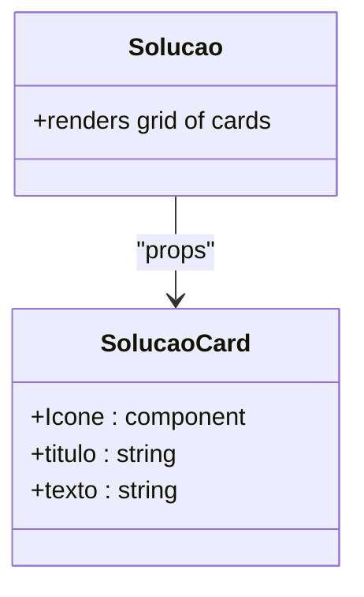

**Diagram sources**
- [Solucao.jsx:25-68](file://src/components/Solucao.jsx#L25-L68)
- [SolucaoCard.jsx:1-28](file://src/components/SolucaoCard.jsx#L1-L28)

**Section sources**
- [Solucao.jsx:1-74](file://src/components/Solucao.jsx#L1-L74)
- [SolucaoCard.jsx:1-28](file://src/components/SolucaoCard.jsx#L1-L28)

### PublicoAlvo and PublicoAlvoCard
Responsibilities:
- PublicoAlvo introduces target audience and showcases key areas.
- PublicoAlvoCard renders audience feature cards.

Data flow:
- PublicoAlvo passes Icone, titulo, and texto to PublicoAlvoCard.

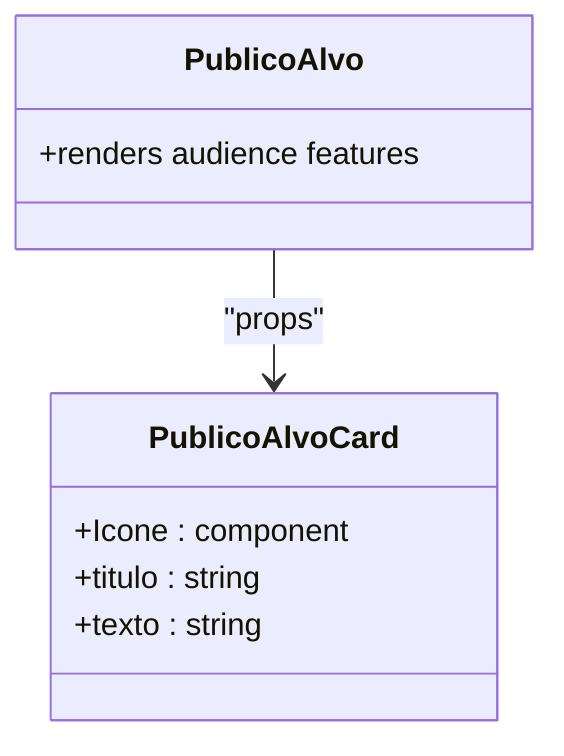

**Diagram sources**
- [PublicoAlvo.jsx:54-80](file://src/components/PublicoAlvo.jsx#L54-L80)
- [PublicoAlvoCard.jsx:1-26](file://src/components/PublicoAlvoCard.jsx#L1-L26)

**Section sources**
- [PublicoAlvo.jsx:1-88](file://src/components/PublicoAlvo.jsx#L1-L88)
- [PublicoAlvoCard.jsx:1-26](file://src/components/PublicoAlvoCard.jsx#L1-L26)

### Galeria and GaleriaFotos
Responsibilities:
- Galeria arranges images in a grid.
- GaleriaFotos renders a single image figure.

Data flow:
- Galeria passes src and alt (via texto) to GaleriaFotos.

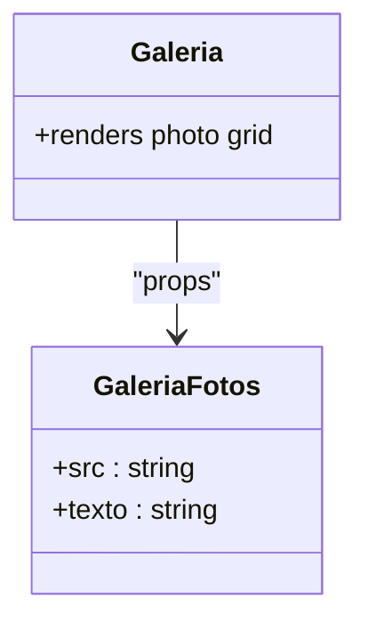

**Diagram sources**
- [Galeria.jsx:21-49](file://src/components/Galeria.jsx#L21-L49)
- [GaleriaFotos.jsx:1-13](file://src/components/GaleriaFotos.jsx#L1-L13)

**Section sources**
- [Galeria.jsx:1-55](file://src/components/Galeria.jsx#L1-L55)
- [GaleriaFotos.jsx:1-13](file://src/components/GaleriaFotos.jsx#L1-L13)

### Equipe and EquipeCard
Responsibilities:
- Equipe lists team members.
- EquipeCard renders a member profile card.

Data flow:
- Equipe passes src, alt, titulo, funcao, and textoTime to EquipeCard.

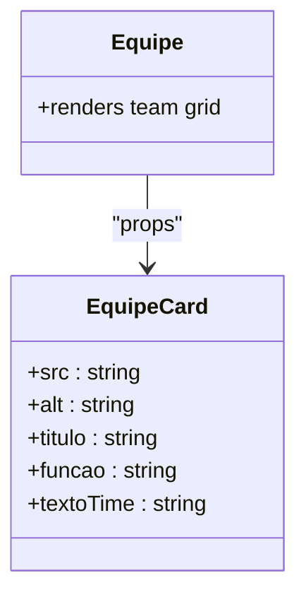

**Diagram sources**
- [Equipe.jsx:23-69](file://src/components/Equipe.jsx#L23-L69)
- [EquipeCard.jsx:1-27](file://src/components/EquipeCard.jsx#L1-L27)

**Section sources**
- [Equipe.jsx:1-75](file://src/components/Equipe.jsx#L1-L75)
- [EquipeCard.jsx:1-27](file://src/components/EquipeCard.jsx#L1-L27)

### Contato, ContatoItem, and ContatoForm
Responsibilities:
- Contato combines contact information and a form.
- ContatoItem renders a contact detail row with an icon.
- ContatoForm renders input or textarea fields based on props.

Data flow:
- Contato passes Icone, titulo, texto to ContatoItem.
- Contato passes label, type, id, name, placeholder, and textarea flag to ContatoForm.

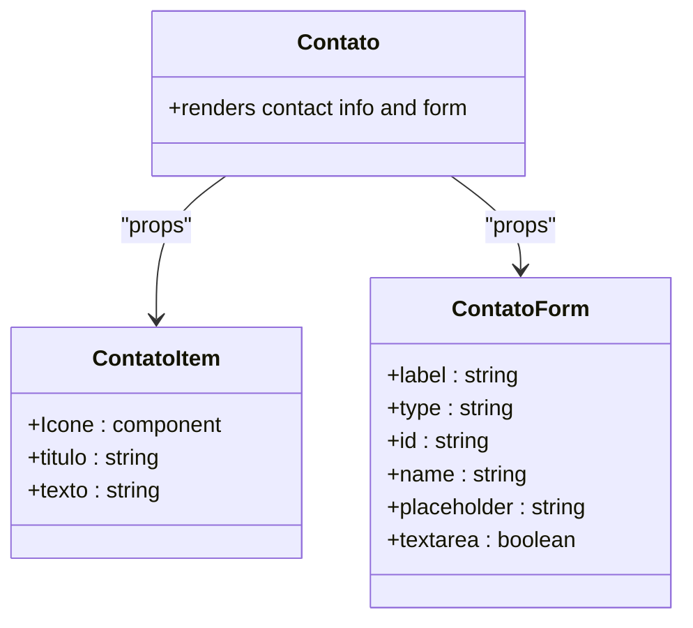

**Diagram sources**
- [Contato.jsx:25-106](file://src/components/Contato.jsx#L25-L106)
- [ContatoItem.jsx:1-31](file://src/components/ContatoItem.jsx#L1-L31)
- [ContatoForm.jsx:1-32](file://src/components/ContatoForm.jsx#L1-L32)

**Section sources**
- [Contato.jsx:1-112](file://src/components/Contato.jsx#L1-L112)
- [ContatoItem.jsx:1-31](file://src/components/ContatoItem.jsx#L1-L31)
- [ContatoForm.jsx:1-32](file://src/components/ContatoForm.jsx#L1-L32)

### Footer, FooterColuna, and FooterLink
Responsibilities:
- Footer composes columns and links.
- FooterColuna groups related links.
- FooterLink renders a single link.

Data flow:
- Footer passes titulo to FooterColuna and children links.
- Footer passes href and texto to FooterLink.

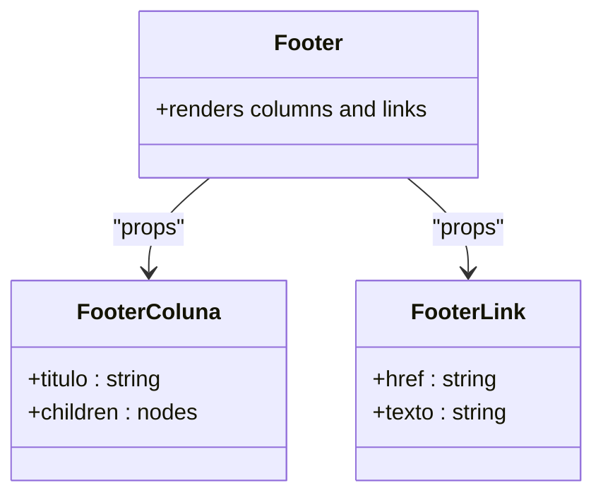

**Diagram sources**
- [Footer.jsx:34-81](file://src/components/Footer.jsx#L34-L81)

**Section sources**
- [Footer.jsx:1-127](file://src/components/Footer.jsx#L1-L127)

## Dependency Analysis
Top-level dependencies:
- React and ReactDOM for rendering.
- Tailwind CSS and @tailwindcss/vite for styling.
- react-icons for iconography.
- Vite for build tooling.

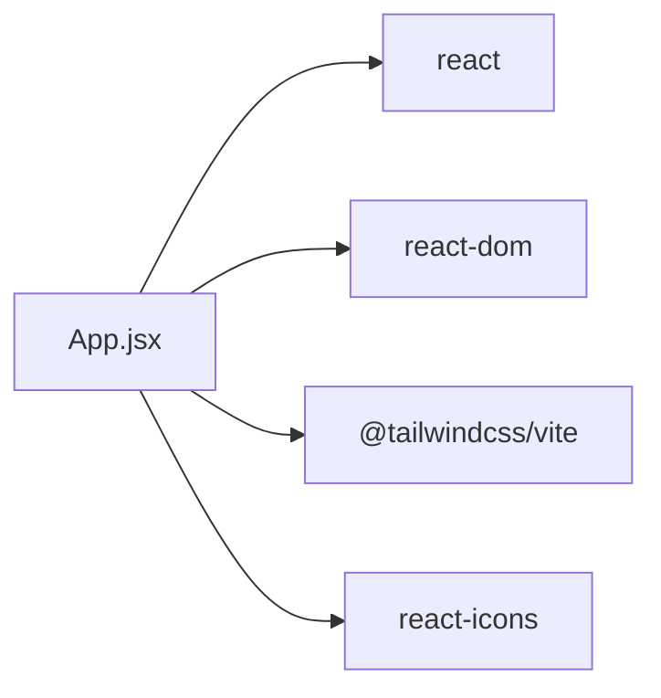

**Diagram sources**
- [package.json:12-18](file://package.json#L12-L18)

**Section sources**
- [package.json:1-31](file://package.json#L1-L31)

## Performance Considerations
- Functional components: All components are functional, which aligns with modern React practices and enables efficient re-renders when props change.
- Prop drilling: Used for simple data passing between parent and child components. Keep prop interfaces minimal and stable to avoid unnecessary re-renders.
- Icon rendering: Passing icon components as props avoids conditional logic inside presentational components.
- Static assets: Images and videos are referenced via relative paths; ensure correct paths to prevent 404 errors during development and production builds.
- Styling: Inline Tailwind utilities keep styles close to components but can become verbose; consider extracting reusable style patterns into custom classes or components if they repeat frequently.

[No sources needed since this section provides general guidance]

## Troubleshooting Guide
Common issues and resolutions:
- Missing or incorrect asset paths:
  - Symptoms: Broken images or missing video.
  - Resolution: Verify relative paths under public/imagens and adjust references accordingly.
- Icon not rendering:
  - Symptoms: Blank space where an icon should appear.
  - Resolution: Ensure the icon component is correctly imported and passed as Icone prop.
- Form inputs not visible or mislabeled:
  - Symptoms: Labels not associated with inputs.
  - Resolution: Confirm htmlFor/id pairing in ContatoForm and that required props are passed from Contato.
- Navigation anchors not scrolling:
  - Symptoms: Clicking header links does not scroll to sections.
  - Resolution: Verify section ids match anchor href values (e.g., #inicio, #solucao, #publico-alvo, #galerias, #equipe, #contato).

**Section sources**
- [Header.jsx:24-67](file://src/components/Header.jsx#L24-L67)
- [ContatoForm.jsx:1-32](file://src/components/ContatoForm.jsx#L1-L32)
- [Hero.jsx:10-17](file://src/components/Hero.jsx#L10-L17)

## Conclusion
OptiCode’s component architecture emphasizes simplicity and clarity through functional components, prop-driven composition, and unidirectional data flow. App.jsx serves as the root orchestrator, while section components delegate rendering to small, focused presentational components. Styling is consistently applied via Tailwind CSS utilities, and icons are integrated through react-icons. For future scaling, consider introducing React Context or a lightweight state library if cross-cutting state becomes necessary, and extract repeated Tailwind patterns into reusable components or CSS modules to maintain consistency and reduce duplication.