# Component Architecture

<cite>
**Referenced Files in This Document**
- [App.jsx](file://src/App.jsx)
- [Header.jsx](file://src/components/Header.jsx)
- [Hero.jsx](file://src/components/Hero.jsx)
- [Solucao.jsx](file://src/components/Solucao.jsx)
- [PublicoAlvo.jsx](file://src/components/PublicoAlvo.jsx)
- [Galeria.jsx](file://src/components/Galeria.jsx)
- [Equipe.jsx](file://src/components/Equipe.jsx)
- [Contato.jsx](file://src/components/Contato.jsx)
- [Footer.jsx](file://src/components/Footer.jsx)
- [HeaderLink.jsx](file://src/components/HeaderLink.jsx)
- [HeroBenefico.jsx](file://src/components/HeroBenefico.jsx)
- [SolucaoCard.jsx](file://src/components/SolucaoCard.jsx)
- [PublicoAlvoCard.jsx](file://src/components/PublicoAlvoCard.jsx)
- [EquipeCard.jsx](file://src/components/EquipeCard.jsx)
- [GaleriaFotos.jsx](file://src/components/GaleriaFotos.jsx)
- [ContatoItem.jsx](file://src/components/ContatoItem.jsx)
- [ContatoForm.jsx](file://src/components/ContatoForm.jsx)
- [FooterColuna.jsx](file://src/components/FooterColuna.jsx)
- [FooterLink.jsx](file://src/components/FooterLink.jsx)
</cite>

## Table of Contents
1. Introduction
2. Project Structure
3. Core Components
4. Architecture Overview
5. Detailed Component Analysis
6. Dependency Analysis
7. Performance Considerations
8. Troubleshooting Guide
9. Conclusion

## Introduction
This document describes the architectural design of the OptiCode component system. The application is built with functional React components and uses props-driven composition to assemble a section-based landing page. App.jsx acts as the main orchestrator, composing top-level sections (Header, Hero, Solucao, PublicoAlvo, Galeria, Equipe, Contato, Footer). Each section composes smaller reusable components such as card components (SolucaoCard, PublicoAlvoCard, EquipeCard) and utility components (HeaderLink, FooterColuna, FooterLink). Styling is primarily done with Tailwind CSS classes applied directly in JSX, and icons are integrated via react-icons.

## Project Structure
The project follows a feature-oriented layout under src/components, where each major UI area has its own folder-like grouping:
- Layout and orchestration: App.jsx
- Sections: Header, Hero, Solucao, PublicoAlvo, Galeria, Equipe, Contato, Footer
- Reusable cards: SolucaoCard, PublicoAlvoCard, EquipeCard
- Utility components: HeaderLink, FooterColuna, FooterLink
- Section-specific helpers: HeroBenefico, GaleriaFotos, ContatoItem, ContatoForm

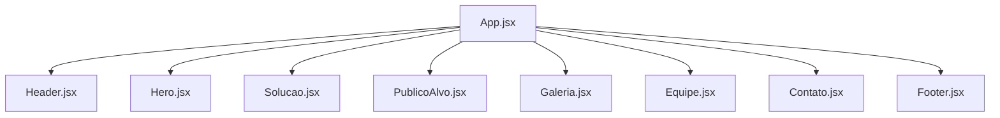

**Diagram sources**
- [App.jsx:1-26](file://src/App.jsx#L1-L26)

**Section sources**
- [App.jsx:1-26](file://src/App.jsx#L1-L26)

## Core Components
- App.jsx: Orchestrates the page by rendering all top-level sections in order. It does not pass data between sections; each section is self-contained.
- Header.jsx: Renders navigation links using HeaderLink for consistency across menu items.
- Hero.jsx: Presents the hero banner and benefits using HeroBenefico for repeated benefit items.
- Solucao.jsx: Displays solution features using SolucaoCard for each feature tile.
- PublicoAlvo.jsx: Describes target audience and uses PublicoAlvoCard for audience-related tiles.
- Galeria.jsx: Shows images using GaleriaFotos for consistent image presentation.
- Equipe.jsx: Lists team members using EquipeCard for uniform member profiles.
- Contato.jsx: Provides contact information and form fields using ContatoItem and ContatoForm.
- Footer.jsx: Organizes footer columns and links using FooterColuna and FooterLink.

Key patterns:
- Props-driven composition: Parent components pass data (text, icons, URLs) to child components.
- Reusability: Card components encapsulate common layouts and styling.
- Icon integration: Icons are passed as components via props (e.g., Icone prop), enabling flexible icon usage without hardcoding markup.

**Section sources**
- [App.jsx:1-26](file://src/App.jsx#L1-L26)
- [Header.jsx:1-77](file://src/components/Header.jsx#L1-L77)
- [Hero.jsx:1-67](file://src/components/Hero.jsx#L1-L67)
- [Solucao.jsx:1-74](file://src/components/Solucao.jsx#L1-L74)
- [PublicoAlvo.jsx:1-88](file://src/components/PublicoAlvo.jsx#L1-L88)
- [Galeria.jsx:1-55](file://src/components/Galeria.jsx#L1-L55)
- [Equipe.jsx:1-75](file://src/components/Equipe.jsx#L1-L75)
- [Contato.jsx:1-112](file://src/components/Contato.jsx#L1-L112)
- [Footer.jsx:1-127](file://src/components/Footer.jsx#L1-L127)

## Architecture Overview
The application uses a flat, section-based architecture. App.jsx composes sections sequentially. Within each section, parent components delegate rendering to smaller, focused components. Data flows downward via props; there is no shared state or cross-section communication.

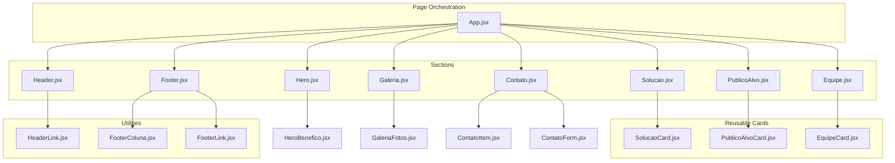

**Diagram sources**
- [App.jsx:1-26](file://src/App.jsx#L1-L26)
- [Header.jsx:1-77](file://src/components/Header.jsx#L1-L77)
- [Hero.jsx:1-67](file://src/components/Hero.jsx#L1-L67)
- [Solucao.jsx:1-74](file://src/components/Solucao.jsx#L1-L74)
- [PublicoAlvo.jsx:1-88](file://src/components/PublicoAlvo.jsx#L1-L88)
- [Galeria.jsx:1-55](file://src/components/Galeria.jsx#L1-L55)
- [Equipe.jsx:1-75](file://src/components/Equipe.jsx#L1-L75)
- [Contato.jsx:1-112](file://src/components/Contato.jsx#L1-L112)
- [Footer.jsx:1-127](file://src/components/Footer.jsx#L1-L127)
- [HeaderLink.jsx:1-14](file://src/components/HeaderLink.jsx#L1-L14)
- [HeroBenefico.jsx:1-12](file://src/components/HeroBenefico.jsx#L1-L12)
- [SolucaoCard.jsx:1-28](file://src/components/SolucaoCard.jsx#L1-L28)
- [PublicoAlvoCard.jsx:1-26](file://src/components/PublicoAlvoCard.jsx#L1-L26)
- [EquipeCard.jsx:1-27](file://src/components/EquipeCard.jsx#L1-L27)
- [GaleriaFotos.jsx:1-13](file://src/components/GaleriaFotos.jsx#L1-L13)
- [ContatoItem.jsx:1-31](file://src/components/ContatoItem.jsx#L1-L31)
- [ContatoForm.jsx:1-32](file://src/components/ContatoForm.jsx#L1-L32)
- [FooterColuna.jsx:1-15](file://src/components/FooterColuna.jsx#L1-L15)
- [FooterLink.jsx:1-11](file://src/components/FooterLink.jsx#L1-L11)

## Detailed Component Analysis

### App.jsx — Main Orchestrator
- Responsibility: Compose and render all top-level sections in sequence.
- Composition pattern: Declarative JSX tree with no inter-component state.
- Styling: Imports global styles via App.css.

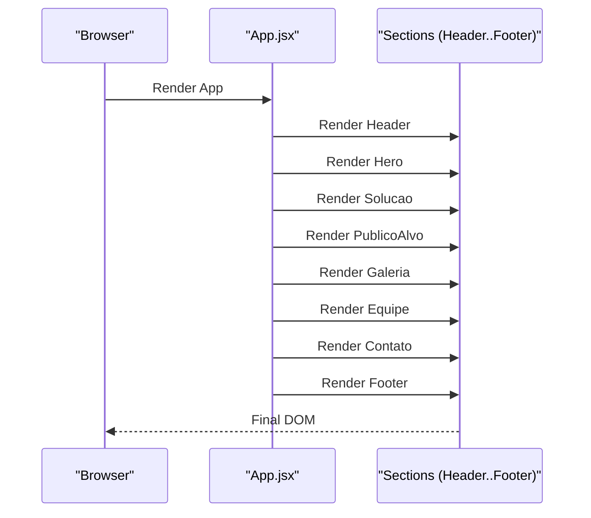

**Diagram sources**
- [App.jsx:1-26](file://src/App.jsx#L1-L26)

**Section sources**
- [App.jsx:1-26](file://src/App.jsx#L1-L26)

### Header and HeaderLink — Navigation
- Header renders a nav bar and uses HeaderLink for each menu item.
- HeaderLink abstracts list item and anchor element, receiving href and texto.

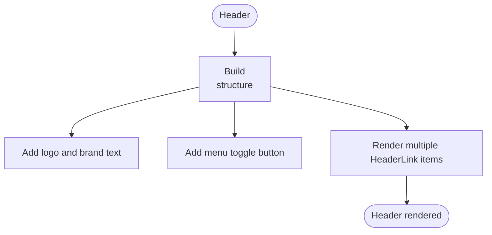

**Diagram sources**
- [Header.jsx:1-77](file://src/components/Header.jsx#L1-L77)
- [HeaderLink.jsx:1-14](file://src/components/HeaderLink.jsx#L1-L14)

**Section sources**
- [Header.jsx:1-77](file://src/components/Header.jsx#L1-L77)
- [HeaderLink.jsx:1-14](file://src/components/HeaderLink.jsx#L1-L14)

### Hero and HeroBenefico — Hero Banner
- Hero presents a video background, title, subtitle, CTAs, and a benefits list.
- HeroBenefico renders a single benefit item with an icon and label.

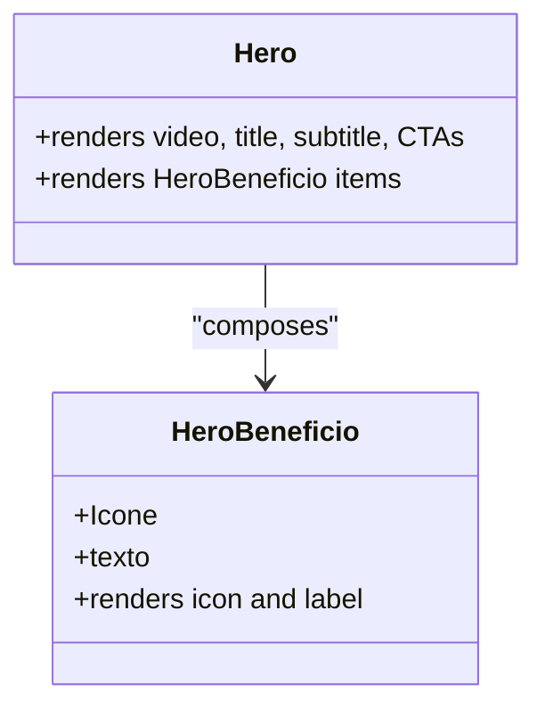

**Diagram sources**
- [Hero.jsx:1-67](file://src/components/Hero.jsx#L1-L67)
- [HeroBenefico.jsx:1-12](file://src/components/HeroBenefico.jsx#L1-L12)

**Section sources**
- [Hero.jsx:1-67](file://src/components/Hero.jsx#L1-L67)
- [HeroBenefico.jsx:1-12](file://src/components/HeroBenefico.jsx#L1-L12)

### Solucao and SolucaoCard — Solution Features
- Solucao displays a grid of feature cards.
- SolucaoCard renders an icon, title, and description.

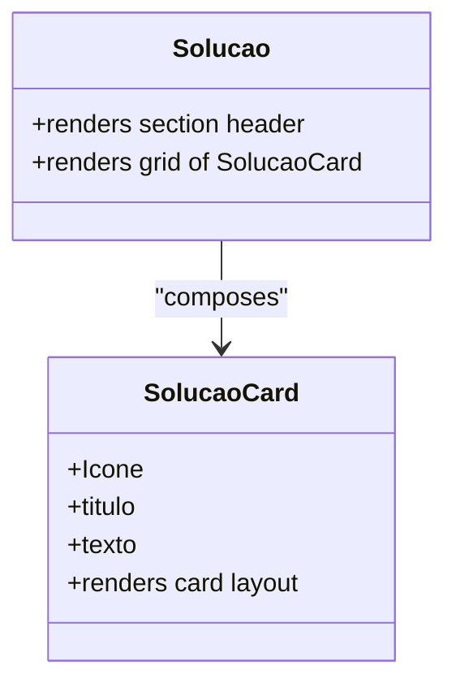

**Diagram sources**
- [Solucao.jsx:1-74](file://src/components/Solucao.jsx#L1-L74)
- [SolucaoCard.jsx:1-28](file://src/components/SolucaoCard.jsx#L1-L28)

**Section sources**
- [Solucao.jsx:1-74](file://src/components/Solucao.jsx#L1-L74)
- [SolucaoCard.jsx:1-28](file://src/components/SolucaoCard.jsx#L1-L28)

### PublicoAlvo and PublicoAlvoCard — Target Audience
- PublicoAlvo shows a large icon and description, plus a grid of audience-focused cards.
- PublicoAlvoCard renders an icon, title, and description.

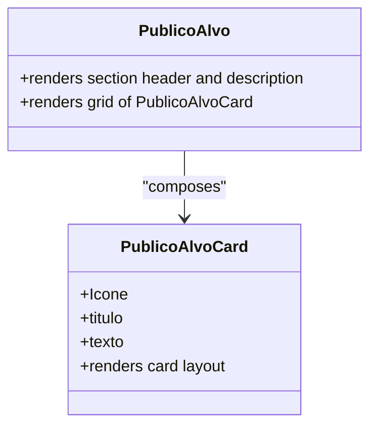

**Diagram sources**
- [PublicoAlvo.jsx:1-88](file://src/components/PublicoAlvo.jsx#L1-L88)
- [PublicoAlvoCard.jsx:1-26](file://src/components/PublicoAlvoCard.jsx#L1-L26)

**Section sources**
- [PublicoAlvo.jsx:1-88](file://src/components/PublicoAlvo.jsx#L1-L88)
- [PublicoAlvoCard.jsx:1-26](file://src/components/PublicoAlvoCard.jsx#L1-L26)

### Galeria and GaleriaFotos — Image Gallery
- Galeria provides a section header and a photo grid.
- GaleriaFotos renders a figure with an image and alt text.

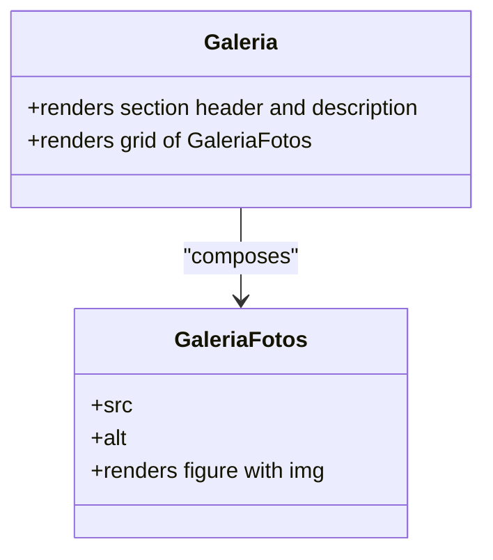

**Diagram sources**
- [Galeria.jsx:1-55](file://src/components/Galeria.jsx#L1-L55)
- [GaleriaFotos.jsx:1-13](file://src/components/GaleriaFotos.jsx#L1-L13)

**Section sources**
- [Galeria.jsx:1-55](file://src/components/Galeria.jsx#L1-L55)
- [GaleriaFotos.jsx:1-13](file://src/components/GaleriaFotos.jsx#L1-L13)

### Equipe and EquipeCard — Team Profiles
- Equipe renders a section header and a grid of team cards.
- EquipeCard renders profile image, name, role, and short bio.

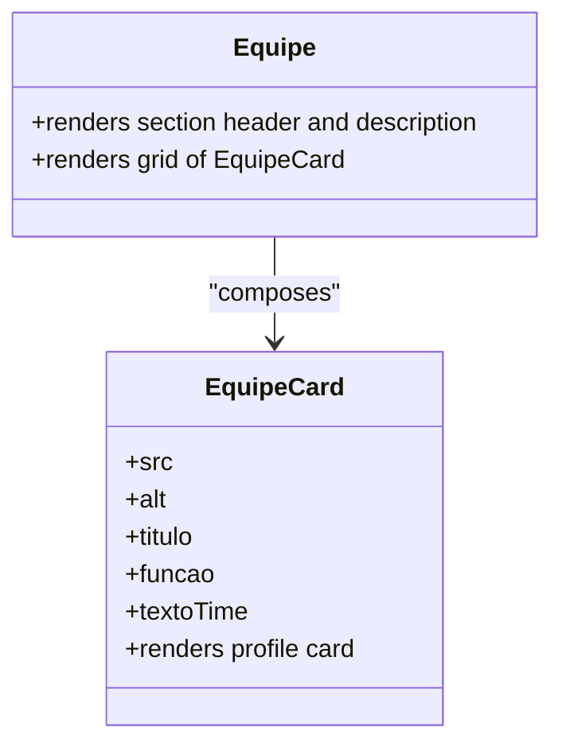

**Diagram sources**
- [Equipe.jsx:1-75](file://src/components/Equipe.jsx#L1-L75)
- [EquipeCard.jsx:1-27](file://src/components/EquipeCard.jsx#L1-L27)

**Section sources**
- [Equipe.jsx:1-75](file://src/components/Equipe.jsx#L1-L75)
- [EquipeCard.jsx:1-27](file://src/components/EquipeCard.jsx#L1-L27)

### Contato, ContatoItem, and ContatoForm — Contact Section
- Contato organizes contact info and a form.
- ContatoItem renders a contact detail row with an icon, title, and text.
- ContatoForm renders either an input or textarea based on props.

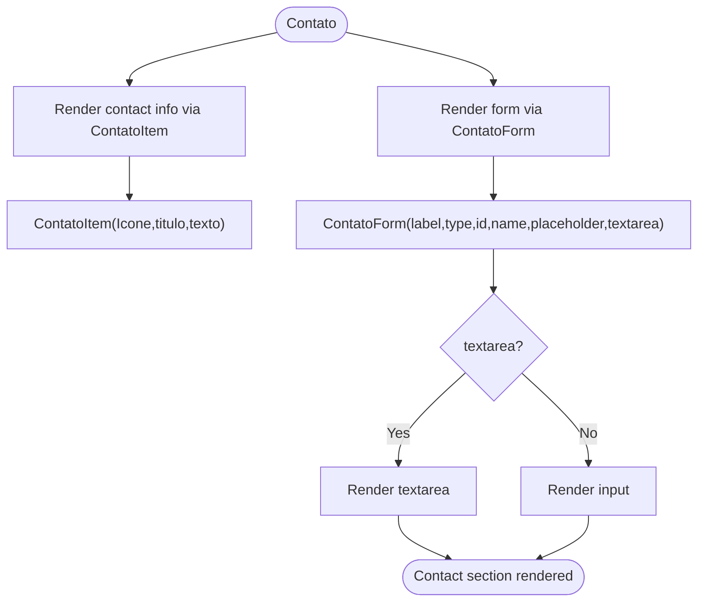

**Diagram sources**
- [Contato.jsx:1-112](file://src/components/Contato.jsx#L1-L112)
- [ContatoItem.jsx:1-31](file://src/components/ContatoItem.jsx#L1-L31)
- [ContatoForm.jsx:1-32](file://src/components/ContatoForm.jsx#L1-L32)

**Section sources**
- [Contato.jsx:1-112](file://src/components/Contato.jsx#L1-L112)
- [ContatoItem.jsx:1-31](file://src/components/ContatoItem.jsx#L1-L31)
- [ContatoForm.jsx:1-32](file://src/components/ContatoForm.jsx#L1-L32)

### Footer, FooterColuna, and FooterLink — Footer
- Footer organizes brand info, navigation columns, and contact details.
- FooterColuna wraps a column heading and a list of links.
- FooterLink renders a single link item.

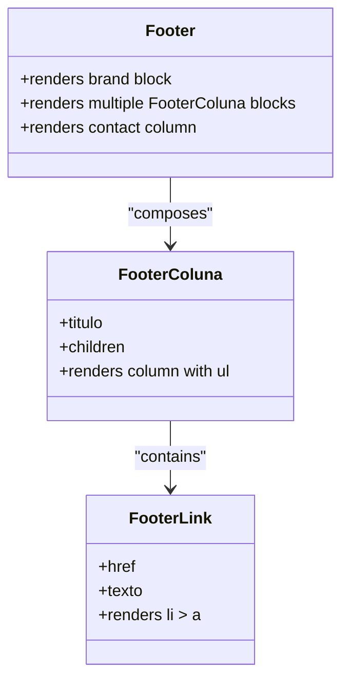

**Diagram sources**
- [Footer.jsx:1-127](file://src/components/Footer.jsx#L1-L127)
- [FooterColuna.jsx:1-15](file://src/components/FooterColuna.jsx#L1-L15)
- [FooterLink.jsx:1-11](file://src/components/FooterLink.jsx#L1-L11)

**Section sources**
- [Footer.jsx:1-127](file://src/components/Footer.jsx#L1-L127)
- [FooterColuna.jsx:1-15](file://src/components/FooterColuna.jsx#L1-L15)
- [FooterLink.jsx:1-11](file://src/components/FooterLink.jsx#L1-L11)

## Dependency Analysis
The dependency graph reflects a clear separation of concerns:
- App.jsx depends only on top-level sections.
- Sections depend on their respective card/utility components.
- Utility components are leaf nodes with minimal dependencies.

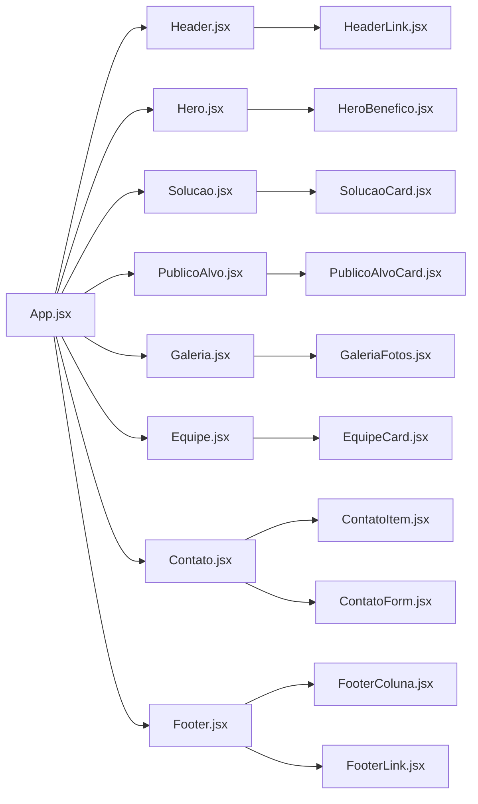

**Diagram sources**
- [App.jsx:1-26](file://src/App.jsx#L1-L26)
- [Header.jsx:1-77](file://src/components/Header.jsx#L1-L77)
- [Hero.jsx:1-67](file://src/components/Hero.jsx#L1-L67)
- [Solucao.jsx:1-74](file://src/components/Solucao.jsx#L1-L74)
- [PublicoAlvo.jsx:1-88](file://src/components/PublicoAlvo.jsx#L1-L88)
- [Galeria.jsx:1-55](file://src/components/Galeria.jsx#L1-L55)
- [Equipe.jsx:1-75](file://src/components/Equipe.jsx#L1-L75)
- [Contato.jsx:1-112](file://src/components/Contato.jsx#L1-L112)
- [Footer.jsx:1-127](file://src/components/Footer.jsx#L1-L127)
- [HeaderLink.jsx:1-14](file://src/components/HeaderLink.jsx#L1-L14)
- [HeroBenefico.jsx:1-12](file://src/components/HeroBenefico.jsx#L1-L12)
- [SolucaoCard.jsx:1-28](file://src/components/SolucaoCard.jsx#L1-L28)
- [PublicoAlvoCard.jsx:1-26](file://src/components/PublicoAlvoCard.jsx#L1-L26)
- [GaleriaFotos.jsx:1-13](file://src/components/GaleriaFotos.jsx#L1-L13)
- [EquipeCard.jsx:1-27](file://src/components/EquipeCard.jsx#L1-L27)
- [ContatoItem.jsx:1-31](file://src/components/ContatoItem.jsx#L1-L31)
- [ContatoForm.jsx:1-32](file://src/components/ContatoForm.jsx#L1-L32)
- [FooterColuna.jsx:1-15](file://src/components/FooterColuna.jsx#L1-L15)
- [FooterLink.jsx:1-11](file://src/components/FooterLink.jsx#L1-L11)

**Section sources**
- [App.jsx:1-26](file://src/App.jsx#L1-L26)
- [Header.jsx:1-77](file://src/components/Header.jsx#L1-L77)
- [Hero.jsx:1-67](file://src/components/Hero.jsx#L1-L67)
- [Solucao.jsx:1-74](file://src/components/Solucao.jsx#L1-L74)
- [PublicoAlvo.jsx:1-88](file://src/components/PublicoAlvo.jsx#L1-L88)
- [Galeria.jsx:1-55](file://src/components/Galeria.jsx#L1-L55)
- [Equipe.jsx:1-75](file://src/components/Equipe.jsx#L1-L75)
- [Contato.jsx:1-112](file://src/components/Contato.jsx#L1-L112)
- [Footer.jsx:1-127](file://src/components/Footer.jsx#L1-L127)

## Performance Considerations
- Static content: Most components render static content driven by props; this keeps re-renders predictable and efficient.
- Icon components: Passing icon components via props avoids inline SVG duplication and leverages react-icons’ optimized exports.
- Images: Ensure images are appropriately sized and consider lazy loading if the gallery grows.
- No global state: The absence of shared state reduces unnecessary re-renders across sections.

[No sources needed since this section provides general guidance]

## Troubleshooting Guide
- Missing or incorrect props:
  - Cards expect specific props (e.g., Icone, titulo, texto). Verify prop names and types when adding new cards.
  - EquipoCard expects src, alt, titulo, funcao, textoTime.
  - GaleriaFotos expects src and alt/texto depending on usage.
- Broken image paths:
  - Confirm relative paths for images under public/imagens.
- Icon rendering issues:
  - Ensure the correct icon component is imported and passed as Icone prop.
- Form behavior:
  - ContatoForm toggles between input and textarea based on the textarea prop. Validate that required attributes (id, name, placeholder) are provided.

**Section sources**
- [SolucaoCard.jsx:1-28](file://src/components/SolucaoCard.jsx#L1-L28)
- [PublicoAlvoCard.jsx:1-26](file://src/components/PublicoAlvoCard.jsx#L1-L26)
- [EquipeCard.jsx:1-27](file://src/components/EquipeCard.jsx#L1-L27)
- [GaleriaFotos.jsx:1-13](file://src/components/GaleriaFotos.jsx#L1-L13)
- [ContatoForm.jsx:1-32](file://src/components/ContatoForm.jsx#L1-L32)

## Conclusion
The OptiCode component system follows a clean, props-driven, functional architecture. App.jsx orchestrates the page by composing sections, which in turn compose reusable card and utility components. This approach promotes clarity, maintainability, and scalability. Styling is handled through Tailwind CSS classes applied directly in JSX, and icons are integrated flexibly via react-icons passed as props. The result is a well-structured, readable codebase that is easy to extend and customize.

[No sources needed since this section summarizes without analyzing specific files]