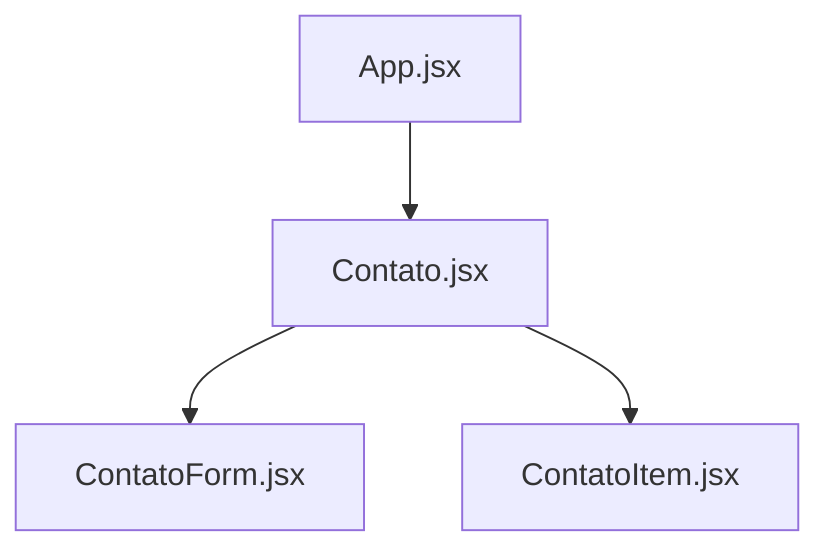
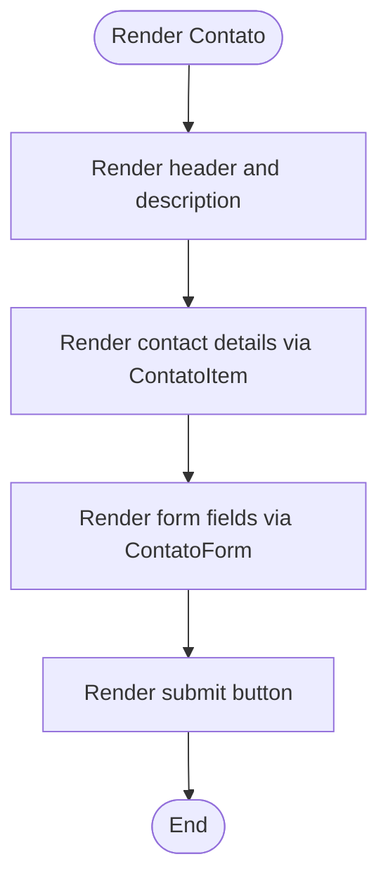
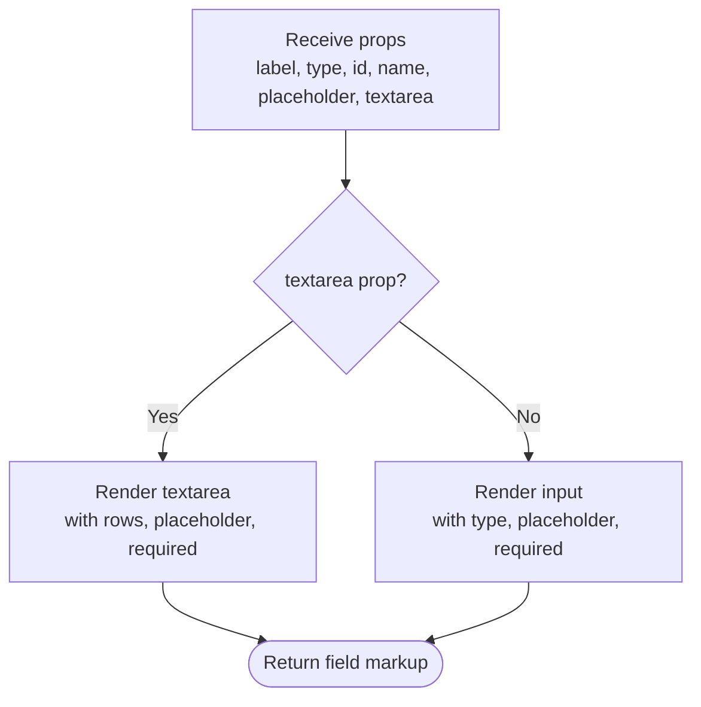
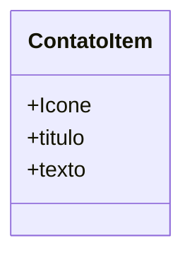
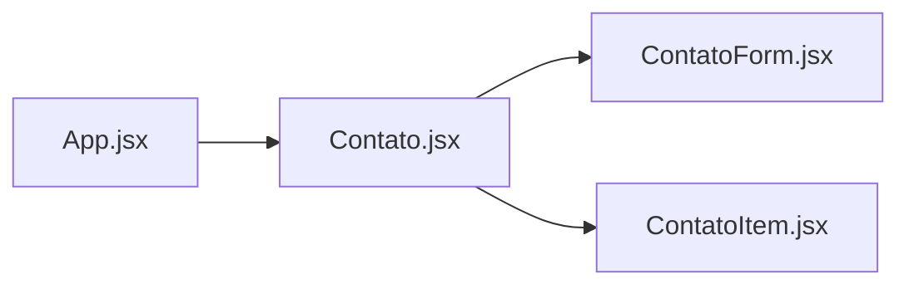

# Contact System

<cite>
**Referenced Files in This Document**
- [Contato.jsx](file://src/components/Contato.jsx)
- [ContatoForm.jsx](file://src/components/ContatoForm.jsx)
- [ContatoItem.jsx](file://src/components/ContatoItem.jsx)
- [App.jsx](file://src/App.jsx)
</cite>

## Table of Contents
1. [Introduction](#introduction)
2. [Project Structure](#project-structure)
3. [Core Components](#core-components)
4. [Architecture Overview](#architecture-overview)
5. [Detailed Component Analysis](#detailed-component-analysis)
6. [Dependency Analysis](#dependency-analysis)
7. [Performance Considerations](#performance-considerations)
8. [Troubleshooting Guide](#troubleshooting-guide)
9. [Conclusion](#conclusion)

## Introduction
This document explains the contact system implementation, focusing on three core components: Contato (the contact section), ContatoForm (reusable form field component), and ContatoItem (contact information display). It covers how the contact form is structured, how fields are rendered, how validation is handled, and how to integrate with backend services. The content includes concrete examples from the codebase via file references and diagrams that map directly to the source files.

## Project Structure
The contact system lives under src/components and is composed of:
- Contato.jsx: Renders the contact section, including a list of contact items and a form using ContatoForm.
- ContatoForm.jsx: Renders input or textarea fields based on props.
- ContatoItem.jsx: Displays a single contact item with an icon, title, and text.
- App.jsx: Includes the Contato component as part of the application layout.



**Diagram sources**
- [App.jsx:1-26](file://src/App.jsx#L1-L26)
- [Contato.jsx:1-112](file://src/components/Contato.jsx#L1-L112)
- [ContatoForm.jsx:1-32](file://src/components/ContatoForm.jsx#L1-L32)
- [ContatoItem.jsx:1-31](file://src/components/ContatoItem.jsx#L1-L31)

**Section sources**
- [App.jsx:1-26](file://src/App.jsx#L1-L26)
- [Contato.jsx:1-112](file://src/components/Contato.jsx#L1-L112)

## Core Components
- Contato: A section that presents contact details and a form. It composes ContatoItem for displaying email, location, and hours, and uses multiple instances of ContatoForm for user inputs.
- ContatoForm: A presentational component that renders either an input or textarea based on a boolean prop. It supports label, type, id, name, placeholder, and textarea toggle.
- ContatoItem: A presentational component that displays an icon, title, and text for each contact detail.

Key responsibilities:
- Contato orchestrates the UI and data presentation.
- ContatoForm abstracts field rendering for consistency and accessibility.
- ContatoItem standardizes the visual representation of contact info.

**Section sources**
- [Contato.jsx:8-108](file://src/components/Contato.jsx#L8-L108)
- [ContatoForm.jsx:1-32](file://src/components/ContatoForm.jsx#L1-L32)
- [ContatoItem.jsx:1-31](file://src/components/ContatoItem.jsx#L1-L31)

## Architecture Overview
The contact section is a composite UI built by Contato. It renders:
- A header area with descriptive text.
- A left panel showing contact details via ContatoItem.
- A right panel containing a form built from multiple ContatoForm instances.

```mermaid
sequenceDiagram
participant User as "User"
participant Section as "Contato.jsx"
participant FormField as "ContatoForm.jsx"
participant Item as "ContatoItem.jsx"
User->>Section : Open page
Section->>Item : Render contact details (email, location, hours)
Section->>FormField : Render input fields (name, email, subject)
Section->>FormField : Render textarea (message)
User->>Section : Click submit button
Note over Section : No onSubmit handler attached; default browser behavior applies
```

**Diagram sources**
- [Contato.jsx:25-104](file://src/components/Contato.jsx#L25-L104)
- [ContatoForm.jsx:1-32](file://src/components/ContatoForm.jsx#L1-L32)
- [ContatoItem.jsx:1-31](file://src/components/ContatoItem.jsx#L1-L31)

## Detailed Component Analysis

### Contato Component
Responsibilities:
- Compose the contact section layout.
- Display contact details using ContatoItem.
- Provide a form using multiple ContatoForm instances.
- Include a submit button.

Props interface: None (stateless presentational component).

Validation:
- Uses HTML5 required attributes on inputs and textarea.
- No custom validation logic or error messages are implemented.

Accessibility:
- Each field has a label linked via htmlFor/id.
- Semantic address element groups contact details.

Styling:
- Relies on CSS classes defined elsewhere (e.g., caixaContato, formulario, botao).

Integration points:
- Currently no form submission handling; adding an onSubmit would enable backend integration.



**Diagram sources**
- [Contato.jsx:8-108](file://src/components/Contato.jsx#L8-L108)

**Section sources**
- [Contato.jsx:8-108](file://src/components/Contato.jsx#L8-L108)

### ContatoForm Component
Responsibilities:
- Render a labeled input or textarea based on props.
- Ensure basic accessibility with htmlFor/id pairing.
- Enforce required attribute for native validation.

Props interface:
- label: string — Field label text.
- type: string — Input type (e.g., text, email).
- id: string — Unique identifier for the field.
- name: string — Name attribute for form submission.
- placeholder: string — Placeholder text.
- textarea: boolean — If true, render textarea instead of input.

Validation:
- Native HTML5 validation via required attribute.
- No custom validation rules or error state management.

Accessibility:
- Label is associated with the input via htmlFor/id.
- Required fields are indicated by the required attribute.

Styling:
- Container uses a class for grouping; styling is external.



**Diagram sources**
- [ContatoForm.jsx:1-32](file://src/components/ContatoForm.jsx#L1-L32)

**Section sources**
- [ContatoForm.jsx:1-32](file://src/components/ContatoForm.jsx#L1-L32)

### ContatoItem Component
Responsibilities:
- Display a single contact detail with an icon, title, and text.
- Provide consistent visual structure for contact entries.

Props interface:
- Icone: React component — Icon to render.
- titulo: string — Title text.
- texto: string — Description text.

Validation:
- Not applicable (presentational only).

Accessibility:
- Uses semantic headings and paragraphs for content structure.

Styling:
- Inline Tailwind-like utility classes applied to the icon container and text block.



**Diagram sources**
- [ContatoItem.jsx:1-31](file://src/components/ContatoItem.jsx#L1-L31)

**Section sources**
- [ContatoItem.jsx:1-31](file://src/components/ContatoItem.jsx#L1-L31)

## Dependency Analysis
- App.jsx imports and renders Contato as part of the main application layout.
- Contato.jsx imports and composes ContatoForm and ContatoItem.
- ContatoForm and ContatoItem are leaf components with no further dependencies within this feature.



**Diagram sources**
- [App.jsx:1-26](file://src/App.jsx#L1-L26)
- [Contato.jsx:1-112](file://src/components/Contato.jsx#L1-L112)

**Section sources**
- [App.jsx:1-26](file://src/App.jsx#L1-L26)
- [Contato.jsx:1-112](file://src/components/Contato.jsx#L1-L112)

## Performance Considerations
- Presentational components: All three components are simple and stateless, which keeps rendering overhead low.
- Reusability: ContatoForm reduces duplication across fields, improving maintainability.
- Icons: Using React icons avoids heavy image assets and leverages vector graphics.

[No sources needed since this section provides general guidance]

## Troubleshooting Guide
Common issues and resolutions:
- Fields not validating:
  - Ensure required attributes are set on inputs and textarea.
  - Verify that labels are correctly associated with inputs via htmlFor/id.
- Form submission not working:
  - Add an onSubmit handler to the form element in Contato.jsx to capture and process data.
  - Use event.preventDefault() to manage submission without page reload.
- Styling inconsistencies:
  - Confirm that CSS classes referenced by the components exist in your stylesheets.
  - For ContatoItem, verify that inline utility classes are supported by your build setup.

**Section sources**
- [Contato.jsx:62-104](file://src/components/Contato.jsx#L62-L104)
- [ContatoForm.jsx:1-32](file://src/components/ContatoForm.jsx#L1-L32)
- [ContatoItem.jsx:1-31](file://src/components/ContatoItem.jsx#L1-L31)

## Conclusion
The contact system is a clean, composable set of presentational components. Contato coordinates the layout and composition, ContatoForm standardizes field rendering, and ContatoItem provides a consistent way to display contact details. While the current implementation relies on HTML5 validation and lacks form submission handling, it offers a solid foundation for extending functionality such as custom validation, error messaging, and backend integration.

[No sources needed since this section summarizes without analyzing specific files]