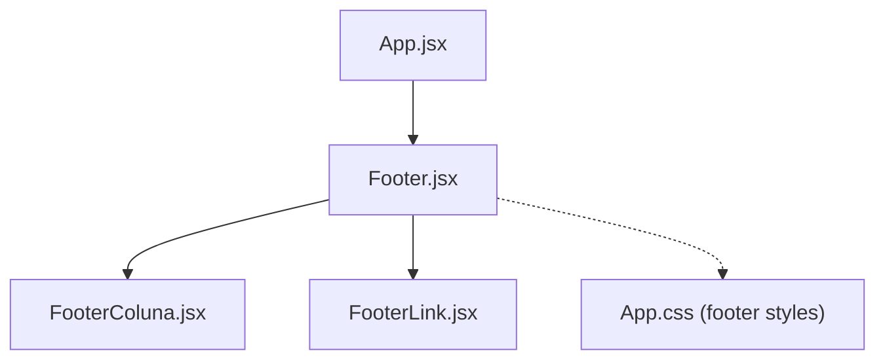
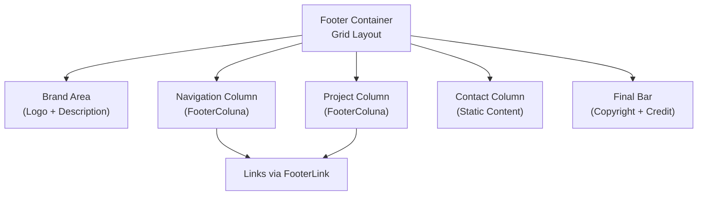
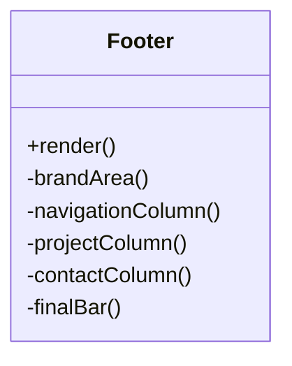
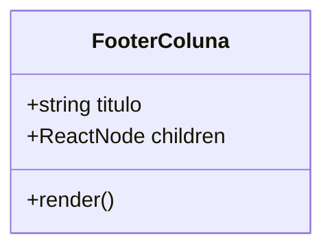
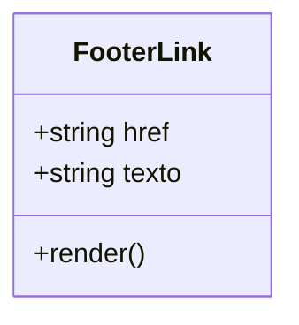
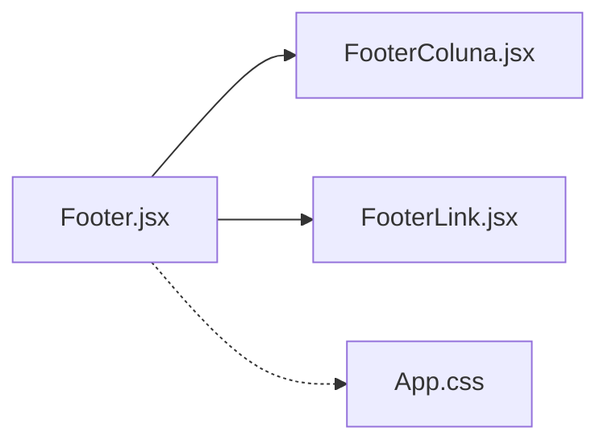

# Footer Component

<cite>
**Referenced Files in This Document**
- [Footer.jsx](file://src/components/Footer.jsx)
- [FooterColuna.jsx](file://src/components/FooterColuna.jsx)
- [FooterLink.jsx](file://src/components/FooterLink.jsx)
- [App.css](file://src/App.css)
- [App.jsx](file://src/App.jsx)
</cite>

## Table of Contents
1. [Introduction](#introduction)
2. [Project Structure](#project-structure)
3. [Core Components](#core-components)
4. [Architecture Overview](#architecture-overview)
5. [Detailed Component Analysis](#detailed-component-analysis)
6. [Dependency Analysis](#dependency-analysis)
7. [Performance Considerations](#performance-considerations)
8. [Troubleshooting Guide](#troubleshooting-guide)
9. [Conclusion](#conclusion)

## Introduction
This document explains the footer implementation built with three React components: Footer, FooterColuna, and FooterLink. It covers the layout structure, column organization, link management patterns, props interfaces, responsive behavior, and accessibility considerations. The goal is to make the footer easy to understand for beginners while providing enough technical depth for experienced developers.

## Project Structure
The footer is composed of three small, focused components that are rendered at the bottom of the application. The main App component includes the Footer as the last section.

**Diagram sources**
- [App.jsx:1-26](file://src/App.jsx#L1-L26)
- [Footer.jsx:1-127](file://src/components/Footer.jsx#L1-L127)
- [FooterColuna.jsx:1-15](file://src/components/FooterColuna.jsx#L1-L15)
- [FooterLink.jsx:1-11](file://src/components/FooterLink.jsx#L1-L11)

**Section sources**
- [App.jsx:1-26](file://src/App.jsx#L1-L26)

## Core Components
- Footer: Top-level container that composes the brand area, navigation columns, contact info, and a final bar with copyright text.
- FooterColuna: Column wrapper that renders a heading and an unordered list for links.
- FooterLink: Simple anchor link item used inside columns.

Key responsibilities:
- Footer orchestrates content and layout using CSS Grid.
- FooterColuna standardizes column markup and styling hooks.
- FooterLink encapsulates link items for consistent structure and styling.

**Section sources**
- [Footer.jsx:1-127](file://src/components/Footer.jsx#L1-L127)
- [FooterColuna.jsx:1-15](file://src/components/FooterColuna.jsx#L1-L15)
- [FooterLink.jsx:1-11](file://src/components/FooterLink.jsx#L1-L11)

## Architecture Overview
The footer uses a grid-based layout with four primary areas:
- Brand area with logo and description
- Navigation column
- Project column
- Contact information column
- Final bar with copyright and project credit

**Diagram sources**
- [Footer.jsx:4-123](file://src/components/Footer.jsx#L4-L123)
- [App.css:905-1061](file://src/App.css#L905-L1061)

## Detailed Component Analysis

### Footer Component
Responsibilities:
- Compose brand area, two navigational columns, a static contact column, and a final bar.
- Provide semantic HTML structure with a footer element and appropriate headings.
- Use internal anchors to navigate within the page.

Props interface:
- None; this is a presentational component with hardcoded content.

Layout and structure:
- Uses a root footer element with id="footer".
- Contains a .rodape container that applies a 4-column grid on desktop.
- Includes a .rodapeFinal bar for copyright and project credits.

Accessibility highlights:
- Semantic <footer> element.
- Headings for sections (e.g., "NAVEGAÇÃO", "PROJETO", "CONTATO").
- Icons use aria-hidden="true" to avoid screen reader noise.

Styling hooks:
- Classes: rodape, marcaRodape, logoRodape, descricaoRodape, colunaRodape, contatoRodape, rodapeFinal.

Example usage pattern:
- Columns are created by rendering multiple FooterColuna components.
- Links are added inside columns using FooterLink components.

**Section sources**
- [Footer.jsx:1-127](file://src/components/Footer.jsx#L1-L127)
- [App.css:905-1061](file://src/App.css#L905-L1061)

#### Footer Component Class Diagram

**Diagram sources**
- [Footer.jsx:4-123](file://src/components/Footer.jsx#L4-L123)

### FooterColuna Component
Responsibilities:
- Render a column with a title and a list of links.
- Provide a consistent DOM structure for styling and accessibility.

Props interface:
- titulo: string — Column heading text.
- children: ReactNode — List items (typically FooterLink elements).

Structure:
- Renders a div with class "colunaRodape".
- Renders an h3 for the column title.
- Renders an ul containing children.

Styling hooks:
- .colunaRodape, .colunaRodape h3, .colunaRodape ul, .colunaRodape li.

Best practices:
- Always pass a valid string for titulo.
- Ensure children are list items for correct semantics and styling.

**Section sources**
- [FooterColuna.jsx:1-15](file://src/components/FooterColuna.jsx#L1-L15)
- [App.css:995-1027](file://src/App.css#L995-L1027)

#### FooterColuna Component Class Diagram

**Diagram sources**
- [FooterColuna.jsx:1-15](file://src/components/FooterColuna.jsx#L1-L15)

### FooterLink Component
Responsibilities:
- Render a single link item inside a list.

Props interface:
- href: string — Destination URL or anchor.
- texto: string — Link label text.

Structure:
- Renders an li containing an anchor with the provided href and texto.

Styling hooks:
- .colunaRodape a (link styles applied via parent column).

Best practices:
- Always provide both href and texto.
- Use descriptive link text for accessibility.

**Section sources**
- [FooterLink.jsx:1-11](file://src/components/FooterLink.jsx#L1-L11)
- [App.css:1016-1027](file://src/App.css#L1016-L1027)

#### FooterLink Component Class Diagram

**Diagram sources**
- [FooterLink.jsx:1-11](file://src/components/FooterLink.jsx#L1-L11)

### Footer Columns and Links: Concrete Examples
- Navigation column:
  - Title: "NAVEGAÇÃO"
  - Links: Início, Solução, Público-Alvo, Galeria, Nossa Equipe
- Project column:
  - Title: "PROJETO"
  - Links: Nossa Solução, Estudantes, Smartphone JOVI
- Contact column:
  - Static content with email and location, each with an icon.

These examples demonstrate how FooterColuna wraps lists of FooterLink elements and how the contact column is structured without using FooterColuna.

**Section sources**
- [Footer.jsx:34-106](file://src/components/Footer.jsx#L34-L106)

## Dependency Analysis
Component relationships:
- Footer depends on FooterColuna and FooterLink.
- FooterColuna and FooterLink are leaf components with no further dependencies.
- Styling is centralized in App.css.

**Diagram sources**
- [Footer.jsx:1-127](file://src/components/Footer.jsx#L1-L127)
- [FooterColuna.jsx:1-15](file://src/components/FooterColuna.jsx#L1-L15)
- [FooterLink.jsx:1-11](file://src/components/FooterLink.jsx#L1-L11)
- [App.css:905-1061](file://src/App.css#L905-L1061)

**Section sources**
- [Footer.jsx:1-127](file://src/components/Footer.jsx#L1-L127)
- [FooterColuna.jsx:1-15](file://src/components/FooterColuna.jsx#L1-L15)
- [FooterLink.jsx:1-11](file://src/components/FooterLink.jsx#L1-L11)
- [App.css:905-1061](file://src/App.css#L905-L1061)

## Performance Considerations
- Lightweight components: All three components are simple presentational components with minimal logic, resulting in low render cost.
- No state or side effects: Reduces unnecessary re-renders.
- CSS Grid layout: Efficiently arranges columns without heavy JavaScript calculations.
- Icon attributes: Using aria-hidden="true" prevents extra work for assistive technologies.

[No sources needed since this section provides general guidance]

## Troubleshooting Guide
Common issues and resolutions:
- Links not visible or misaligned:
  - Verify that FooterLink elements are placed inside FooterColuna so they inherit list and link styles.
  - Check .colunaRodape a styles in App.css.
- Column titles missing:
  - Ensure FooterColuna receives a titulo prop.
- Footer layout breaks on smaller screens:
  - Confirm media queries for .rodape are active and classes match.
  - On mobile, the footer switches to a single column; ensure content remains readable.
- Accessibility warnings:
  - Add aria-hidden="true" to decorative icons.
  - Use meaningful link texts instead of generic labels.

Relevant code references:
- Footer link usage and structure: [Footer.jsx:34-106](file://src/components/Footer.jsx#L34-L106)
- Column and link styles: [App.css:995-1027](file://src/App.css#L995-L1027)
- Responsive footer layout: [App.css:1116-1223](file://src/App.css#L1116-L1223)

**Section sources**
- [Footer.jsx:34-106](file://src/components/Footer.jsx#L34-L106)
- [App.css:995-1027](file://src/App.css#L995-L1027)
- [App.css:1116-1223](file://src/App.css#L1116-L1223)

## Conclusion
The footer implementation is a clean, modular setup using three focused components. Footer orchestrates the overall layout, FooterColuna standardizes column structure, and FooterLink encapsulates link items. The design leverages CSS Grid for responsive layouts, maintains semantic HTML for accessibility, and keeps styling centralized. This approach is straightforward for beginners and extensible for advanced customization.

[No sources needed since this section summarizes without analyzing specific files]