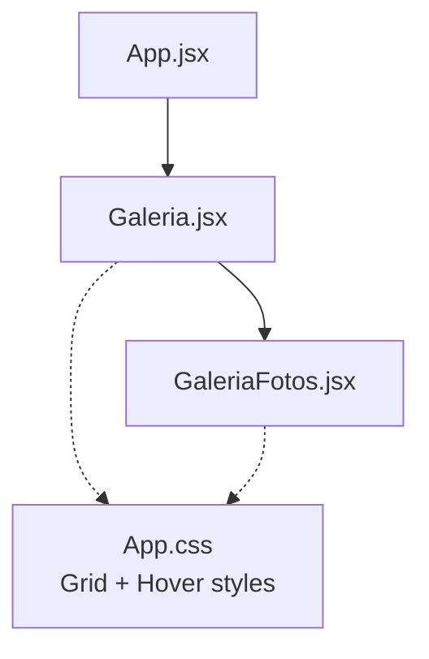
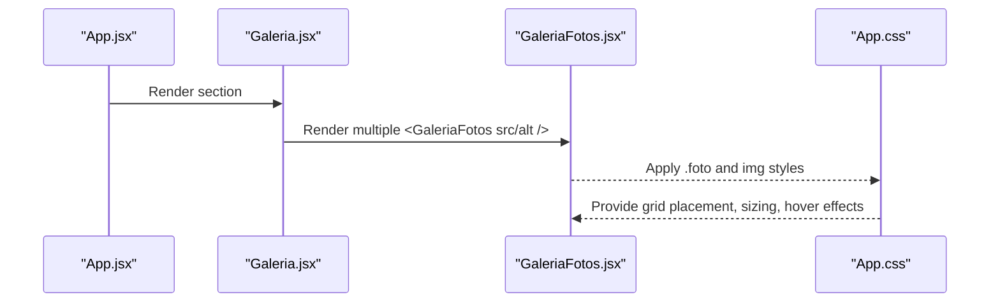
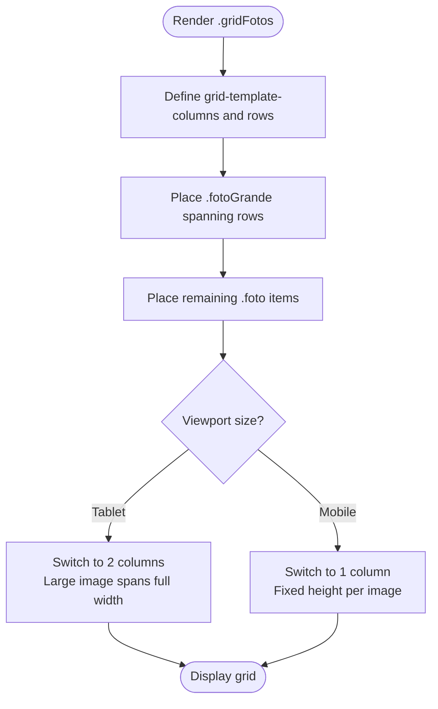
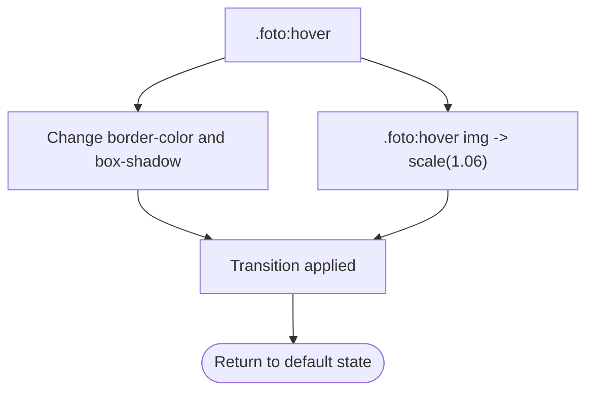
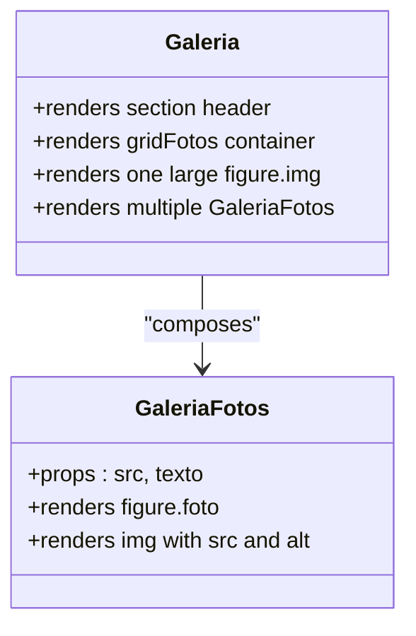

# Gallery System

<cite>
**Referenced Files in This Document**
- [Galeria.jsx](file://src/components/Galeria.jsx)
- [GaleriaFotos.jsx](file://src/components/GaleriaFotos.jsx)
- [App.css](file://src/App.css)
- [App.jsx](file://src/App.jsx)
</cite>

## Table of Contents
1. [Introduction](#introduction)
2. [Project Structure](#project-structure)
3. [Core Components](#core-components)
4. [Architecture Overview](#architecture-overview)
5. [Detailed Component Analysis](#detailed-component-analysis)
6. [Dependency Analysis](#dependency-analysis)
7. [Performance Considerations](#performance-considerations)
8. [Troubleshooting Guide](#troubleshooting-guide)
9. [Conclusion](#conclusion)

## Introduction
This document explains the gallery system implemented with the Galeria and GaleriaFotos components. It covers how images are organized into a responsive grid, how hover effects and zoom interactions work, and how to customize the component props for image sources, alt text, and styling. It also documents the CSS Grid layout used to create a masonry-like arrangement, how images maintain aspect ratios, and provides recommendations for optimization, lazy loading, and performance at scale.

## Project Structure
The gallery is composed of two React components:
- Galeria: renders the section header and the image grid, mixing a large featured image with multiple smaller images via GaleriaFotos.
- GaleriaFotos: a reusable card that wraps an image inside a figure element.

**Diagram sources**
- [App.jsx:1-26](file://src/App.jsx#L1-L26)
- [Galeria.jsx:1-55](file://src/components/Galeria.jsx#L1-L55)
- [GaleriaFotos.jsx:1-13](file://src/components/GaleriaFotos.jsx#L1-L13)
- [App.css:618-667](file://src/App.css#L618-L667)

**Section sources**
- [App.jsx:1-26](file://src/App.jsx#L1-L26)
- [Galeria.jsx:1-55](file://src/components/Galeria.jsx#L1-L55)
- [GaleriaFotos.jsx:1-13](file://src/components/GaleriaFotos.jsx#L1-L13)

## Core Components
- Galeria
  - Renders a section with a title and description.
  - Creates a grid container (gridFotos) containing one large image and several GaleriaFotos items.
  - Uses a mix of static markup for the large image and repeated GaleriaFotos instances for other images.

- GaleriaFotos
  - Accepts props for image source and alt text.
  - Renders a figure with an img tag, styled by shared CSS classes.

Props interface for GaleriaFotos:
- src: string — URL or path to the image file.
- texto: string — Alt text for accessibility and SEO.

Styling customization:
- The component applies the .foto class to the figure and uses object-fit on the img to fill its container while preserving aspect ratio.
- Additional visual behavior (hover border color, glow, and zoom) is defined in CSS.

**Section sources**
- [Galeria.jsx:21-49](file://src/components/Galeria.jsx#L21-L49)
- [GaleriaFotos.jsx:1-13](file://src/components/GaleriaFotos.jsx#L1-L13)

## Architecture Overview
The gallery follows a simple parent-child relationship:
- App mounts Galeria as part of the page.
- Galeria composes the grid and delegates each small image to GaleriaFotos.
- Shared styles in App.css define the grid layout, image sizing, and hover animations.

**Diagram sources**
- [App.jsx:11-22](file://src/App.jsx#L11-L22)
- [Galeria.jsx:21-49](file://src/components/Galeria.jsx#L21-L49)
- [GaleriaFotos.jsx:1-13](file://src/components/GaleriaFotos.jsx#L1-L13)
- [App.css:618-667](file://src/App.css#L618-L667)

## Detailed Component Analysis

### Image Grid Layout (Masonry-like)
The grid is built with CSS Grid:
- Container: .gridFotos defines columns and rows.
- Large image: .fotoGrante spans two rows to create a prominent feature cell.
- Responsive breakpoints adjust column count and row heights for tablets and phones.

Key behaviors:
- Desktop: three-column layout with a tall first item spanning both rows.
- Tablet: two-column layout; the large image spans full width in the top row.
- Mobile: single-column stack with fixed height per image.

Aspect ratio handling:
- Images use width: 100% and height: 100% with object-fit: cover to fill their grid cells without distortion.

Hover effects:
- On hover, the image scales slightly (zoom), and the figure’s border and box-shadow change to highlight the active item.

**Diagram sources**
- [App.css:618-667](file://src/App.css#L618-L667)
- [App.css:1096-1104](file://src/App.css#L1096-L1104)
- [App.css:1188-1198](file://src/App.css#L1188-L1198)

**Section sources**
- [App.css:618-667](file://src/App.css#L618-L667)
- [App.css:1096-1104](file://src/App.css#L1096-L1104)
- [App.css:1188-1198](file://src/App.css#L1188-L1198)

### Hover Effects and Zoom Interactions
- The .foto wrapper has a transition for smooth border and shadow changes.
- The img inside .foto transitions transform to create a subtle zoom effect on hover.
- These transitions provide a polished interaction without JavaScript.

**Diagram sources**
- [App.css:635-667](file://src/App.css#L635-L667)

**Section sources**
- [App.css:635-667](file://src/App.css#L635-L667)

### Component Props Interface: GaleriaFotos
- Props:
  - src: string — Path or URL to the image asset.
  - texto: string — Alt text describing the image content.
- Rendering:
  - Wraps the image in a figure with class foto.
  - Applies shared CSS for sizing, overflow, and hover effects.

Usage examples from the codebase:
- Galeria passes different src paths and descriptive alt texts to GaleriaFotos for multiple images.
- One large image is rendered directly in Galeria using a static figure and img tag.

**Section sources**
- [GaleriaFotos.jsx:1-13](file://src/components/GaleriaFotos.jsx#L1-L13)
- [Galeria.jsx:23-48](file://src/components/Galeria.jsx#L23-L48)

### Data Flow and Composition

**Diagram sources**
- [Galeria.jsx:1-55](file://src/components/Galeria.jsx#L1-L55)
- [GaleriaFotos.jsx:1-13](file://src/components/GaleriaFotos.jsx#L1-L13)

## Dependency Analysis
- App.jsx imports and renders Galeria as part of the application shell.
- Galeria imports GaleriaFotos and composes it multiple times.
- Both components rely on App.css for layout and animation styles.

**Diagram sources**
- [App.jsx:1-26](file://src/App.jsx#L1-L26)
- [Galeria.jsx:1-55](file://src/components/Galeria.jsx#L1-L55)
- [GaleriaFotos.jsx:1-13](file://src/components/GaleriaFotos.jsx#L1-L13)
- [App.css:618-667](file://src/App.css#L618-L667)

**Section sources**
- [App.jsx:1-26](file://src/App.jsx#L1-L26)
- [Galeria.jsx:1-55](file://src/components/Galeria.jsx#L1-L55)
- [GaleriaFotos.jsx:1-13](file://src/components/GaleriaFotos.jsx#L1-L13)

## Performance Considerations
Current implementation notes:
- Images are loaded eagerly by default since no lazy-loading attributes are present.
- No explicit width/height attributes are set on img elements, which can cause layout shifts during load.
- No responsive image formats (e.g., srcset/picture) are used.

Recommendations for large galleries:
- Lazy loading: Add loading="lazy" to img tags to defer offscreen images.
- Aspect stability: Set explicit width and height on img to prevent layout shift.
- Responsive images: Use srcset or picture to serve appropriately sized assets based on device pixel ratio and viewport.
- Format optimization: Prefer modern formats (WebP/AVIF) with fallbacks.
- Caching: Ensure proper cache headers for static assets.
- Interaction cost: Keep hover transforms lightweight; avoid heavy filters or shadows on many elements simultaneously.

[No sources needed since this section provides general guidance]

## Troubleshooting Guide
Common issues and resolutions:
- Images appear stretched or cropped unexpectedly:
  - Verify that the container sets fixed dimensions (rows/columns) and that img uses object-fit: cover.
  - Check that the correct grid placement is applied (e.g., .fotoGrande spans rows).
- Hover zoom not visible:
  - Ensure .foto has overflow: hidden so scaled images do not spill out.
  - Confirm that the hover rule targets .foto:hover img and includes a transform transition.
- Broken image paths:
  - Confirm relative paths match the public directory structure and build configuration.
- Accessibility concerns:
  - Always provide meaningful alt text via the texto prop for each image.

**Section sources**
- [App.css:635-667](file://src/App.css#L635-L667)
- [Galeria.jsx:23-48](file://src/components/Galeria.jsx#L23-L48)
- [GaleriaFotos.jsx:1-13](file://src/components/GaleriaFotos.jsx#L1-L13)

## Conclusion
The gallery system uses a straightforward React composition pattern with Galeria orchestrating the layout and GaleriaFotos rendering individual image cards. CSS Grid creates a flexible, masonry-like grid with responsive breakpoints, while CSS transitions deliver smooth hover zoom and visual feedback. For production-scale galleries, adopt lazy loading, responsive image formats, and explicit sizing to improve performance and user experience.