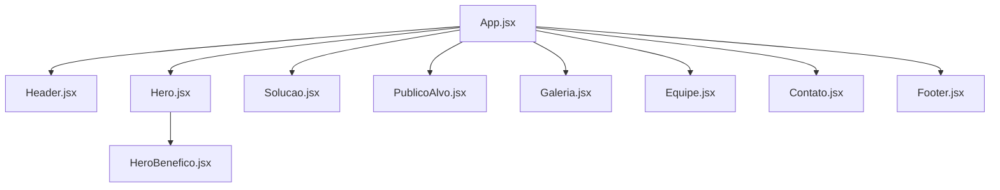
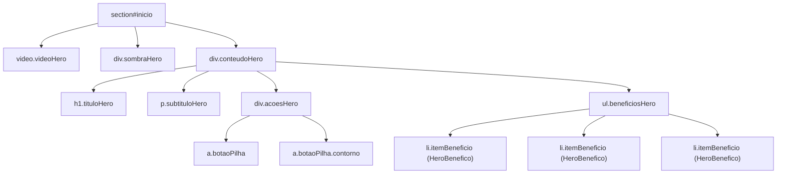
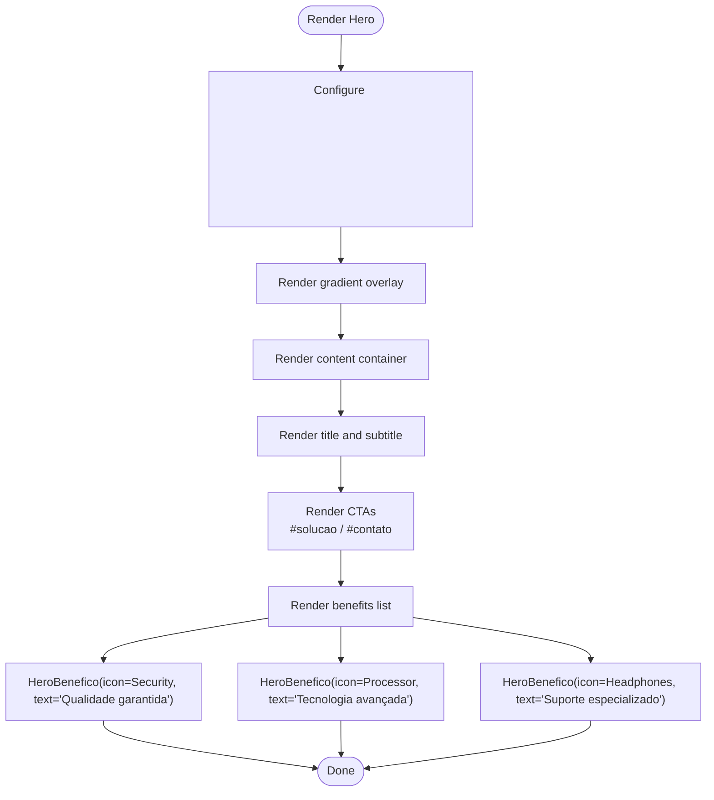
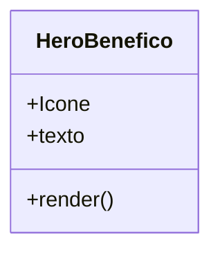
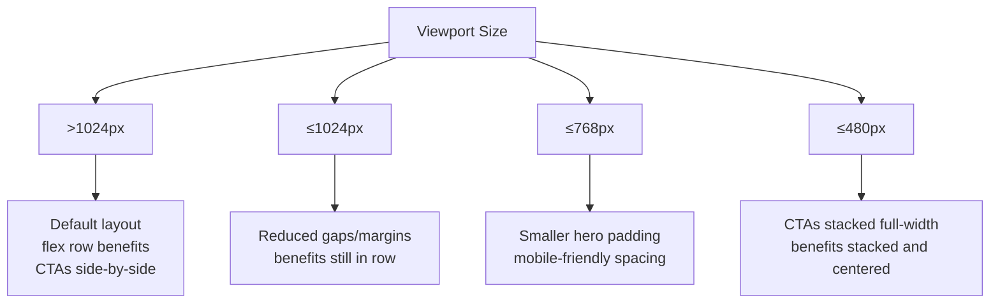
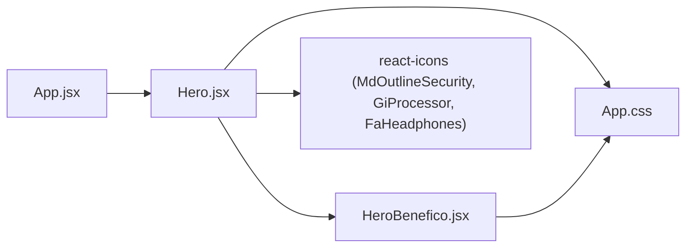

# Hero Section

<cite>
**Referenced Files in This Document**
- [Hero.jsx](file://src/components/Hero.jsx)
- [HeroBenefico.jsx](file://src/components/HeroBenefico.jsx)
- [App.css](file://src/App.css)
- [01-redesign-hero.md](file://docs/01-redesign-hero.md)
- [App.jsx](file://src/App.jsx)
</cite>

## Table of Contents
1. [Introduction](#introduction)
2. [Project Structure](#project-structure)
3. [Core Components](#core-components)
4. [Architecture Overview](#architecture-overview)
5. [Detailed Component Analysis](#detailed-component-analysis)
6. [Dependency Analysis](#dependency-analysis)
7. [Performance Considerations](#performance-considerations)
8. [Troubleshooting Guide](#troubleshooting-guide)
9. [Conclusion](#conclusion)

## Introduction
This document explains the hero section implementation, focusing on the Hero and HeroBenefico components. It covers:
- Video background integration and configuration
- Call-to-action (CTA) button behavior
- Benefit highlights system
- Props interface for both components
- Responsive design patterns across devices
- Performance considerations for video loading and optimization

The goal is to make this accessible to beginners while providing enough technical depth for experienced developers.

## Project Structure
The hero section lives under the components folder and is composed of two React components:
- Hero: main hero layout with video background, headline, subtitle, CTAs, and benefit list
- HeroBenefico: small component that renders a single benefit item with an icon and text

**Diagram sources**
- [App.jsx:1-26](file://src/App.jsx#L1-L26)
- [Hero.jsx:1-67](file://src/components/Hero.jsx#L1-L67)
- [HeroBenefico.jsx:1-12](file://src/components/HeroBenefico.jsx#L1-L12)

**Section sources**
- [App.jsx:1-26](file://src/App.jsx#L1-L26)
- [Hero.jsx:1-67](file://src/components/Hero.jsx#L1-L67)
- [HeroBenefico.jsx:1-12](file://src/components/HeroBenefico.jsx#L1-L12)

## Core Components
- Hero
  - Renders a full-viewport section with a background video, overlay, title, subtitle, two CTAs, and a horizontal list of benefits.
  - Uses react-icons for benefit icons.
  - Links CTAs to page anchors (#solucao and #contato).
- HeroBenefico
  - Renders a single benefit row with an icon component and a text label.

Key responsibilities:
- Hero orchestrates layout, content, and composition of benefit items.
- HeroBenefico encapsulates the visual structure of each benefit item.

**Section sources**
- [Hero.jsx:1-67](file://src/components/Hero.jsx#L1-L67)
- [HeroBenefico.jsx:1-12](file://src/components/HeroBenefico.jsx#L1-L12)

## Architecture Overview
The hero section follows a layered approach:
- Layer 1: Background video element fills the section.
- Layer 2: Gradient overlay ensures text legibility.
- Layer 3: Content container holds headline, subtitle, CTAs, and benefits.

**Diagram sources**
- [Hero.jsx:8-62](file://src/components/Hero.jsx#L8-L62)
- [App.css:147-317](file://src/App.css#L147-L317)

## Detailed Component Analysis

### Hero Component
Responsibilities:
- Provide the hero section markup and compose child elements.
- Configure the background video with autoplay, muted, loop, and inline playback.
- Render two CTAs linking to other sections via anchors.
- Render three benefit items using HeroBenefico with different icons and labels.

Video configuration:
- The video element uses attributes to ensure autoplay works across modern browsers and iOS.
- The CSS positions the video absolutely to cover the entire section and applies opacity for subtlety.

CTAs:
- Primary CTA (“Saiba mais”) links to #solucao.
- Secondary CTA (“Comprar”) links to #contato and uses an outlined style variant.

Benefits:
- Three benefit items are rendered as a flex row with consistent spacing.
- Each item uses a react-icon component passed as a prop.

Props interface:
- Hero does not accept props; it is a presentational component with hardcoded content.

Accessibility:
- The overlay div is marked aria-hidden since it is purely decorative.

**Diagram sources**
- [Hero.jsx:10-58](file://src/components/Hero.jsx#L10-L58)

**Section sources**
- [Hero.jsx:1-67](file://src/components/Hero.jsx#L1-L67)
- [App.css:147-317](file://src/App.css#L147-L317)

### HeroBenefico Component
Responsibilities:
- Render a single benefit item with an icon and a short text label.
- Accept props for the icon component and text string.

Props interface:
- Icone: A React component used to render the benefit icon.
- texto: A string displayed next to the icon.

Rendering pattern:
- Returns an li with className itemBeneficio containing the icon component and a span with the text.

Usage examples from codebase:
- Security icon with “Qualidade garantida”
- Processor icon with “Tecnologia avançada”
- Headphones icon with “Suporte especializado”

**Diagram sources**
- [HeroBenefico.jsx:1-12](file://src/components/HeroBenefico.jsx#L1-L12)

**Section sources**
- [HeroBenefico.jsx:1-12](file://src/components/HeroBenefico.jsx#L1-L12)
- [Hero.jsx:41-58](file://src/components/Hero.jsx#L41-L58)

### Video Background Integration
Behavior:
- The video element is positioned absolutely to fill the section.
- object-fit: cover ensures the video scales without distortion.
- Opacity reduces intensity so text remains readable.
- An overlay gradient improves contrast and blends into the next section’s background color.

Browser compatibility:
- autoPlay requires muted to work in most browsers.
- playsInline enables autoplay on iOS.
- loop keeps the video playing continuously.

Fallback:
- If the video fails to load, the section background remains black, preserving readability.

**Section sources**
- [Hero.jsx:10-17](file://src/components/Hero.jsx#L10-L17)
- [App.css:165-191](file://src/App.css#L165-L191)
- [01-redesign-hero.md:93-101](file://docs/01-redesign-hero.md#L93-L101)

### Call-to-Action Buttons
Variants:
- Solid primary button: .botaoPilha
- Outlined secondary button: .botaoPilha.contorno

Interactions:
- Hover states adjust background or add subtle transparency.
- Rounded pill shape with large border-radius.

Navigation:
- Anchor links navigate within the page to #solucao and #contato.

Responsive behavior:
- On small screens, CTAs stack vertically and stretch to full width.

**Section sources**
- [Hero.jsx:31-39](file://src/components/Hero.jsx#L31-L39)
- [App.css:235-281](file://src/App.css#L235-L281)
- [App.css:1226-1245](file://src/App.css#L1226-L1245)

### Benefit Highlights System
Structure:
- ul.beneficiosHero contains multiple li.itemBeneficio.
- Each item composes HeroBenefico with a specific icon and label.

Styling:
- Flexbox layout with wrap and gap for responsive alignment.
- Muted text color and uppercase styling for a minimal look.
- Icons sized consistently with the text.

Responsive behavior:
- At medium breakpoints, gaps and margins reduce.
- At small breakpoints, items stack vertically and center-align.

**Section sources**
- [Hero.jsx:41-58](file://src/components/Hero.jsx#L41-L58)
- [App.css:284-317](file://src/App.css#L284-L317)
- [App.css:1063-1068](file://src/App.css#L1063-L1068)
- [App.css:1247-1252](file://src/App.css#L1247-L1252)

### Responsive Design Patterns
Breakpoints and behaviors:
- ≤1024px: Reduce benefit gaps and margins; adapt grids elsewhere.
- ≤768px: Adjust hero padding for mobile navbar height; switch layouts for other sections.
- ≤480px: Stack CTAs vertically and set full width; stack benefits vertically and center them.

Typography:
- Fluid typography using clamp() for title and subtitle to scale smoothly across viewports.

**Diagram sources**
- [App.css:1063-1068](file://src/App.css#L1063-L1068)
- [App.css:1167-1169](file://src/App.css#L1167-L1169)
- [App.css:1226-1252](file://src/App.css#L1226-L1252)

**Section sources**
- [App.css:147-317](file://src/App.css#L147-L317)
- [App.css:1063-1068](file://src/App.css#L1063-L1068)
- [App.css:1167-1169](file://src/App.css#L1167-L1169)
- [App.css:1226-1252](file://src/App.css#L1226-L1252)

## Dependency Analysis
Component relationships:
- App imports and renders Hero among other sections.
- Hero imports HeroBenefico and react-icons for benefit icons.
- Styles are centralized in App.css.

**Diagram sources**
- [App.jsx:1-26](file://src/App.jsx#L1-L26)
- [Hero.jsx:1-67](file://src/components/Hero.jsx#L1-L67)
- [HeroBenefico.jsx:1-12](file://src/components/HeroBenefico.jsx#L1-L12)
- [App.css:1-17](file://src/App.css#L1-L17)

**Section sources**
- [App.jsx:1-26](file://src/App.jsx#L1-L26)
- [Hero.jsx:1-67](file://src/components/Hero.jsx#L1-L67)
- [HeroBenefico.jsx:1-12](file://src/components/HeroBenefico.jsx#L1-L12)

## Performance Considerations
Video loading and optimization:
- Use autoPlay + muted + playsInline to enable autoplay across devices.
- Apply loop for continuous background playback.
- Ensure the video file is optimized:
  - Prefer efficient codecs (e.g., H.264/MP4 or WebM) and appropriate bitrate.
  - Limit resolution to what is necessary for the hero area.
  - Compress the file to reduce payload size.
- Consider lazy strategies:
  - Defer heavy assets until after initial paint if needed.
  - Use preload hints judiciously to avoid blocking critical resources.
- Fallbacks:
  - Maintain a solid background color behind the video so content remains readable if the video fails to load.

Text legibility:
- The gradient overlay ensures contrast even when the video is bright or busy.

Mobile performance:
- Avoid unnecessary animations or heavy effects on mobile.
- Keep the hero lightweight by limiting additional DOM nodes and styles.

[No sources needed since this section provides general guidance]

## Troubleshooting Guide
Common issues and resolutions:
- Video does not autoplay:
  - Ensure muted is set alongside autoPlay.
  - Add playsInline for iOS support.
- Text unreadable over video:
  - Verify the overlay gradient is applied and has sufficient contrast.
  - Check video opacity and consider reducing it further if needed.
- CTAs not visible or misaligned on mobile:
  - Confirm media queries apply stacking and full-width styles at ≤480px.
- Benefits not wrapping correctly:
  - Check flex-wrap and gap settings for the benefits list.
- Icons not rendering:
  - Verify react-icons are installed and imported correctly.

**Section sources**
- [Hero.jsx:10-17](file://src/components/Hero.jsx#L10-L17)
- [App.css:165-191](file://src/App.css#L165-L191)
- [App.css:1226-1252](file://src/App.css#L1226-L1252)

## Conclusion
The hero section combines a background video, a gradient overlay, clear CTAs, and a compact benefits list to deliver a focused, high-impact landing experience. The Hero component manages layout and composition, while HeroBenefico encapsulates individual benefit items. Responsive styles ensure a smooth experience across devices, and careful attention to video attributes and overlays guarantees accessibility and readability. For best results, optimize the video asset and maintain the provided fallbacks and overlays.