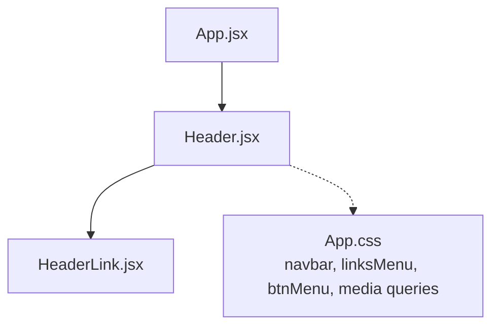
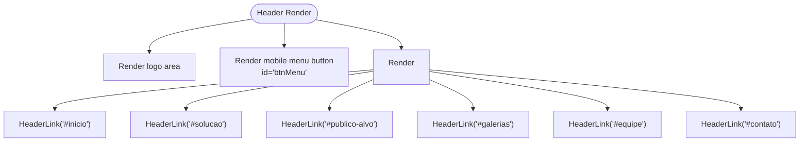
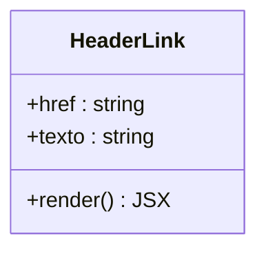
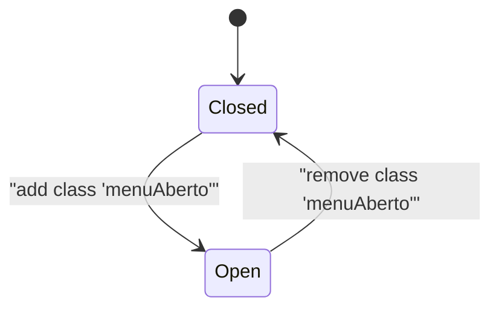
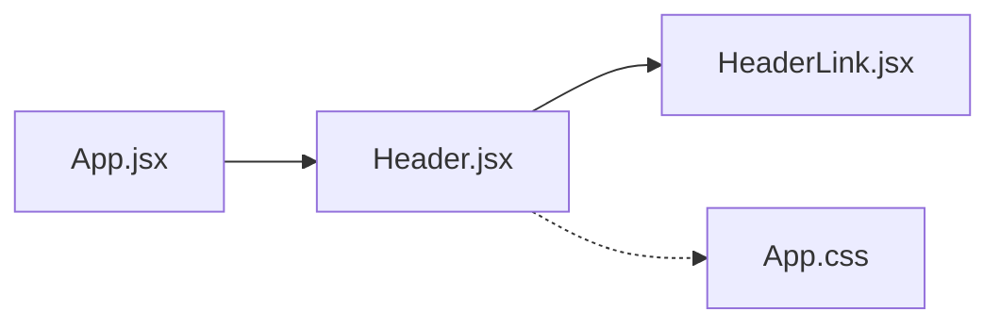

# Navigation System

<cite>
**Referenced Files in This Document**
- [Header.jsx](file://src/components/Header.jsx)
- [HeaderLink.jsx](file://src/components/HeaderLink.jsx)
- [App.jsx](file://src/App.jsx)
- [App.css](file://src/App.css)
</cite>

## Table of Contents
1. [Introduction](#introduction)
2. [Project Structure](#project-structure)
3. [Core Components](#core-components)
4. [Architecture Overview](#architecture-overview)
5. [Detailed Component Analysis](#detailed-component-analysis)
6. [Dependency Analysis](#dependency-analysis)
7. [Performance Considerations](#performance-considerations)
8. [Troubleshooting Guide](#troubleshooting-guide)
9. [Conclusion](#conclusion)

## Introduction
This document explains the navigation system implemented with the Header and HeaderLink components. It covers how the responsive navigation menu works, the mobile menu toggle behavior, and how smooth scrolling is achieved. It also documents the component props interface for HeaderLink, including link text, href attributes, and styling options, as well as relationships with other components and current limitations around navigation state management.

## Project Structure
The navigation UI is composed of:
- A top-level application shell that renders the Header at the top of the page.
- The Header component that builds the navbar, logo, mobile menu button, and a list of navigation links.
- The HeaderLink component that renders each individual navigation item.
- Global styles in App.css that define desktop and mobile layouts, hover states, and the mobile menu visibility logic.



**Diagram sources**
- [App.jsx:1-26](file://src/App.jsx#L1-L26)
- [Header.jsx:1-77](file://src/components/Header.jsx#L1-L77)
- [HeaderLink.jsx:1-14](file://src/components/HeaderLink.jsx#L1-L14)
- [App.css:34-145](file://src/App.css#L34-L145)
- [App.css:1122-1165](file://src/App.css#L1122-L1165)

**Section sources**
- [App.jsx:1-26](file://src/App.jsx#L1-L26)
- [Header.jsx:1-77](file://src/components/Header.jsx#L1-L77)
- [HeaderLink.jsx:1-14](file://src/components/HeaderLink.jsx#L1-L14)
- [App.css:34-145](file://src/App.css#L34-L145)
- [App.css:1122-1165](file://src/App.css#L1122-L1165)

## Core Components
- Header: Renders the fixed top navigation bar, includes a logo, a mobile menu toggle button, and an unordered list of navigation items built from HeaderLink instances.
- HeaderLink: Renders a single navigation link inside a list item, accepting props for the destination and visible text.

Key responsibilities:
- Header composes multiple HeaderLink components to build the navigation menu.
- Header exposes accessibility attributes on the mobile menu button and the menu container.
- HeaderLink focuses on rendering a semantic anchor element with provided content.

**Section sources**
- [Header.jsx:1-77](file://src/components/Header.jsx#L1-L77)
- [HeaderLink.jsx:1-14](file://src/components/HeaderLink.jsx#L1-L14)

## Architecture Overview
The navigation architecture is straightforward:
- App mounts Header at the root of the page.
- Header renders a nav with a logo, a mobile menu button, and a list of links.
- Each link is rendered by HeaderLink.
- CSS controls layout and responsiveness; a class toggles the mobile menu visibility.

```mermaid
sequenceDiagram
participant User as "User"
participant Header as "Header.jsx"
participant Link as "HeaderLink.jsx"
participant CSS as "App.css"
User->>Header : Clicks a navigation link
Header->>Link : Renders <a href="...">text</a>
Link-->>User : Anchor click triggers browser navigation
Note over User,CSS : On small screens, .linksMenu.menuAbosto shows/hides via CSS
```

**Diagram sources**
- [Header.jsx:20-67](file://src/components/Header.jsx#L20-L67)
- [HeaderLink.jsx:1-14](file://src/components/HeaderLink.jsx#L1-L14)
- [App.css:1122-1165](file://src/App.css#L1122-L1165)

## Detailed Component Analysis

### Header Component
Responsibilities:
- Provides the top-level <header> and <nav> elements.
- Renders the brand/logo area.
- Renders a mobile menu toggle button with accessibility attributes (aria-label, aria-expanded, aria-controls).
- Renders a list of navigation items using HeaderLink.

Navigation links structure:
- The header uses multiple HeaderLink components to render links to sections like #inicio, #solucao, #publico-alvo, #galerias, #equipe, and #contato.
- Some links use hash anchors to scroll within the same page; one link points to a separate route path.

Mobile menu toggle:
- The button has id="btnMenu" and the menu ul has id="linksMenu".
- The CSS defines a .menuAberto class that makes the menu visible on small screens.
- There is no JavaScript event listener attached to toggle this class in the current codebase.

Accessibility considerations:
- The menu button includes aria-label, aria-expanded, and aria-controls attributes.
- The icon inside the button uses aria-hidden to avoid screen readers announcing decorative icons.

Styling:
- The navbar is fixed at the top with a glass-like background.
- Links are styled with uppercase text, letter-spacing, and a bottom border that highlights on hover or when active.



**Diagram sources**
- [Header.jsx:10-67](file://src/components/Header.jsx#L10-L67)

**Section sources**
- [Header.jsx:1-77](file://src/components/Header.jsx#L1-L77)
- [App.css:34-145](file://src/App.css#L34-L145)
- [App.css:1122-1165](file://src/App.css#L1122-L1165)

### HeaderLink Component
Props interface:
- href: string — Destination URL or fragment identifier for the link.
- texto: string — Visible label for the link.

Behavior:
- Renders a list item containing an anchor element with the provided href and texto.
- No additional styling props are currently supported.

Usage examples:
- Internal section links: href="#inicio", href="#solucao", href="#publico-alvo", href="#galerias", href="#equipe", href="#contato".
- External or routed link: href="equipe".



**Diagram sources**
- [HeaderLink.jsx:1-14](file://src/components/HeaderLink.jsx#L1-L14)

**Section sources**
- [HeaderLink.jsx:1-14](file://src/components/HeaderLink.jsx#L1-L14)

### Responsive Navigation Menu and Mobile Toggle
Desktop behavior:
- The navbar displays horizontally with links spaced evenly.
- The mobile menu button is hidden.

Mobile behavior (max-width: 768px):
- The menu button becomes visible.
- The navigation list is positioned absolutely below the navbar and hidden by default.
- When the list has the class .menuAberto, it becomes visible as a vertical stack.

Current implementation gap:
- The toggle class .menuAberto exists in CSS but there is no JavaScript to add/remove it on button clicks. As a result, the mobile menu cannot be opened or closed programmatically in the current codebase.



**Diagram sources**
- [App.css:1122-1165](file://src/App.css#L1122-L1165)

**Section sources**
- [App.css:1122-1165](file://src/App.css#L1122-L1165)

### Smooth Scrolling Implementation
Smooth scrolling is handled by the browser’s native behavior when clicking anchor links that point to fragment identifiers (for example, #inicio, #solucao, etc.). The target sections exist in the page markup, so clicking these links scrolls to the corresponding element.

Notes:
- No explicit JavaScript smooth-scrolling logic is present in the navigation components.
- If you need consistent smooth scrolling across all browsers or want to customize timing, you can enable CSS scroll-behavior or implement a JS-based smooth scroll.

**Section sources**
- [Header.jsx:26-66](file://src/components/Header.jsx#L26-L66)

## Dependency Analysis
- App.jsx imports and renders Header at the top of the application tree.
- Header imports HeaderLink and composes multiple instances to build the navigation menu.
- Styles in App.css affect both Header and HeaderLink through shared classes (.navbar, .linksMenu, .btnMenu, and link styles).



**Diagram sources**
- [App.jsx:1-26](file://src/App.jsx#L1-L26)
- [Header.jsx:1-77](file://src/components/Header.jsx#L1-L77)
- [HeaderLink.jsx:1-14](file://src/components/HeaderLink.jsx#L1-L14)
- [App.css:34-145](file://src/App.css#L34-L145)

**Section sources**
- [App.jsx:1-26](file://src/App.jsx#L1-L26)
- [Header.jsx:1-77](file://src/components/Header.jsx#L1-L77)
- [HeaderLink.jsx:1-14](file://src/components/HeaderLink.jsx#L1-L14)
- [App.css:34-145](file://src/App.css#L34-L145)

## Performance Considerations
- The navigation is lightweight: pure React components and static CSS.
- Using hash anchors avoids extra network requests and keeps interactions fast.
- Avoid adding heavy animations to the mobile menu to maintain responsiveness on low-end devices.

[No sources needed since this section provides general guidance]

## Troubleshooting Guide

Common issues and resolutions:

- Mobile menu does not open:
  - Cause: The toggle class .menuAberto is defined in CSS but not toggled by JavaScript.
  - Resolution: Attach a click handler to the button with id="btnMenu" that toggles the class on the element with id="linksMenu". Ensure aria-expanded updates accordingly.

- Accessibility concerns:
  - Ensure the menu button has aria-expanded reflecting the open/closed state.
  - Ensure focus management: when the menu opens, move focus into the first link; when it closes, return focus to the toggle button.
  - Verify keyboard support: allow Enter/Space to toggle the menu and Escape to close it.

- Cross-browser compatibility:
  - Hash anchor scrolling works natively in modern browsers. For older browsers or custom behavior, consider enabling CSS scroll-behavior: smooth or implementing a JS smooth scroll function.
  - Backdrop-filter used in the navbar may have limited support in some browsers; provide a fallback background color if necessary.

- Styling edge cases:
  - On very small screens, ensure the menu width and padding do not overflow the viewport.
  - Confirm that link hover and active states remain visible and accessible with keyboard focus.

**Section sources**
- [Header.jsx:20-22](file://src/components/Header.jsx#L20-L22)
- [App.css:1122-1165](file://src/App.css#L1122-L1165)

## Conclusion
The navigation system is built with two focused components: Header, which orchestrates the navbar and menu structure, and HeaderLink, which renders individual links. The design is responsive, with mobile-specific styles ready to show a vertical menu when the .menuAberto class is applied. Currently, the mobile toggle lacks JavaScript wiring, and smooth scrolling relies on native anchor behavior. Extending the implementation with a simple toggle handler and optional smooth-scroll configuration will improve usability and cross-browser consistency while maintaining accessibility best practices.