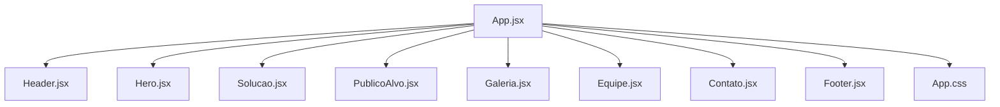
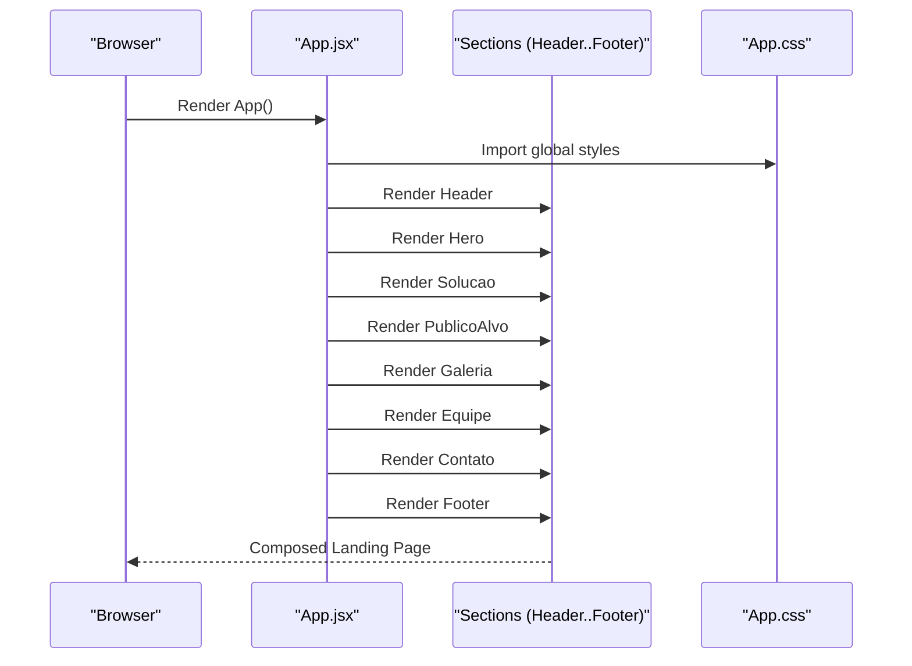
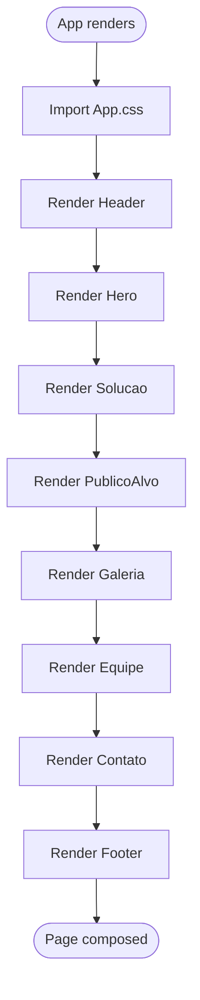
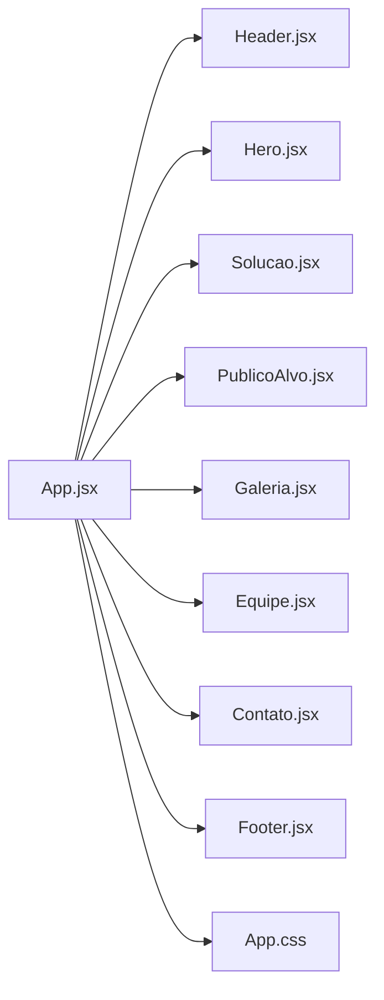

# Root Component (App.jsx)

<cite>
**Referenced Files in This Document**
- [App.jsx](file://src/App.jsx)
- [App.css](file://src/App.css)
- [Header.jsx](file://src/components/Header.jsx)
- [Hero.jsx](file://src/components/Hero.jsx)
- [Solucao.jsx](file://src/components/Solucao.jsx)
- [PublicoAlvo.jsx](file://src/components/PublicoAlvo.jsx)
- [Galeria.jsx](file://src/components/Galeria.jsx)
- [Equipe.jsx](file://src/components/Equipe.jsx)
- [Contato.jsx](file://src/components/Contato.jsx)
- [Footer.jsx](file://src/components/Footer.jsx)
</cite>

## Table of Contents
1. [Introduction](#introduction)
2. [Project Structure](#project-structure)
3. [Core Components](#core-components)
4. [Architecture Overview](#architecture-overview)
5. [Detailed Component Analysis](#detailed-component-analysis)
6. [Dependency Analysis](#dependency-analysis)
7. [Performance Considerations](#performance-considerations)
8. [Troubleshooting Guide](#troubleshooting-guide)
9. [Conclusion](#conclusion)

## Introduction
This document explains the root component App.jsx and how it orchestrates the complete landing page by composing major sections: Header, Hero, Solucao, PublicoAlvo, Galeria, Equipe, Contato, and Footer. It covers the component composition pattern, unidirectional data flow via props, styling with Tailwind CSS classes and global styles from App.css, and guidance for adding new sections while maintaining consistency.

## Project Structure
The application is a React project using Vite. The root component imports all top-level section components and one global stylesheet. Each section is implemented as a separate component under src/components.

**Diagram sources**
- [App.jsx:1-9](file://src/App.jsx#L1-L9)

**Section sources**
- [App.jsx:1-26](file://src/App.jsx#L1-L26)

## Core Components
App.jsx composes the following top-level sections in a fixed order to build the landing page layout:
- Header: navigation bar and links
- Hero: hero banner with video background and call-to-action
- Solucao: solution features grid
- PublicoAlvo: target audience section
- Galeria: image gallery
- Equipe: team members
- Contato: contact information and form
- Footer: site footer with columns and links

Each section is rendered as a child of App without passing state or handlers, reflecting a presentational composition pattern where App acts as a layout container.

**Section sources**
- [App.jsx:11-24](file://src/App.jsx#L11-L24)

## Architecture Overview
App.jsx follows a simple composition architecture:
- Imports all section components
- Imports global styles
- Renders sections sequentially inside a fragment
- Does not manage shared state at this level

**Diagram sources**
- [App.jsx:1-24](file://src/App.jsx#L1-L24)
- [App.css:1-5](file://src/App.css#L1-L5)

## Detailed Component Analysis

### App.jsx: Layout Orchestrator
Responsibilities:
- Import and render all major sections
- Apply global styles via App.css import
- Maintain consistent vertical ordering of sections

Props and Data Flow:
- No props are passed down from App to sections; each section renders its own content
- Unidirectional data flow is maintained by design: if future state is needed, it should be lifted to a higher-level provider or managed within individual sections

Styling Approach:
- Global styles are imported from App.css, which includes Tailwind CSS integration and custom CSS variables
- Sections use semantic HTML elements and class names that match App.css selectors

**Diagram sources**
- [App.jsx:1-24](file://src/App.jsx#L1-L24)

**Section sources**
- [App.jsx:1-26](file://src/App.jsx#L1-L26)

### Header.jsx: Navigation Bar
Responsibilities:
- Renders a fixed navigation bar with logo, menu toggle button, and list of links
- Uses HeaderLink children to compose navigation items

Props Usage:
- Passes href and texto to HeaderLink instances to define link destinations and labels

Styling:
- Uses Tailwind utility classes and custom classes defined in App.css (e.g., navbar, logo, linksMenu)

Accessibility:
- Includes aria-label and aria attributes on the menu button

**Section sources**
- [Header.jsx:1-77](file://src/components/Header.jsx#L1-L77)

### Hero.jsx: Hero Banner
Responsibilities:
- Renders a full-height hero section with a background video, overlay, title, subtitle, actions, and benefit items
- Composes HeroBeneficio items with icons and text

Props Usage:
- Passes Icone and texto to HeroBeneficio to render benefit items

Styling:
- Uses Tailwind utility classes and custom classes from App.css (e.g., videoHero, sombraHero, conteudoHero)

**Section sources**
- [Hero.jsx:1-67](file://src/components/Hero.jsx#L1-L67)

### Solucao.jsx: Solution Features
Responsibilities:
- Renders a section header and a grid of feature cards
- Composes SolucaoCard components with icon, title, and description

Props Usage:
- Passes Icone, titulo, and texto to SolucaoCard

Styling:
- Uses Tailwind utility classes and custom classes from App.css (e.g., topoSecao1, grid, card)

**Section sources**
- [Solucao.jsx:1-74](file://src/components/Solucao.jsx#L1-L74)

### PublicoAlvo.jsx: Target Audience
Responsibilities:
- Renders a section header, main area with large icon and description, and a grid of audience cards
- Composes PublicoAlvoCard components with icon, title, and description

Props Usage:
- Passes Icone, titulo, and texto to PublicoAlvoCard

Styling:
- Uses Tailwind utility classes and custom classes from App.css (e.g., caixaPrincipal, areaPrincipal, gridPublico, cardPublico)

**Section sources**
- [PublicoAlvo.jsx:1-88](file://src/components/PublicoAlvo.jsx#L1-L88)

### Galeria.jsx: Image Gallery
Responsibilities:
- Renders a section header and a responsive photo grid
- Composes GaleriaFotos components for smaller images and uses a figure for the large image

Props Usage:
- Passes src and alt to GaleriaFotos

Styling:
- Uses Tailwind utility classes and custom classes from App.css (e.g., galeria, gridFotos, foto, fotoGrande)

**Section sources**
- [Galeria.jsx:1-55](file://src/components/Galeria.jsx#L1-L55)

### Equipe.jsx: Team Members
Responsibilities:
- Renders a section header and a grid of team member cards
- Composes EquipeCard components with image, alt, name, role, and description

Props Usage:
- Passes src, alt, titulo, funcao, and textoTime to EquipeCard

Styling:
- Uses Tailwind utility classes and custom classes from App.css (e.g., gridTime, cardTime, fotoPerfil)

**Section sources**
- [Equipe.jsx:1-75](file://src/components/Equipe.jsx#L1-L75)

### Contato.jsx: Contact Section
Responsibilities:
- Renders a section header, contact info block, and a contact form
- Composes ContatoItem for contact details and ContatoForm for input fields

Props Usage:
- Passes Icone, titulo, and texto to ContatoItem
- Passes label, type, id, name, placeholder, and textarea to ContatoForm

Styling:
- Uses Tailwind utility classes and custom classes from App.css (e.g., caixaContato, infoContato, formulario)

**Section sources**
- [Contato.jsx:1-112](file://src/components/Contato.jsx#L1-L112)

### Footer.jsx: Site Footer
Responsibilities:
- Renders brand info, navigation columns, and contact column
- Composes FooterColuna and FooterLink components

Props Usage:
- Passes titulo to FooterColuna
- Passes href and texto to FooterLink

Styling:
- Uses Tailwind utility classes and custom classes from App.css (e.g., rodape, marcaRodape, colunaRodape)

**Section sources**
- [Footer.jsx:1-127](file://src/components/Footer.jsx#L1-L127)

## Dependency Analysis
App.jsx depends on all top-level section components and global styles. Each section may depend on smaller presentational components and icon libraries.

**Diagram sources**
- [App.jsx:1-9](file://src/App.jsx#L1-L9)

**Section sources**
- [App.jsx:1-9](file://src/App.jsx#L1-L9)

## Performance Considerations
- Keep App.jsx minimal: avoid logic or heavy computations here; delegate to sections or providers when needed
- Prefer lazy loading for non-critical sections if the page becomes large
- Ensure images and videos are optimized and appropriately sized
- Avoid unnecessary re-renders by keeping sections stateless unless required

[No sources needed since this section provides general guidance]

## Troubleshooting Guide
Common issues and resolutions:
- Missing global styles: ensure App.css is imported in App.jsx
- Tailwind not applied: verify Tailwind is configured and imported in App.css
- Broken image paths: confirm relative paths in sections point to public assets correctly
- Accessibility warnings: add aria attributes to interactive elements like buttons and links
- Inconsistent spacing: align new sections with existing section headers and grids defined in App.css

**Section sources**
- [App.jsx:9](file://src/App.jsx#L9)
- [App.css:1-5](file://src/App.css#L1-L5)

## Conclusion
App.jsx serves as a clean, declarative container that composes the entire landing page by rendering major sections in a fixed order. It relies on global styles from App.css and Tailwind utilities. To extend the app, add new sections as components and include them in App.jsx’s render tree, following the same prop-passing patterns used by existing sections.

[No sources needed since this section summarizes without analyzing specific files]