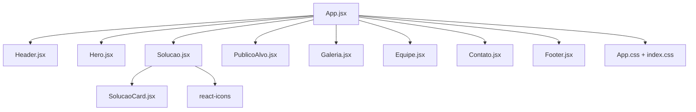
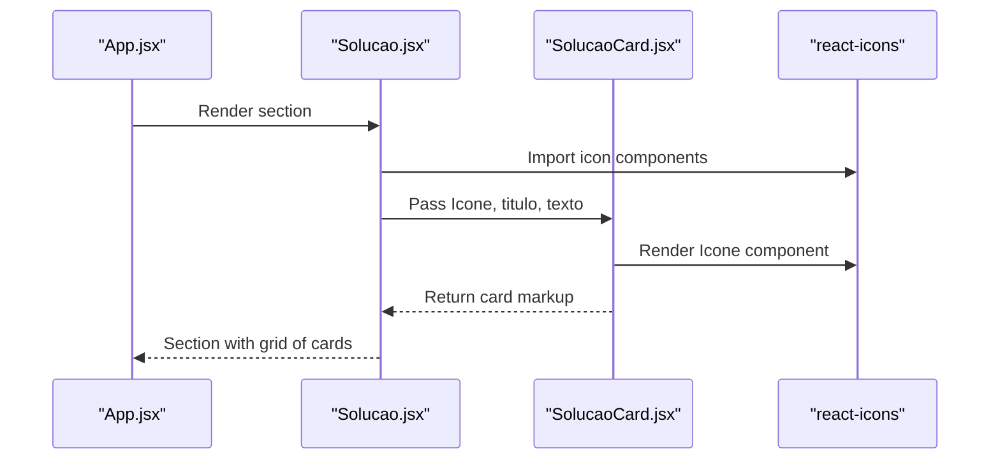
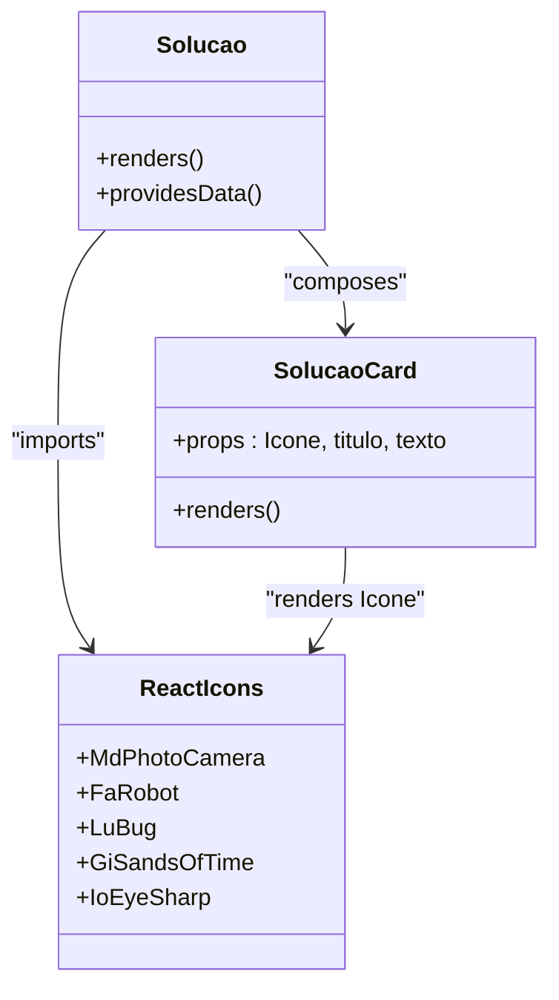
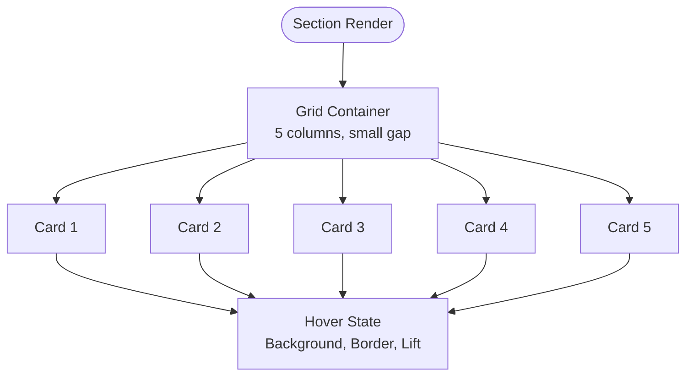
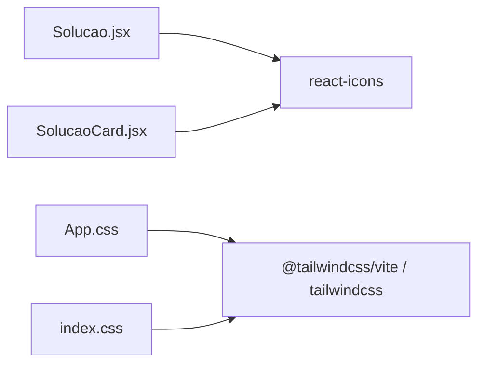

# Solutions Showcase

<cite>
**Referenced Files in This Document**
- [Solucao.jsx](file://src/components/Solucao.jsx)
- [SolucaoCard.jsx](file://src/components/SolucaoCard.jsx)
- [App.jsx](file://src/App.jsx)
- [App.css](file://src/App.css)
- [index.css](file://src/index.css)
- [package.json](file://package.json)
</cite>

## Table of Contents
1. [Introduction](#introduction)
2. [Project Structure](#project-structure)
3. [Core Components](#core-components)
4. [Architecture Overview](#architecture-overview)
5. [Detailed Component Analysis](#detailed-component-analysis)
6. [Dependency Analysis](#dependency-analysis)
7. [Performance Considerations](#performance-considerations)
8. [Troubleshooting Guide](#troubleshooting-guide)
9. [Conclusion](#conclusion)

## Introduction
This document explains the solutions showcase implementation centered on the Solucao and SolucaoCard components. It covers how the solution cards are structured, styled, and presented using a responsive grid layout. You will learn about the component props interface for SolucaoCard (icon handling, title, description), hover effects, icon integration with react-icons, and how to extend the system with custom icons. The content is designed to be accessible to beginners while providing enough technical depth for experienced developers.

## Project Structure
The solutions showcase is composed of:
- A section container that renders multiple solution cards
- A reusable card component that displays an icon, title, and description
- Global styles defining the grid layout and card appearance
- App-level composition that includes the showcase section

**Diagram sources**
- [App.jsx:1-26](file://src/App.jsx#L1-L26)
- [Solucao.jsx:1-74](file://src/components/Solucao.jsx#L1-L74)
- [SolucaoCard.jsx:1-28](file://src/components/SolucaoCard.jsx#L1-L28)
- [App.css:350-445](file://src/App.css#L350-L445)
- [index.css:1-1](file://src/index.css#L1-L1)

**Section sources**
- [App.jsx:1-26](file://src/App.jsx#L1-L26)
- [Solucao.jsx:1-74](file://src/components/Solucao.jsx#L1-L74)
- [SolucaoCard.jsx:1-28](file://src/components/SolucaoCard.jsx#L1-L28)
- [App.css:350-445](file://src/App.css#L350-L445)
- [index.css:1-1](file://src/index.css#L1-L1)

## Core Components
- Solucao: Renders the “Solutions” section header and a grid of solution cards. It imports icons from react-icons and passes them as props to SolucaoCard along with titles and descriptions.
- SolucaoCard: A presentational component that renders an icon, title, and description inside a styled card. It uses Tailwind utility classes for icon styling and relies on global CSS for card layout and hover effects.

Key responsibilities:
- Solucao: Composes data (icons, titles, descriptions) and delegates rendering to SolucaoCard.
- SolucaoCard: Displays the provided icon, title, and description; applies inline Tailwind utilities to the icon; leaves card-level styling to global CSS.

**Section sources**
- [Solucao.jsx:1-74](file://src/components/Solucao.jsx#L1-L74)
- [SolucaoCard.jsx:1-28](file://src/components/SolucaoCard.jsx#L1-L28)

## Architecture Overview
The showcase follows a simple parent-child pattern:
- App composes sections including Solucao.
- Solucao renders multiple SolucaoCard instances, each receiving an icon component and text content via props.
- Styling is split between Tailwind utilities (inline on the icon) and global CSS (grid layout, card appearance, hover states).

**Diagram sources**
- [App.jsx:1-26](file://src/App.jsx#L1-L26)
- [Solucao.jsx:1-74](file://src/components/Solucao.jsx#L1-L74)
- [SolucaoCard.jsx:1-28](file://src/components/SolucaoCard.jsx#L1-L28)

## Detailed Component Analysis

### Solucao Component
Responsibilities:
- Define the section heading and label.
- Provide five solution items, each with:
  - An icon component from react-icons
  - A title string
  - A description string
- Render all items inside a grid container.

Props usage:
- No props accepted by Solucao itself; it is self-contained and composes data internally.

Data flow:
- Each SolucaoCard receives:
  - Icone: a react-icons component (rendered as <Icone className="...">)
  - titulo: string used for the card heading
  - texto: string used for the card paragraph

Example usage patterns (from codebase):
- Camera icon with photography-related title and description
- Robot icon for post-processing feature
- Bug icon for files and bugs reliability
- Hourglass-like icon for shutter lag improvement
- Eye icon for quick focus capability

Styling approach:
- The section uses a dedicated class for background and typography.
- The grid container defines a 5-column layout with small gaps.
- Cards use a shared card style defined globally.

Accessibility considerations:
- Use semantic elements: section, article, h3, p.
- Ensure sufficient color contrast for text and icons.
- Keep headings descriptive and concise.

**Section sources**
- [Solucao.jsx:1-74](file://src/components/Solucao.jsx#L1-L74)
- [App.css:350-445](file://src/App.css#L350-L445)

### SolucaoCard Component
Responsibilities:
- Render a single solution card with an icon, title, and description.
- Apply Tailwind utility classes directly to the icon element for size, color, spacing, shadow, and transition.

Props interface:
- Icone: Required. A react-icons component (function or class component) rendered as <Icone className="..."/>.
- titulo: Required. String displayed as the card heading.
- texto: Required. String displayed as the card paragraph.

Styling details:
- Icon styling via Tailwind utilities:
  - Color: blue accent
  - Size: large
  - Spacing: bottom margin
  - Shadow: subtle glow
  - Transition: smooth changes on hover
- Card styling via global CSS:
  - Background, border, radius, padding
  - Hover state: background shift, border highlight, slight lift
  - Typography: heading and paragraph styles

Hover behavior:
- Card hover: background darkens slightly, border highlights, and the card lifts vertically.
- Icon hover: color shifts to a brighter accent and moves up slightly.

Extensibility:
- To add new features, create a new SolucaoCard instance in Solucao with a different icon and text.
- To customize icon appearance beyond Tailwind utilities, pass additional classes through the Icone prop or adjust global styles.

**Diagram sources**
- [Solucao.jsx:1-74](file://src/components/Solucao.jsx#L1-L74)
- [SolucaoCard.jsx:1-28](file://src/components/SolucaoCard.jsx#L1-L28)

**Section sources**
- [SolucaoCard.jsx:1-28](file://src/components/SolucaoCard.jsx#L1-L28)
- [App.css:395-445](file://src/App.css#L395-L445)

### Grid Layout Implementation
The grid is implemented using CSS Grid:
- Container class sets a max width, centering, display grid, and a 5-column template with small gaps.
- Cards have consistent min-height, padding, background, border, radius, and transition.
- Hover states provide visual feedback for both the card and its icon.

Responsive behavior:
- The current implementation uses a fixed 5-column grid without media queries.
- On smaller screens, this can cause tight spacing or overflow.
- Recommended improvements:
  - Add breakpoints to reduce columns (e.g., 3 on tablet, 2 on mobile).
  - Adjust gap and padding at smaller sizes.
  - Consider using Tailwind’s responsive utilities if migrating more styles there.

**Diagram sources**
- [App.css:395-445](file://src/App.css#L395-L445)

**Section sources**
- [App.css:395-445](file://src/App.css#L395-L445)

### Icon Integration with react-icons
- Icons are imported from react-icons modules (material design, font awesome, lucide, etc.).
- Each icon is passed as a component prop to SolucaoCard and rendered with Tailwind utilities applied via className.
- To add a new icon:
  - Import the desired icon from react-icons.
  - Create a new SolucaoCard instance in Solucao with the icon component and relevant text.
  - Optionally adjust Tailwind classes on the icon for size/color/shadow.

Examples from the codebase:
- MdPhotoCamera for photography
- FaRobot for AI post-processing
- LuBug for robust file saving and bug reduction
- GiSandsOfTime for reduced shutter lag
- IoEyeSharp for fast focus

**Section sources**
- [Solucao.jsx:1-74](file://src/components/Solucao.jsx#L1-L74)
- [package.json:12-18](file://package.json#L12-L18)

### Styling Customization
- Inline Tailwind utilities on the icon control color, size, spacing, shadow, and transitions.
- Global CSS controls card layout, typography, and hover effects.
- To customize further:
  - Modify Tailwind classes on the Icone element to change color, size, or animation.
  - Update global card styles to adjust background, borders, shadows, or typography.
  - Introduce CSS variables for theme colors to make customization easier.

**Section sources**
- [SolucaoCard.jsx:1-28](file://src/components/SolucaoCard.jsx#L1-L28)
- [App.css:395-445](file://src/App.css#L395-L445)

## Dependency Analysis
External dependencies relevant to the showcase:
- react-icons: Provides icon components used in Solucao and rendered by SolucaoCard.
- tailwindcss: Utility-first CSS framework; Tailwind directives are imported in CSS files.

**Diagram sources**
- [Solucao.jsx:1-74](file://src/components/Solucao.jsx#L1-L74)
- [SolucaoCard.jsx:1-28](file://src/components/SolucaoCard.jsx#L1-L28)
- [App.css:1-5](file://src/App.css#L1-L5)
- [index.css:1-1](file://src/index.css#L1-L1)
- [package.json:12-18](file://package.json#L12-L18)

**Section sources**
- [package.json:12-18](file://package.json#L12-L18)
- [App.css:1-5](file://src/App.css#L1-L5)
- [index.css:1-1](file://src/index.css#L1-L1)

## Performance Considerations
- Rendering overhead: SolucaoCard is lightweight; no heavy computations or external API calls.
- Icon rendering: react-icons components are efficient; ensure only necessary icons are imported.
- Transitions: Hover transitions are GPU-accelerated transforms and opacity changes; keep animations minimal.
- CSS performance: Avoid excessive nesting; prefer utility classes where appropriate.
- Responsive improvements: Adding media queries or Tailwind responsive utilities can prevent layout thrashing on small screens.

[No sources needed since this section provides general guidance]

## Troubleshooting Guide
Common issues and resolutions:
- Icons not visible or incorrectly sized:
  - Verify the Icone prop is a valid react-icons component.
  - Check Tailwind classes applied to the icon for size and color.
- Card hover effects not appearing:
  - Ensure the card has the correct class and that global CSS is loaded.
  - Confirm no conflicting styles override hover states.
- Grid layout issues on small screens:
  - Add responsive breakpoints to reduce columns and adjust gaps/padding.
  - Consider using Tailwind’s responsive utilities for better maintainability.
- Missing react-icons dependency:
  - Confirm react-icons is installed in package.json and dependencies are installed.

**Section sources**
- [Solucao.jsx:1-74](file://src/components/Solucao.jsx#L1-L74)
- [SolucaoCard.jsx:1-28](file://src/components/SolucaoCard.jsx#L1-L28)
- [App.css:395-445](file://src/App.css#L395-L445)
- [package.json:12-18](file://package.json#L12-L18)

## Conclusion
The solutions showcase demonstrates a clean, extensible pattern for presenting feature cards:
- Solucao composes data and renders multiple SolucaoCard instances.
- SolucaoCard focuses on presentation, accepting an icon component and text via props.
- Styling combines Tailwind utilities for icon treatment and global CSS for grid and card aesthetics.
- The system integrates react-icons seamlessly and can be extended with new icons and features.
- For improved responsiveness, consider adding media queries or Tailwind responsive utilities to adapt the grid across devices.

[No sources needed since this section summarizes without analyzing specific files]