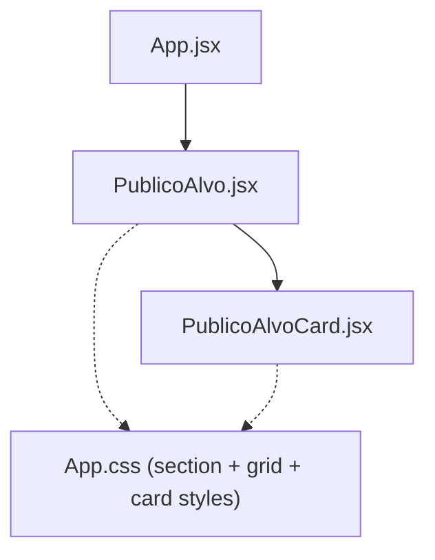
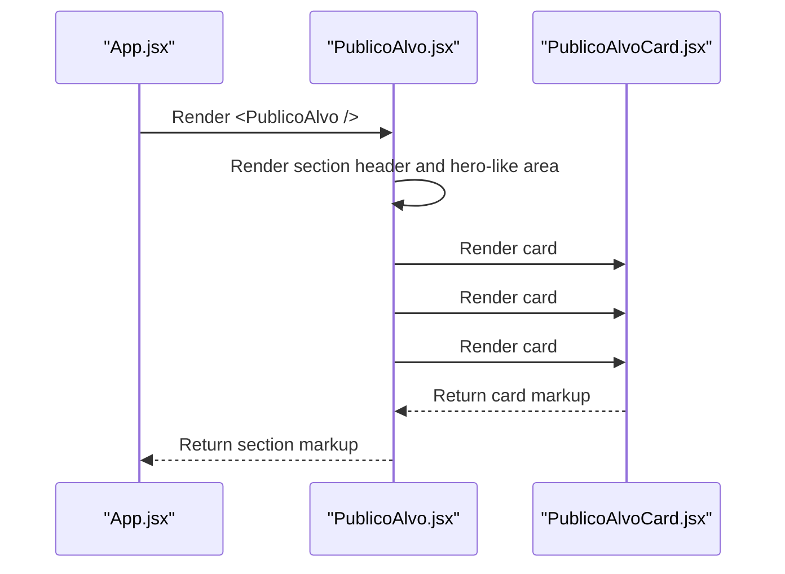
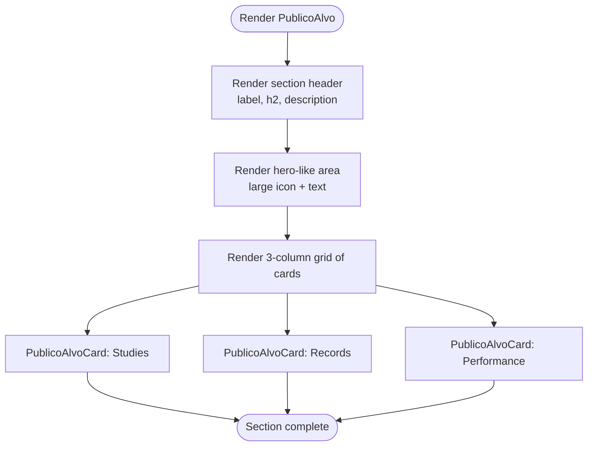
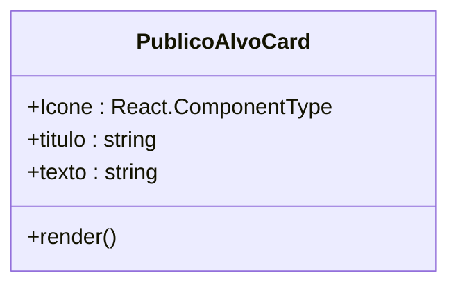
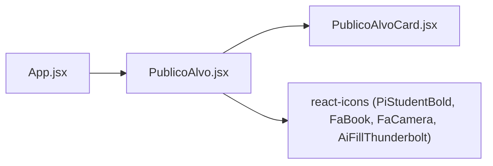

# Target Audience Section

<cite>
**Referenced Files in This Document**
- [PublicoAlvo.jsx](file://src/components/PublicoAlvo.jsx)
- [PublicoAlvoCard.jsx](file://src/components/PublicoAlvoCard.jsx)
- [App.jsx](file://src/App.jsx)
- [App.css](file://src/App.css)
</cite>

## Table of Contents
1. [Introduction](#introduction)
2. [Project Structure](#project-structure)
3. [Core Components](#core-components)
4. [Architecture Overview](#architecture-overview)
5. [Detailed Component Analysis](#detailed-component-analysis)
6. [Dependency Analysis](#dependency-analysis)
7. [Performance Considerations](#performance-considerations)
8. [Troubleshooting Guide](#troubleshooting-guide)
9. [Conclusion](#conclusion)

## Introduction
This document explains the implementation of the Target Audience section, focusing on the PublicoAlvo and PublicoAlvoCard components. It covers how audience personas are displayed and styled, the responsive grid layout, content organization patterns, and the component props interface for PublicoAlvoCard. The goal is to make the material accessible to beginners while providing enough technical depth for experienced developers.

## Project Structure
The Target Audience section is composed of two React components:
- PublicoAlvo: the section container that composes the header, hero-like area, and a three-column grid of persona cards.
- PublicoAlvoCard: a reusable card component used to render each persona item with an icon, title, and description.

**Diagram sources**
- [App.jsx:1-26](file://src/App.jsx#L1-L26)
- [PublicoAlvo.jsx:1-88](file://src/components/PublicoAlvo.jsx#L1-L88)
- [PublicoAlvoCard.jsx:1-26](file://src/components/PublicoAlvoCard.jsx#L1-L26)
- [App.css:448-602](file://src/App.css#L448-L602)

**Section sources**
- [App.jsx:1-26](file://src/App.jsx#L1-L26)
- [PublicoAlvo.jsx:1-88](file://src/components/PublicoAlvo.jsx#L1-L88)
- [PublicoAlvoCard.jsx:1-26](file://src/components/PublicoAlvoCard.jsx#L1-L26)
- [App.css:448-602](file://src/App.css#L448-L602)

## Core Components
- PublicoAlvo renders the section’s top label, heading, description, a large hero-like area with a prominent student icon and text, and a grid of three PublicoAlvoCard instances representing “Studies,” “Records,” and “Performance.”
- PublicoAlvoCard renders a single card with an icon prop, a title, and a description paragraph.

Key responsibilities:
- PublicoAlvo: orchestrates content and layout; imports icons from react-icons and composes PublicoAlvoCard instances.
- PublicoAlvoCard: presents a consistent card UI using Tailwind utility classes for styling the icon and spacing.

Styling approach:
- CSS Grid is used for both the main area and the three-column grid of cards.
- Visual polish uses Tailwind utilities inline for icon sizing, color, shadow, and transitions.

**Section sources**
- [PublicoAlvo.jsx:1-88](file://src/components/PublicoAlvo.jsx#L1-L88)
- [PublicoAlvoCard.jsx:1-26](file://src/components/PublicoAlvoCard.jsx#L1-L26)
- [App.css:448-602](file://src/App.css#L448-L602)

## Architecture Overview
The Target Audience section follows a simple parent-child relationship:
- App mounts PublicoAlvo as one of the page sections.
- PublicoAlvo renders a structured section with a header and a two-part body:
  - Left: large icon and descriptive text.
  - Right: a three-column grid of PublicoAlvoCard components.

**Diagram sources**
- [App.jsx:11-22](file://src/App.jsx#L11-L22)
- [PublicoAlvo.jsx:7-84](file://src/components/PublicoAlvo.jsx#L7-L84)
- [PublicoAlvoCard.jsx:1-24](file://src/components/PublicoAlvoCard.jsx#L1-L24)

## Detailed Component Analysis

### PublicoAlvo Component
Responsibilities:
- Provides the section-level structure and labels.
- Renders a hero-like area with a large student icon and explanatory text.
- Composes three PublicoAlvoCard instances with distinct icons and copy.

Props usage:
- No props; it is a presentational component.

Layout:
- Uses a two-column grid for the hero-like area (icon left, text right).
- Uses a three-column grid for the persona cards.

Styling:
- Tailwind utilities applied directly to the icon element for size, color, shadow, and transition effects.
- Section-level styles defined in App.css for typography, spacing, borders, and hover states.

Content examples:
- Studies card: icon for books, title “ESTUDOS,” description about faster access to study materials.
- Records card: camera icon, title “REGISTROS,” description about efficient camera capture for whiteboards and documents.
- Performance card: lightning icon, title “DESEMPENHO,” description about fluidity for daily tasks.

Accessibility considerations:
- Semantic HTML elements (section, article, h2, h3, p) improve screen reader navigation.
- Icons are decorative but should remain accessible by default when using icon libraries; ensure no missing alt text issues arise if images were used instead.

**Section sources**
- [PublicoAlvo.jsx:1-88](file://src/components/PublicoAlvo.jsx#L1-L88)
- [App.css:448-602](file://src/App.css#L448-L602)

#### PublicoAlvo Layout Flow

**Diagram sources**
- [PublicoAlvo.jsx:7-84](file://src/components/PublicoAlvo.jsx#L7-L84)

### PublicoAlvoCard Component
Responsibilities:
- Renders a single persona card with an icon, title, and description.
- Applies Tailwind utilities to style the icon and spacing.

Props interface:
- Icone: A React component (icon) to render at the top of the card.
- titulo: String used as the card’s heading.
- texto: String used as the card’s description paragraph.

Styling:
- Icon receives Tailwind classes for color, size, margin, shadow, and transition.
- Card container uses flexbox to center content vertically and align text centrally.

Extensibility:
- To add image support, replace Icone with an img src or accept both Icone and imagem props.
- To support custom styling, consider adding className or style props.

**Section sources**
- [PublicoAlvoCard.jsx:1-26](file://src/components/PublicoAlvoCard.jsx#L1-L26)

#### PublicoAlvoCard Props Diagram

**Diagram sources**
- [PublicoAlvoCard.jsx:1-26](file://src/components/PublicoAlvoCard.jsx#L1-L26)

### Responsive Grid Layout
- The three-card grid uses CSS Grid with three equal columns: repeat(3, 1fr).
- The hero-like area uses a two-column grid with a fixed-width column for the large icon and a flexible column for text.
- Hover effects and borders provide visual separation between cards.

Current behavior:
- On typical desktop widths, all three cards appear side-by-side.
- There are no explicit media queries in the provided CSS for this section; responsiveness relies on the fluid nature of grid columns and container max-widths.

Recommendations for responsiveness:
- Add breakpoints to switch to a single-column layout on small screens.
- Use minmax() and auto-fit to create a more robust responsive grid without many media queries.
- Consider reducing icon sizes and padding on smaller viewports.

**Section sources**
- [App.css:495-602](file://src/App.css#L495-L602)

### Content Organization Patterns
- Section header pattern: label, h2, and description centered above the content.
- Hero-like area pattern: split into icon and text columns with a border separator.
- Card grid pattern: repeated PublicoAlvoCard instances with consistent spacing and hover states.

These patterns promote consistency across the site and simplify maintenance.

**Section sources**
- [PublicoAlvo.jsx:10-84](file://src/components/PublicoAlvo.jsx#L10-L84)
- [App.css:448-602](file://src/App.css#L448-L602)

## Dependency Analysis
- App.jsx imports and renders PublicoAlvo as part of the application shell.
- PublicoAlvo imports several icons from react-icons and the PublicoAlvoCard component.
- PublicoAlvoCard does not import additional modules beyond what is provided by the runtime environment.

**Diagram sources**
- [App.jsx:1-8](file://src/App.jsx#L1-L8)
- [PublicoAlvo.jsx:1-5](file://src/components/PublicoAlvo.jsx#L1-L5)

**Section sources**
- [App.jsx:1-26](file://src/App.jsx#L1-L26)
- [PublicoAlvo.jsx:1-88](file://src/components/PublicoAlvo.jsx#L1-L88)

## Performance Considerations
- Icons are vector-based SVGs from react-icons; they scale well and have minimal payload impact.
- Inline Tailwind classes avoid extra CSS files for these components.
- No images are currently used in the Target Audience section, so there is no immediate need for lazy loading or optimization strategies like srcset or loading="lazy".

If images are introduced later:
- Prefer lazy loading for off-screen images.
- Use modern formats (WebP/AVIF) and appropriate dimensions.
- Consider a responsive image strategy with srcset and sizes.

[No sources needed since this section provides general guidance]

## Troubleshooting Guide
Common issues and resolutions:
- Missing icons: Ensure react-icons is installed and the correct icon names are imported.
- Styling not applied: Verify that App.css is imported in App.jsx and that Tailwind is configured correctly.
- Layout misalignment: Check that the container classes (caixaPrincipal, areaPrincipal, gridPublico) are present and not overridden by other styles.
- Accessibility: Ensure semantic tags are preserved and that any future images include proper alt text.

**Section sources**
- [App.jsx:1-10](file://src/App.jsx#L1-L10)
- [PublicoAlvo.jsx:1-88](file://src/components/PublicoAlvo.jsx#L1-L88)
- [App.css:448-602](file://src/App.css#L448-L602)

## Conclusion
The Target Audience section is built with clear, composable components and a straightforward CSS Grid layout. PublicoAlvo organizes the section’s content and delegates rendering of individual personas to PublicoAlvoCard. The current implementation uses vector icons and Tailwind utilities for styling, resulting in a clean and maintainable codebase. For further scalability, consider enhancing the card props interface to support images and customizable styles, and introduce responsive breakpoints to adapt gracefully across devices.