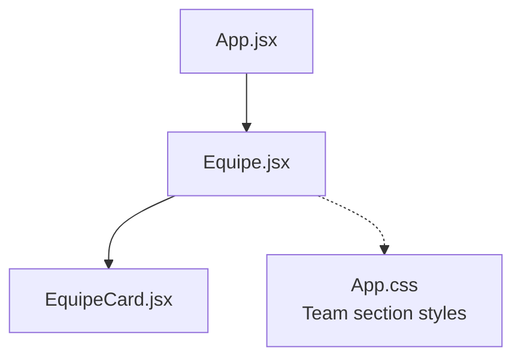
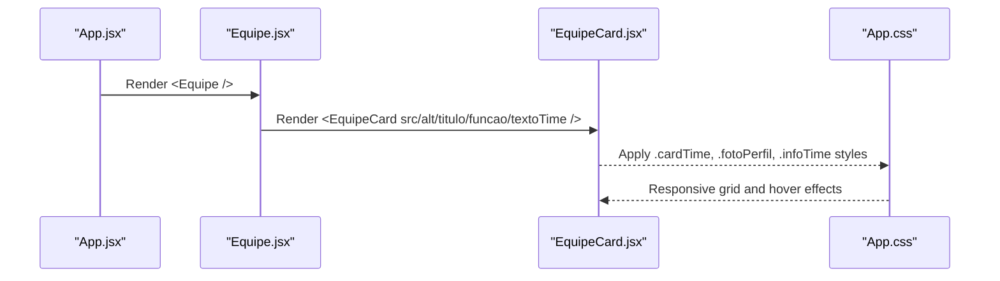
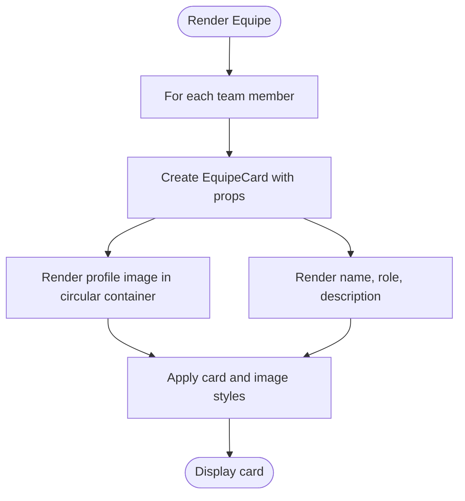
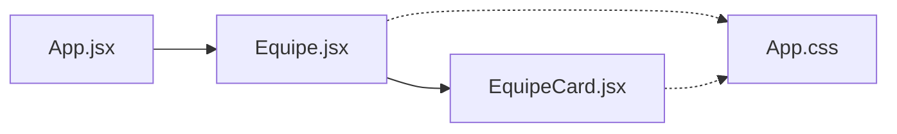

# Team Presentation

<cite>
**Referenced Files in This Document**
- [Equipe.jsx](file://src/components/Equipe.jsx)
- [EquipeCard.jsx](file://src/components/EquipeCard.jsx)
- [App.jsx](file://src/App.jsx)
- [App.css](file://src/App.css)
</cite>

## Table of Contents
1. [Introduction](#introduction)
2. [Project Structure](#project-structure)
3. [Core Components](#core-components)
4. [Architecture Overview](#architecture-overview)
5. [Detailed Component Analysis](#detailed-component-analysis)
6. [Dependency Analysis](#dependency-analysis)
7. [Performance Considerations](#performance-considerations)
8. [Troubleshooting Guide](#troubleshooting-guide)
9. [Conclusion](#conclusion)

## Introduction
This document explains the team presentation implementation focused on the Equipe and EquipeCard components. It covers how team member cards are structured, how profile images and role information are displayed, and how the layout adapts across screen sizes. It also provides guidance for extending the components to include social media links and improving accessibility and performance.

## Project Structure
The team section is composed of:
- A parent section component that renders a grid of team cards
- A reusable card component that displays a profile image, name, role, and short description
- Global styles that define the responsive grid and card appearance

**Diagram sources**
- [App.jsx:1-26](file://src/App.jsx#L1-L26)
- [Equipe.jsx:1-75](file://src/components/Equipe.jsx#L1-L75)
- [EquipeCard.jsx:1-27](file://src/components/EquipeCard.jsx#L1-L27)
- [App.css:680-759](file://src/App.css#L680-L759)

**Section sources**
- [App.jsx:1-26](file://src/App.jsx#L1-L26)
- [Equipe.jsx:1-75](file://src/components/Equipe.jsx#L1-L75)
- [EquipeCard.jsx:1-27](file://src/components/EquipeCard.jsx#L1-L27)
- [App.css:680-759](file://src/App.css#L680-L759)

## Core Components
- Equipe: Renders the team section header and a grid of EquipeCard instances with static data for each team member.
- EquipeCard: Displays a single team member’s profile image, name, role, and short description.

Key responsibilities:
- Equipe manages content composition and passes props to EquipeCard.
- EquipeCard focuses on presentation of one team member.

**Section sources**
- [Equipe.jsx:1-75](file://src/components/Equipe.jsx#L1-L75)
- [EquipeCard.jsx:1-27](file://src/components/EquipeCard.jsx#L1-L27)

## Architecture Overview
The team section follows a simple parent-child pattern:
- App includes Equipe as one of its sections.
- Equipe renders multiple EquipeCard components.
- Styles in App.css control the responsive grid and card visuals.

**Diagram sources**
- [App.jsx:11-22](file://src/App.jsx#L11-L22)
- [Equipe.jsx:23-69](file://src/components/Equipe.jsx#L23-L69)
- [EquipeCard.jsx:1-27](file://src/components/EquipeCard.jsx#L1-L27)
- [App.css:683-759](file://src/App.css#L683-L759)

## Detailed Component Analysis

### Equipe Component
Responsibilities:
- Provides the section heading and introductory text.
- Renders a grid container (gridTime) with multiple EquipeCard instances.
- Passes profile image path, alt text, name, role, and short description to each card.

Props usage examples:
- Profile image path via src
- Accessible alt text via alt
- Member name via titulo
- Role/title via funcao
- Short description via textoTime

Current data model per member:
- Image source
- Alt text
- Name
- Role
- Description

Note: Social media links are not currently part of the data model or UI.

**Section sources**
- [Equipe.jsx:1-75](file://src/components/Equipe.jsx#L1-L75)

### EquipeCard Component
Responsibilities:
- Renders a semantic article element representing a single team member.
- Displays a circular profile image container and an info block with name, role, and description.

Props interface:
- src: string — Path to the profile image
- alt: string — Accessible alternative text for the image
- titulo: string — Member’s full name
- funcao: string — Member’s role or title
- textoTime: string — Short description of responsibilities

Rendering structure:
- Container: article.cardTime
- Image wrapper: div.fotoPerfil containing img
- Info block: div.infoTime with h3 (name), p.funcao (role), p.textoTime (description)

Accessibility highlights:
- Uses semantic article and heading elements
- Provides alt text for images
- Clear hierarchy from name to role to description

Extensibility points:
- Add social media props (e.g., linkedin, github, twitter) and render icon links inside infoTime
- Introduce a prop for avatar shape or size if needed

**Section sources**
- [EquipeCard.jsx:1-27](file://src/components/EquipeCard.jsx#L1-L27)

### Styling and Responsive Layout
Grid behavior:
- Base grid uses five columns for large screens.
- At medium breakpoints, it switches to three columns.
- At tablet breakpoint, it switches to two columns.
- At small screens, it collapses to a single column.

Card styling:
- Cards have padding, background color, border, rounded corners, and centered text.
- Hover state changes background, border color, and adds subtle lift and shadow.
- Profile image is constrained within a circular container and scaled using object-fit cover.

Typography:
- Name is bold and prominent.
- Role is highlighted with an accent color.
- Description has comfortable line height and muted color.

Breakpoints summary:
- Large: 5 columns
- Medium: 3 columns
- Tablet: 2 columns
- Small: 1 column

**Section sources**
- [App.css:683-759](file://src/App.css#L683-L759)
- [App.css:1106-1108](file://src/App.css#L1106-L1108)
- [App.css:1200-1202](file://src/App.css#L1200-L1202)
- [App.css:1280-1282](file://src/App.css#L1280-L1282)

### Data Flow and Rendering

[No sources needed since this diagram shows conceptual workflow, not actual code structure]

## Dependency Analysis
- App imports Equipe and mounts it in the application shell.
- Equipe imports EquipeCard and composes multiple instances.
- Both components rely on global CSS classes defined in App.css for layout and visual design.

**Diagram sources**
- [App.jsx:1-26](file://src/App.jsx#L1-L26)
- [Equipe.jsx:1-75](file://src/components/Equipe.jsx#L1-L75)
- [EquipeCard.jsx:1-27](file://src/components/EquipeCard.jsx#L1-L27)
- [App.css:680-759](file://src/App.css#L680-L759)

**Section sources**
- [App.jsx:1-26](file://src/App.jsx#L1-L26)
- [Equipe.jsx:1-75](file://src/components/Equipe.jsx#L1-L75)
- [EquipeCard.jsx:1-27](file://src/components/EquipeCard.jsx#L1-L27)
- [App.css:680-759](file://src/App.css#L680-L759)

## Performance Considerations
- Image sizing: The current setup scales images via CSS object-fit cover within a fixed-size container. Ensure images are appropriately sized to avoid unnecessary bandwidth.
- Lazy loading: Consider lazy-loading off-screen images to improve initial load time.
- Asset optimization: Use modern formats (e.g., WebP) and compress images to reduce payload.
- Avoid re-renders: Since EquipeCard is presentational and receives primitive props, it will be efficient; keep props minimal and stable.

[No sources needed since this section provides general guidance]

## Troubleshooting Guide
Common issues and resolutions:
- Image not visible or distorted:
  - Verify the image path passed via src is correct and accessible.
  - Ensure the image file exists at the expected location.
  - Confirm the container dimensions and object-fit behavior are applied by the CSS.
- Alt text missing:
  - Always provide meaningful alt text via the alt prop for accessibility.
- Layout breaks on certain screens:
  - Check the active breakpoint rules for gridTime and ensure no custom overrides conflict with the base styles.
- Hover effect not appearing:
  - Confirm the card container has the correct class and that CSS is loaded.

**Section sources**
- [Equipe.jsx:25-67](file://src/components/Equipe.jsx#L25-L67)
- [EquipeCard.jsx:1-27](file://src/components/EquipeCard.jsx#L1-L27)
- [App.css:683-759](file://src/App.css#L683-L759)

## Conclusion
The team presentation is implemented with a clear separation of concerns: Equipe composes the section and data, while EquipeCard handles the presentation of individual members. The layout is fully responsive through CSS Grid and media queries. To extend functionality, you can add social media link props to EquipeCard and corresponding rendering logic, while maintaining accessibility and performance best practices.