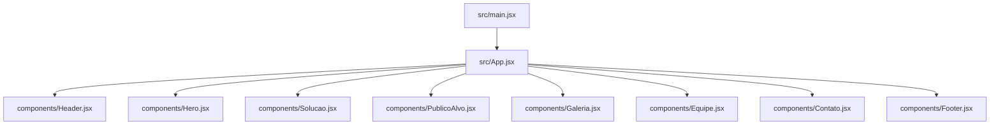
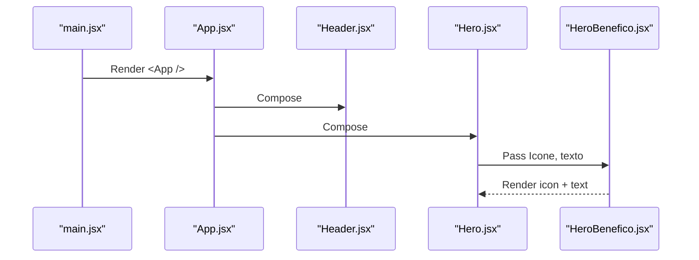
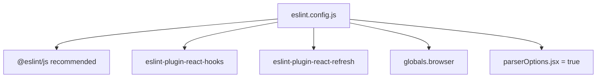

# Coding Standards & Conventions

<cite>
**Referenced Files in This Document**
- [eslint.config.js](file://eslint.config.js)
- [package.json](file://package.json)
- [README.md](file://README.md)
- [src/main.jsx](file://src/main.jsx)
- [src/App.jsx](file://src/App.jsx)
- [src/components/Header.jsx](file://src/components/Header.jsx)
- [src/components/HeaderLink.jsx](file://src/components/HeaderLink.jsx)
- [src/components/Hero.jsx](file://src/components/Hero.jsx)
- [src/components/HeroBenefico.jsx](file://src/components/HeroBenefico.jsx)
- [src/components/Solucao.jsx](file://src/components/Solucao.jsx)
- [src/components/PublicoAlvo.jsx](file://src/components/PublicoAlvo.jsx)
- [src/components/Galeria.jsx](file://src/components/Galeria.jsx)
- [src/components/Equipe.jsx](file://src/components/Equipe.jsx)
- [src/components/Contato.jsx](file://src/components/Contato.jsx)
- [src/components/Footer.jsx](file://src/components/Footer.jsx)
</cite>

## Table of Contents
1. Introduction
2. Project Structure
3. Core Components
4. Architecture Overview
5. Detailed Component Analysis
6. Dependency Analysis
7. Performance Considerations
8. Troubleshooting Guide
9. Conclusion

## Introduction
This document defines the coding standards and conventions for the OptiCode project, focusing on JavaScript/JSX style, naming patterns, file organization, import/export structure, ESLint configuration, JSX syntax, prop definitions, component composition, formatting rules, comments, and error handling. The goal is to ensure consistent, readable, and maintainable code across the codebase.

## Project Structure
OptiCode is a React + Vite application with components organized under src/components. The entry point mounts the root App component, which composes page sections (Header, Hero, Solucao, PublicoAlvo, Galeria, Equipe, Contato, Footer).

**Diagram sources**
- [src/main.jsx:1-11](file://src/main.jsx#L1-L11)
- [src/App.jsx:1-26](file://src/App.jsx#L1-L26)

**Section sources**
- [src/main.jsx:1-11](file://src/main.jsx#L1-L11)
- [src/App.jsx:1-26](file://src/App.jsx#L1-L26)

## Core Components
- Entry and composition:
  - Application bootstrap and strict mode wrapping are defined at the entry point.
  - Root App composes top-level page sections as child components.
- Section components:
  - Header, Hero, Solucao, PublicoAlvo, Galeria, Equipe, Contato, Footer each encapsulate a distinct page area.
- Reusable sub-components:
  - HeaderLink, HeroBeneficio, and others are used to reduce duplication and improve readability.

Key responsibilities:
- src/main.jsx: Bootstraps React and renders App inside StrictMode.
- src/App.jsx: Orchestrates section components.
- Section components: Render content and compose smaller UI pieces.

**Section sources**
- [src/main.jsx:1-11](file://src/main.jsx#L1-L11)
- [src/App.jsx:1-26](file://src/App.jsx#L1-L26)
- [src/components/Header.jsx:1-77](file://src/components/Header.jsx#L1-L77)
- [src/components/Hero.jsx:1-67](file://src/components/Hero.jsx#L1-L67)
- [src/components/Solucao.jsx:1-74](file://src/components/Solucao.jsx#L1-L74)
- [src/components/PublicoAlvo.jsx:1-88](file://src/components/PublicoAlvo.jsx#L1-L88)
- [src/components/Galeria.jsx:1-55](file://src/components/Galeria.jsx#L1-L55)
- [src/components/Equipe.jsx:1-75](file://src/components/Equipe.jsx#L1-L75)
- [src/components/Contato.jsx:1-112](file://src/components/Contato.jsx#L1-L112)
- [src/components/Footer.jsx:1-127](file://src/components/Footer.jsx#L1-L127)

## Architecture Overview
The application follows a unidirectional data flow where parent components pass props to children. There is no state management library; components are primarily presentational. Icons are imported from react-icons and passed as props to renderers.

**Diagram sources**
- [src/main.jsx:6-10](file://src/main.jsx#L6-L10)
- [src/App.jsx:11-23](file://src/App.jsx#L11-L23)
- [src/components/Hero.jsx:43-56](file://src/components/Hero.jsx#L43-L56)
- [src/components/HeroBenefico.jsx:1-11](file://src/components/HeroBenefico.jsx#L1-L11)

## Detailed Component Analysis

### Naming Conventions
- Components: PascalCase for component files and default exports (e.g., Header, Hero, Solucao).
- Functions: camelCase for function declarations and destructured props (e.g., href, texto, titulo, textoTime).
- CSS classes: BEM-like or descriptive kebab/camel names used consistently within components.
- Props: camelCase for prop names; when passing React components as props, use a clear name like Icone.

Examples in codebase:
- Component default export pattern: see Header, Hero, Solucao, PublicoAlvo, Galeria, Equipe, Contato, Footer.
- Function component with destructured props: see HeaderLink, HeroBeneficio.

**Section sources**
- [src/components/Header.jsx:1-77](file://src/components/Header.jsx#L1-L77)
- [src/components/HeaderLink.jsx:1-14](file://src/components/HeaderLink.jsx#L1-L14)
- [src/components/Hero.jsx:1-67](file://src/components/Hero.jsx#L1-L67)
- [src/components/HeroBenefico.jsx:1-12](file://src/components/HeroBenefico.jsx#L1-L12)

### File Organization and Import/Export Patterns
- One component per file under src/components.
- Relative imports for sibling components (e.g., "./HeaderLink").
- External libraries imported directly (e.g., react-icons).
- Default exports for components; named imports for icons.

Best practices observed:
- Group related components together (e.g., Header uses HeaderLink).
- Keep imports close to usage and avoid unused imports.

**Section sources**
- [src/components/Header.jsx:1-77](file://src/components/Header.jsx#L1-L77)
- [src/components/Hero.jsx:1-67](file://src/components/Hero.jsx#L1-L67)
- [src/components/Solucao.jsx:1-74](file://src/components/Solucao.jsx#L1-L74)
- [src/components/PublicoAlvo.jsx:1-88](file://src/components/PublicoAlvo.jsx#L1-L88)
- [src/components/Galeria.jsx:1-55](file://src/components/Galeria.jsx#L1-L55)
- [src/components/Equipe.jsx:1-75](file://src/components/Equipe.jsx#L1-L75)
- [src/components/Contato.jsx:1-112](file://src/components/Contato.jsx#L1-L112)
- [src/components/Footer.jsx:1-127](file://src/components/Footer.jsx#L1-L127)

### JSX Syntax and Accessibility
- Use semantic HTML elements (header, nav, section, footer, address, figure).
- Provide alt text for images and aria attributes for interactive elements.
- Avoid unnecessary wrapper fragments unless required by layout.

Accessibility examples:
- aria-hidden on decorative icons.
- aria-label and aria-expanded on menu toggle.
- alt descriptions on images.

**Section sources**
- [src/components/Header.jsx:10-22](file://src/components/Header.jsx#L10-L22)
- [src/components/Galeria.jsx:23-28](file://src/components/Galeria.jsx#L23-L28)

### Prop Interfaces and Composition Patterns
- Props are passed via destructuring in function components.
- Icon components are passed as props to renderers (e.g., HeroBeneficio receives Icone).
- Reusable card-like components accept structured props (e.g., SolucaoCard, PublicoAlvoCard, EquipeCard, ContatoItem, ContatoForm).

Recommended prop interface pattern (conceptual):
- Define a single object describing all props for clarity and consistency.
- Validate critical props at runtime if needed.

Observed patterns:
- Icon-based cards: { Icone, titulo, texto }
- Team cards: { src, alt, titulo, funcao, textoTime }
- Contact form fields: { label, type, id, name, placeholder, textarea? }

**Section sources**
- [src/components/Hero.jsx:43-56](file://src/components/Hero.jsx#L43-L56)
- [src/components/HeroBenefico.jsx:1-11](file://src/components/HeroBenefico.jsx#L1-L11)
- [src/components/Solucao.jsx:27-66](file://src/components/Solucao.jsx#L27-L66)
- [src/components/PublicoAlvo.jsx:56-77](file://src/components/PublicoAlvo.jsx#L56-L77)
- [src/components/Equipe.jsx:25-67](file://src/components/Equipe.jsx#L25-L67)
- [src/components/Contato.jsx:38-94](file://src/components/Contato.jsx#L38-L94)

### Code Formatting Rules
- Indentation: 2 spaces (consistent across components).
- Quotes: Single quotes for strings and imports.
- Semicolons: Used consistently.
- Trailing commas: Not used in current files.
- Line length: Keep lines concise; break long JSX into multiple lines for readability.
- Prettier is not configured; rely on ESLint recommended rules and manual consistency.

Formatting anti-patterns to avoid:
- Mixed indentation or inconsistent spacing.
- Inconsistent quote styles.
- Missing semicolons.
- Overly long JSX expressions without line breaks.

**Section sources**
- [src/components/Header.jsx:1-77](file://src/components/Header.jsx#L1-L77)
- [src/components/Hero.jsx:1-67](file://src/components/Hero.jsx#L1-L67)
- [src/components/Footer.jsx:1-127](file://src/components/Footer.jsx#L1-L127)

### Comment Standards
- Inline comments should explain non-obvious logic.
- Prefer self-descriptive variable and prop names over excessive comments.
- Use JSDoc-style comments for reusable components if documenting prop contracts.

Current practice:
- Minimal inline comments; most logic is straightforward JSX.

Recommendations:
- Add JSDoc to complex components to document props and behavior.
- Keep comments up-to-date with changes.

**Section sources**
- [src/components/Header.jsx:1-77](file://src/components/Header.jsx#L1-L77)
- [src/components/Hero.jsx:1-67](file://src/components/Hero.jsx#L1-L67)

### Error Handling Approaches
- No explicit try/catch blocks in components; errors are expected to be handled at higher levels or via external services.
- For forms, consider adding validation and user feedback before submission.
- For network requests, implement error states and retry logic.

Recommended approach:
- Wrap async operations with try/catch and display user-friendly messages.
- Use React error boundaries for graceful degradation.

**Section sources**
- [src/components/Contato.jsx:62-104](file://src/components/Contato.jsx#L62-L104)

## Dependency Analysis
External dependencies relevant to coding standards:
- ESLint configuration enforces recommended JS rules, React Hooks rules, and React Refresh rules.
- Globals include browser environment.
- JSX parsing is enabled.

**Diagram sources**
- [eslint.config.js:1-22](file://eslint.config.js#L1-L22)

**Section sources**
- [eslint.config.js:1-22](file://eslint.config.js#L1-L22)
- [package.json:19-28](file://package.json#L19-L28)

## Performance Considerations
- Prefer memoization for expensive computations if components re-render frequently.
- Avoid unnecessary re-renders by keeping components focused and props minimal.
- Lazy load heavy assets (images/videos) when appropriate.
- Keep bundle size small by importing only needed icons.

[No sources needed since this section provides general guidance]

## Troubleshooting Guide
Common issues and resolutions:
- Linting errors:
  - Ensure JSX is parsed correctly (parserOptions.jsx enabled).
  - Follow React Hooks rules (no conditional hooks).
- Build warnings:
  - Remove unused imports.
  - Verify asset paths for images and videos.
- Accessibility issues:
  - Add alt text to images.
  - Ensure interactive elements have proper aria attributes.

Actions:
- Run linting via npm script.
- Review ESLint output and fix reported issues.

**Section sources**
- [package.json:6-10](file://package.json#L6-L10)
- [eslint.config.js:10-19](file://eslint.config.js#L10-L19)

## Conclusion
Adhering to these coding standards ensures consistency, accessibility, and maintainability across the OptiCode codebase. By following the naming conventions, file organization, import/export patterns, JSX best practices, and ESLint rules, the team can collaborate effectively and deliver high-quality React applications.

[No sources needed since this section summarizes without analyzing specific files]