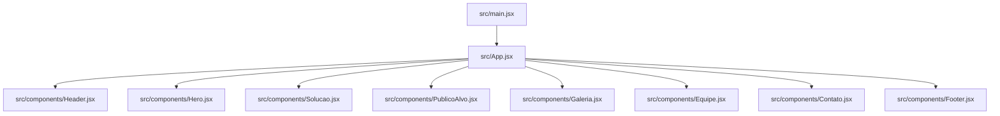
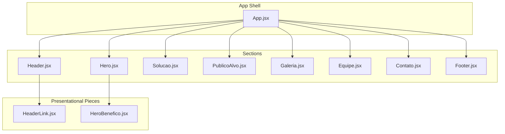
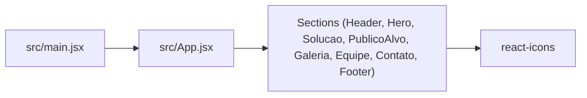

# Component Development Patterns

<cite>
**Referenced Files in This Document**
- [main.jsx](file://src/main.jsx)
- [App.jsx](file://src/App.jsx)
- [Header.jsx](file://src/components/Header.jsx)
- [HeaderLink.jsx](file://src/components/HeaderLink.jsx)
- [Hero.jsx](file://src/components/Hero.jsx)
- [HeroBenefico.jsx](file://src/components/HeroBenefico.jsx)
- [Solucao.jsx](file://src/components/Solucao.jsx)
- [PublicoAlvo.jsx](file://src/components/PublicoAlvo.jsx)
- [Galeria.jsx](file://src/components/Galeria.jsx)
- [Equipe.jsx](file://src/components/Equipe.jsx)
- [Contato.jsx](file://src/components/Contato.jsx)
- [Footer.jsx](file://src/components/Footer.jsx)
- [package.json](file://package.json)
</cite>

## Table of Contents
1. [Introduction](#introduction)
2. [Project Structure](#project-structure)
3. [Core Components](#core-components)
4. [Architecture Overview](#architecture-overview)
5. [Detailed Component Analysis](#detailed-component-analysis)
6. [Dependency Analysis](#dependency-analysis)
7. [Performance Considerations](#performance-considerations)
8. [Troubleshooting Guide](#troubleshooting-guide)
9. [Conclusion](#conclusion)

## Introduction
This document defines component development patterns for the OptiCode React project. It explains how to build new components following established conventions, including presentational vs container roles, props-based data flow, composition strategies, standard file structure, styling with Tailwind CSS, and icon integration with react-icons. It also covers testing approaches, performance optimization techniques, and accessibility requirements.

## Project Structure
OptiCode is a Vite + React application. The entry point renders App inside StrictMode. App composes top-level page sections (Header, Hero, Solucao, PublicoAlvo, Galeria, Equipe, Contato, Footer). Each section is implemented as a presentational component that composes smaller presentational pieces via props.

**Diagram sources**
- [main.jsx:1-11](file://src/main.jsx#L1-L11)
- [App.jsx:1-26](file://src/App.jsx#L1-L26)

**Section sources**
- [main.jsx:1-11](file://src/main.jsx#L1-L11)
- [App.jsx:1-26](file://src/App.jsx#L1-L26)

## Core Components
The codebase follows a clear pattern:
- Presentational components render UI using props and compose other presentational components.
- Data and behavior are kept minimal at this layer; stateful logic would be placed in container components if needed.
- Icons come from react-icons and are passed as props to small presentational components.
- Styling uses Tailwind utility classes where appropriate.

Key examples:
- Header composes HeaderLink items.
- Hero composes HeroBeneficio items and passes icon components as props.
- Solucao, PublicoAlvo, Equipe, and Galeria compose card-like presentational components.
- Contato composes form fields and contact info items.
- Footer composes columns and links.

**Section sources**
- [Header.jsx:1-77](file://src/components/Header.jsx#L1-L77)
- [HeaderLink.jsx:1-14](file://src/components/HeaderLink.jsx#L1-L14)
- [Hero.jsx:1-67](file://src/components/Hero.jsx#L1-L67)
- [HeroBenefico.jsx:1-12](file://src/components/HeroBenefico.jsx#L1-L12)
- [Solucao.jsx:1-74](file://src/components/Solucao.jsx#L1-L74)
- [PublicoAlvo.jsx:1-88](file://src/components/PublicoAlvo.jsx#L1-L88)
- [Galeria.jsx:1-55](file://src/components/Galeria.jsx#L1-L55)
- [Equipe.jsx:1-75](file://src/components/Equipe.jsx#L1-L75)
- [Contato.jsx:1-112](file://src/components/Contato.jsx#L1-L112)
- [Footer.jsx:1-127](file://src/components/Footer.jsx#L1-L127)

## Architecture Overview
OptiCode uses a flat, feature-oriented layout under src/components. Each major page section is a presentational component composed by App. Small reusable pieces (links, cards, list items) are extracted into their own files and composed via props.

**Diagram sources**
- [App.jsx:1-26](file://src/App.jsx#L1-L26)
- [Header.jsx:1-77](file://src/components/Header.jsx#L1-L77)
- [HeaderLink.jsx:1-14](file://src/components/HeaderLink.jsx#L1-L14)
- [Hero.jsx:1-67](file://src/components/Hero.jsx#L1-L67)
- [HeroBenefico.jsx:1-12](file://src/components/HeroBenefico.jsx#L1-L12)

## Detailed Component Analysis

### Presentational vs Container Components
- Presentational components: All current components in src/components are presentational—they receive data via props and render UI. Examples include Header, Hero, Solucao, PublicoAlvo, Galeria, Equipe, Contato, Footer, and their subcomponents like HeaderLink and HeroBenefico.
- Container components: Not present yet. When adding state or side effects (e.g., fetching data), create a container component near App that manages state and passes data down to presentational components. Keep presentational components pure and focused on rendering.

Guidelines:
- Keep components small and single-responsibility.
- Prefer passing data via props rather than global state for simple cases.
- If a component needs state, lift it up to a parent container and pass callbacks for user interactions.

**Section sources**
- [Header.jsx:1-77](file://src/components/Header.jsx#L1-L77)
- [Hero.jsx:1-67](file://src/components/Hero.jsx#L1-L67)
- [Solucao.jsx:1-74](file://src/components/Solucao.jsx#L1-L74)
- [PublicoAlvo.jsx:1-88](file://src/components/PublicoAlvo.jsx#L1-L88)
- [Galeria.jsx:1-55](file://src/components/Galeria.jsx#L1-L55)
- [Equipe.jsx:1-75](file://src/components/Equipe.jsx#L1-L75)
- [Contato.jsx:1-112](file://src/components/Contato.jsx#L1-L112)
- [Footer.jsx:1-127](file://src/components/Footer.jsx#L1-L127)

### Props-Based Data Flow
Common patterns observed:
- Icon components are passed as props to renderers (e.g., HeroBenefico receives an Icon prop).
- Textual content and metadata are passed as string props (e.g., titulo, texto, src, alt).
- Links and navigation items are configured via href and texto props.

Recommendations:
- Define explicit prop names and types (PropTypes or TypeScript) for clarity.
- Provide sensible defaults via default parameters or PropTypes defaults.
- Avoid prop drilling beyond two levels; consider context or a small store when deeper nesting is necessary.

Example references:
- Hero passes Icone and texto to HeroBenefico.
- Header passes href and texto to HeaderLink.
- GaleriaFotos-like usage passes src and alt.

**Section sources**
- [Hero.jsx:1-67](file://src/components/Hero.jsx#L1-L67)
- [HeroBenefico.jsx:1-12](file://src/components/HeroBenefico.jsx#L1-L12)
- [Header.jsx:1-77](file://src/components/Header.jsx#L1-L77)
- [HeaderLink.jsx:1-14](file://src/components/HeaderLink.jsx#L1-L14)
- [Galeria.jsx:1-55](file://src/components/Galeria.jsx#L1-L55)

### Component Composition Strategies
- Section-to-card composition: Sections like Solucao, PublicoAlvo, Equipe, and Galeria compose multiple card-like components.
- List item composition: HeaderLink and HeroBenefico encapsulate repeated list item patterns.
- Form field composition: Contato composes a reusable form field component for inputs and textareas.

Best practices:
- Extract repeated structures into small components.
- Compose complex layouts by combining smaller presentational units.
- Use children prop where a component should wrap arbitrary content (e.g., FooterColuna).

**Section sources**
- [Solucao.jsx:1-74](file://src/components/Solucao.jsx#L1-L74)
- [PublicoAlvo.jsx:1-88](file://src/components/PublicoAlvo.jsx#L1-L88)
- [Equipe.jsx:1-75](file://src/components/Equipe.jsx#L1-L75)
- [Galeria.jsx:1-55](file://src/components/Galeria.jsx#L1-L55)
- [Header.jsx:1-77](file://src/components/Header.jsx#L1-L77)
- [Hero.jsx:1-67](file://src/components/Hero.jsx#L1-L67)
- [Contato.jsx:1-112](file://src/components/Contato.jsx#L1-L112)

### Standard Component Structure
Recommended structure for new components:
- File naming: PascalCase for component files (e.g., Card.jsx, Button.jsx).
- Imports: Group third-party imports (react-icons), then local component imports, then styles.
- Default export: Export the component as default.
- Prop validation: Add PropTypes or TypeScript definitions for required and optional props.
- Accessibility: Include aria attributes where needed and ensure semantic HTML.

References:
- All components use default exports.
- react-icons are imported directly and used as components.

**Section sources**
- [Header.jsx:1-77](file://src/components/Header.jsx#L1-L77)
- [Hero.jsx:1-67](file://src/components/Hero.jsx#L1-L67)
- [package.json:12-17](file://package.json#L12-L17)

### Reusable UI Components Guidelines

#### Cards
- Purpose: Display structured information blocks (e.g., features, team members, audience segments).
- Props: title, description, icon (optional), image (optional), actions (optional).
- Composition: Compose within sections using lists or grids.
- Styling: Use Tailwind utilities for spacing, typography, and responsive layout.

References:
- SolucaoCard-like usage in Solucao.
- PublicoAlvoCard-like usage in PublicoAlvo.
- EquipeCard-like usage in Equipe.

**Section sources**
- [Solucao.jsx:1-74](file://src/components/Solucao.jsx#L1-L74)
- [PublicoAlvo.jsx:1-88](file://src/components/PublicoAlvo.jsx#L1-L88)
- [Equipe.jsx:1-75](file://src/components/Equipe.jsx#L1-L75)

#### Forms
- Purpose: Collect user input (e.g., contact form).
- Props: label, type, id, name, placeholder, textarea flag, validation rules.
- Behavior: Controlled inputs with state managed by a container component; submit handler passed down.
- Accessibility: Associate labels with inputs, provide error messages, and ensure keyboard navigation.

Reference:
- Contato composes form fields and a submit button.

**Section sources**
- [Contato.jsx:1-112](file://src/components/Contato.jsx#L1-L112)

#### Navigation Elements
- Purpose: Link items in headers and footers.
- Props: href, texto, active state (optional), onClick (optional).
- Accessibility: Ensure focus states and screen-reader-friendly labels.

References:
- HeaderLink in Header.
- FooterLink usage in Footer.

**Section sources**
- [Header.jsx:1-77](file://src/components/Header.jsx#L1-L77)
- [HeaderLink.jsx:1-14](file://src/components/HeaderLink.jsx#L1-L14)
- [Footer.jsx:1-127](file://src/components/Footer.jsx#L1-L127)

### Step-by-Step Example: Implementing a New Feature Card
Goal: Create a new feature card component and integrate it into a section.

Steps:
1. Create a new file FeatureCard.jsx in src/components.
2. Define props: title, description, icon (from react-icons), and optional action.
3. Render a semantic card element with Tailwind classes for layout and spacing.
4. Import the icon component from react-icons and render it conditionally.
5. Export the component as default.
6. In the target section (e.g., Solucao), import FeatureCard and render multiple instances with different props.
7. Test visually and verify accessibility (aria-labels, alt texts, headings hierarchy).

References:
- Existing card-like compositions in Solucao, PublicoAlvo, Equipe.
- Icon usage patterns in Hero and Solucao.

**Section sources**
- [Solucao.jsx:1-74](file://src/components/Solucao.jsx#L1-L74)
- [PublicoAlvo.jsx:1-88](file://src/components/PublicoAlvo.jsx#L1-L88)
- [Equipe.jsx:1-75](file://src/components/Equipe.jsx#L1-L75)
- [Hero.jsx:1-67](file://src/components/Hero.jsx#L1-L67)

### Styling with Tailwind CSS
- Use Tailwind utility classes inline for quick styling.
- Maintain consistent spacing and typography scales across components.
- Prefer semantic elements (section, nav, address) and add Tailwind classes for layout.

References:
- PublicoAlvo uses Tailwind classes for icon sizing and color.

**Section sources**
- [PublicoAlvo.jsx:1-88](file://src/components/PublicoAlvo.jsx#L1-L88)

### Icon Integration with react-icons
- Import specific icons from react-icons packages.
- Pass icon components as props to presentational components.
- Ensure icons have accessible descriptions when they convey meaning.

References:
- Hero imports and uses react-icons for benefits.
- Solucao imports and uses react-icons for feature cards.

**Section sources**
- [Hero.jsx:1-67](file://src/components/Hero.jsx#L1-L67)
- [Solucao.jsx:1-74](file://src/components/Solucao.jsx#L1-L74)
- [package.json:12-17](file://package.json#L12-L17)

## Dependency Analysis
High-level dependencies:
- main.jsx bootstraps the app and renders App.
- App composes all top-level sections.
- Sections depend on smaller presentational components and react-icons.
- package.json declares dependencies for React, ReactDOM, Tailwind, and react-icons.

**Diagram sources**
- [main.jsx:1-11](file://src/main.jsx#L1-L11)
- [App.jsx:1-26](file://src/App.jsx#L1-L26)
- [package.json:12-17](file://package.json#L12-L17)

**Section sources**
- [main.jsx:1-11](file://src/main.jsx#L1-L11)
- [App.jsx:1-26](file://src/App.jsx#L1-L26)
- [package.json:1-31](file://package.json#L1-L31)

## Performance Considerations
- Keep components presentational and avoid unnecessary re-renders by memoizing expensive computations if needed.
- Prefer functional components and hooks for simplicity and performance.
- Use lazy loading for heavy assets (images, videos) and consider loading images only when visible.
- Minimize prop drilling; use context sparingly for truly global data.
- Leverage Tailwind’s utility-first approach to reduce custom CSS overhead.

[No sources needed since this section provides general guidance]

## Troubleshooting Guide
Common issues and resolutions:
- Missing icon imports: Ensure react-icons are imported and passed correctly as components.
- Broken image paths: Verify relative paths for images and videos referenced in components.
- Accessibility warnings: Add aria attributes to interactive elements and ensure meaningful alt texts for images.
- Linting errors: Follow ESLint rules configured in the project; keep imports organized and avoid unused variables.

References:
- Video and image usage in Hero and Galeria.
- Interactive elements in Header and Contato.

**Section sources**
- [Hero.jsx:1-67](file://src/components/Hero.jsx#L1-L67)
- [Galeria.jsx:1-55](file://src/components/Galeria.jsx#L1-L55)
- [Header.jsx:1-77](file://src/components/Header.jsx#L1-L77)
- [Contato.jsx:1-112](file://src/components/Contato.jsx#L1-L112)

## Conclusion
OptiCode’s component architecture emphasizes small, presentational components composed via props, with clear separation of concerns and straightforward data flow. By following the patterns outlined here—standard file structure, props-based composition, Tailwind styling, and react-icons integration—you can consistently extend the codebase with new components that are maintainable, accessible, and performant.

[No sources needed since this section summarizes without analyzing specific files]