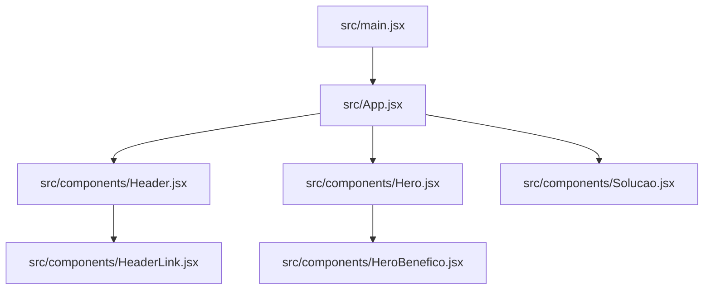
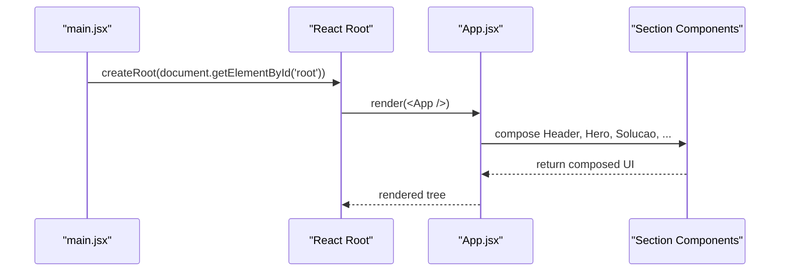
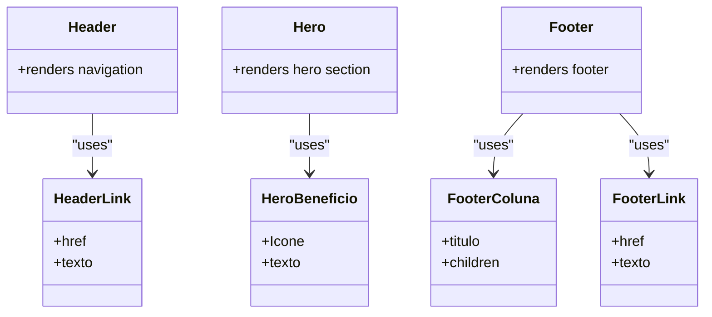
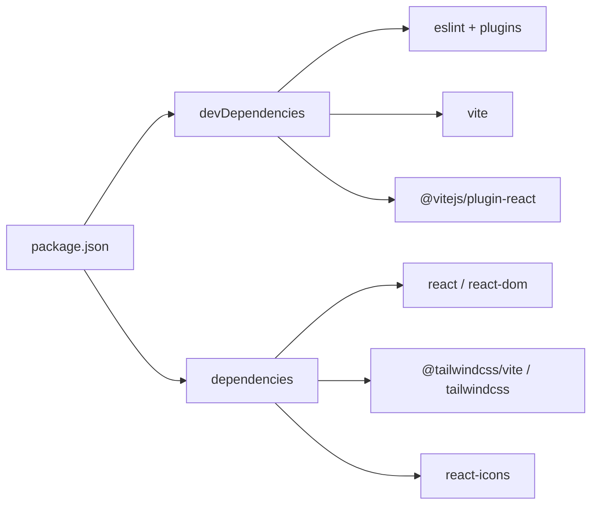

# Development Guidelines

<cite>
**Referenced Files in This Document**
- [README.md](file://README.md)
- [package.json](file://package.json)
- [eslint.config.js](file://eslint.config.js)
- [vite.config.js](file://vite.config.js)
- [.gitignore](file://.gitignore)
- [src/main.jsx](file://src/main.jsx)
- [src/App.jsx](file://src/App.jsx)
- [src/components/Header.jsx](file://src/components/Header.jsx)
- [src/components/HeaderLink.jsx](file://src/components/HeaderLink.jsx)
- [src/components/Footer.jsx](file://src/components/Footer.jsx)
- [src/components/FooterColuna.jsx](file://src/components/FooterColuna.jsx)
- [src/components/FooterLink.jsx](file://src/components/FooterLink.jsx)
- [src/components/Hero.jsx](file://src/components/Hero.jsx)
- [src/components/HeroBenefico.jsx](file://src/components/HeroBenefico.jsx)
- [src/components/Solucao.jsx](file://src/components/Solucao.jsx)
</cite>

## Table of Contents
1. [Introduction](#introduction)
2. [Project Structure](#project-structure)
3. [Core Components](#core-components)
4. [Architecture Overview](#architecture-overview)
5. [Detailed Component Analysis](#detailed-component-analysis)
6. [Dependency Analysis](#dependency-analysis)
7. [Performance Considerations](#performance-considerations)
8. [Troubleshooting Guide](#troubleshooting-guide)
9. [Conclusion](#conclusion)
10. [Appendices](#appendices)

## Introduction
This document establishes the development guidelines for OptiCode, a React + Vite application. It defines coding standards, ESLint rules, component patterns, Git workflow, testing approach, code review practices, performance and accessibility requirements, and security best practices. The goal is to make contributions predictable, maintainable, and accessible while keeping performance and security in mind.

## Project Structure
OptiCode follows a simple, feature-oriented structure:
- Application entry points are under src/.
- UI components live under src/components/.
- Global styles are applied via CSS files at the root of src/.
- Build and lint tooling are configured at the repository root.

**Diagram sources**
- [src/main.jsx:1-11](file://src/main.jsx#L1-L11)
- [src/App.jsx:1-26](file://src/App.jsx#L1-L26)
- [src/components/Header.jsx:1-77](file://src/components/Header.jsx#L1-L77)
- [src/components/HeaderLink.jsx:1-14](file://src/components/HeaderLink.jsx#L1-L14)
- [src/components/Hero.jsx:1-67](file://src/components/Hero.jsx#L1-L67)
- [src/components/HeroBenefico.jsx:1-12](file://src/components/HeroBenefico.jsx#L1-L12)
- [src/components/Solucao.jsx:1-74](file://src/components/Solucao.jsx#L1-L74)

**Section sources**
- [src/main.jsx:1-11](file://src/main.jsx#L1-L11)
- [src/App.jsx:1-26](file://src/App.jsx#L1-L26)

## Core Components
The application composes page sections from small, focused components:
- Header and Footer provide navigation and site-wide information.
- Hero presents the primary value proposition and calls to action.
- Solucao showcases product features using reusable cards.

Key patterns observed:
- Functional components with default exports.
- Props passed as JSX attributes (e.g., href, texto, Icone).
- Composition over inheritance; components render other components.

Examples of component usage:
- App composes multiple section components.
- Header uses HeaderLink to render navigation items.
- Hero uses HeroBeneficio to render benefit items.

**Section sources**
- [src/App.jsx:1-26](file://src/App.jsx#L1-L26)
- [src/components/Header.jsx:1-77](file://src/components/Header.jsx#L1-L77)
- [src/components/Hero.jsx:1-67](file://src/components/Hero.jsx#L1-L67)
- [src/components/Solucao.jsx:1-74](file://src/components/Solucao.jsx#L1-L74)

## Architecture Overview
OptiCode is a single-page React application bootstrapped by Vite. The runtime flow is straightforward:
- main.jsx creates the React root and renders App inside StrictMode.
- App composes top-level sections.
- Each section renders its own subcomponents.

**Diagram sources**
- [src/main.jsx:1-11](file://src/main.jsx#L1-L11)
- [src/App.jsx:1-26](file://src/App.jsx#L1-L26)

## Detailed Component Analysis

### Naming Conventions and File Organization
- Use PascalCase for component names and file names (e.g., Header.jsx, Hero.jsx).
- Keep one component per file unless components are tightly coupled and very small.
- Place all UI components under src/components/.
- Prefer functional components with default exports.

Evidence in codebase:
- All components follow PascalCase naming and default export pattern.
- Components are organized by feature area within src/components/.

**Section sources**
- [src/components/Header.jsx:1-77](file://src/components/Header.jsx#L1-L77)
- [src/components/Hero.jsx:1-67](file://src/components/Hero.jsx#L1-L67)
- [src/components/Solucao.jsx:1-74](file://src/components/Solucao.jsx#L1-L74)

### Prop Interface Definitions
- Define props explicitly using destructuring in function parameters.
- Provide clear prop names that describe intent (e.g., href, texto, Icone, titulo, children).
- For icon components passed as props, use a consistent prop name (Icone) and ensure it is a valid React element or component reference.

Observed examples:
- HeaderLink receives href and texto.
- HeroBeneficio receives Icone and texto.
- FooterColuna receives titulo and children.

Recommendations:
- Add PropTypes or TypeScript types for better safety and IDE support.
- Mark required vs optional props clearly.

**Section sources**
- [src/components/HeaderLink.jsx:1-14](file://src/components/HeaderLink.jsx#L1-L14)
- [src/components/HeroBenefico.jsx:1-12](file://src/components/HeroBenefico.jsx#L1-L12)
- [src/components/FooterColuna.jsx:1-15](file://src/components/FooterColuna.jsx#L1-L15)

### Component Patterns
- Composition: Larger components delegate rendering to smaller ones (Header uses HeaderLink; Hero uses HeroBeneficio).
- Presentational focus: Components primarily render UI and accept data via props.
- Reusability: Cards and link components are reused across sections.

**Diagram sources**
- [src/components/Header.jsx:1-77](file://src/components/Header.jsx#L1-L77)
- [src/components/HeaderLink.jsx:1-14](file://src/components/HeaderLink.jsx#L1-L14)
- [src/components/Hero.jsx:1-67](file://src/components/Hero.jsx#L1-L67)
- [src/components/HeroBenefico.jsx:1-12](file://src/components/HeroBenefico.jsx#L1-L12)
- [src/components/Footer.jsx:1-127](file://src/components/Footer.jsx#L1-L127)
- [src/components/FooterColuna.jsx:1-15](file://src/components/FooterColuna.jsx#L1-L15)
- [src/components/FooterLink.jsx:1-11](file://src/components/FooterLink.jsx#L1-L11)

### Adding New Components
Follow these steps when adding a new component:
1. Create a new file under src/components/ named after the component (PascalCase).
2. Export the component as default.
3. Define props using destructuring and document them inline.
4. Compose existing components where possible.
5. Import and place the component in the appropriate parent (e.g., App or a section component).
6. Run linters and build to validate correctness.

**Section sources**
- [src/App.jsx:1-26](file://src/App.jsx#L1-L26)

### Error Handling Patterns
- Validate props early in components to avoid runtime errors.
- Provide user-friendly messages for invalid states.
- Avoid swallowing errors; log meaningful context during development.

[No sources needed since this section provides general guidance]

### Documentation Standards
- Keep README updated for project setup and scripts.
- Add inline comments for complex logic.
- Document component props and expected behavior in JSDoc or similar.

**Section sources**
- [README.md:1-17](file://README.md#L1-L17)

## Dependency Analysis
Top-level dependencies and tooling:
- React and ReactDOM for UI.
- Vite for build and dev server.
- Tailwind CSS via @tailwindcss/vite plugin.
- ESLint with recommended configs for JS and React Hooks.
- react-icons for iconography.

**Diagram sources**
- [package.json:1-31](file://package.json#L1-L31)

**Section sources**
- [package.json:1-31](file://package.json#L1-L31)

## Performance Considerations
- Prefer static assets under public/ for large media; avoid bundling heavy resources.
- Use lazy loading for routes or heavy sections if the app grows.
- Minimize re-renders by memoizing expensive computations and stable references for props like icons.
- Keep component trees shallow and leverage composition.
- Leverage Vite’s fast HMR and optimized builds out of the box.

[No sources needed since this section provides general guidance]

## Troubleshooting Guide
Common issues and resolutions:
- Linting errors: Run npm run lint to identify and fix style and rule violations.
- Build failures: Ensure imports are correct and no missing dependencies.
- Styles not applying: Verify Tailwind plugin is enabled in Vite config.
- Icons not rendering: Confirm react-icons import paths and that the Icone prop is a valid component reference.

Relevant configuration:
- ESLint configuration enforces recommended rules for JavaScript and React Hooks.
- Vite config enables React and Tailwind plugins.

**Section sources**
- [eslint.config.js:1-22](file://eslint.config.js#L1-L22)
- [vite.config.js:1-10](file://vite.config.js#L1-L10)
- [package.json:6-10](file://package.json#L6-L10)

## Conclusion
By following these guidelines—consistent naming, explicit prop interfaces, composition-based components, strict linting, and thoughtful architecture—you will keep OptiCode maintainable, performant, and accessible. Adhering to the Git workflow and code review process ensures collaborative quality and predictability.

## Appendices

### Coding Standards and ESLint Rules
- Enforce recommended JavaScript rules and React Hooks best practices.
- Enable globals for browser environments.
- Configure parser options to support JSX.

Action items:
- Run npm run lint regularly.
- Fix warnings and errors before committing.

**Section sources**
- [eslint.config.js:1-22](file://eslint.config.js#L1-L22)
- [package.json:6-10](file://package.json#L6-L10)

### Code Style Conventions
- Use functional components with default exports.
- Use PascalCase for component names and files.
- Keep components small and focused on a single responsibility.
- Prefer declarative JSX and avoid imperative DOM manipulation.

**Section sources**
- [src/components/Header.jsx:1-77](file://src/components/Header.jsx#L1-L77)
- [src/components/Hero.jsx:1-67](file://src/components/Hero.jsx#L1-L67)

### Git Workflow, Commit Messages, and Branching Strategy
Recommended workflow:
- Create feature branches from main (e.g., feature/add-contact-form).
- Use conventional commit messages (e.g., feat:, fix:, docs:, style:, refactor:, test:, chore:).
- Keep commits atomic and descriptive.
- Open pull requests with clear descriptions and checklists.
- Request reviews from at least one maintainer.
- Squash and merge PRs into main after approval.

Branching strategy:
- main: production-ready code.
- develop: integration branch (optional for larger teams).
- feature/*: isolated work streams.
- hotfix/*: urgent fixes.

[No sources needed since this section provides general guidance]

### Testing Approaches
- Unit tests: Test pure functions and component rendering with a framework like Jest and React Testing Library.
- Integration tests: Validate component interactions and user flows.
- Accessibility tests: Use axe-core or similar tools to detect common accessibility issues.
- Performance tests: Measure render times and bundle size with Vite’s build output.

[No sources needed since this section provides general guidance]

### Code Review Process
Checklist:
- Does the code follow ESLint rules?
- Are components well-named and organized?
- Are props documented and validated?
- Is the UI accessible (semantic HTML, aria attributes)?
- Are there any performance concerns?
- Are changes covered by tests?
- Is documentation updated if needed?

[No sources needed since this section provides general guidance]

### Accessibility Requirements
- Use semantic HTML elements (header, nav, section, footer).
- Provide meaningful alt text for images and aria-labels for interactive elements.
- Ensure keyboard navigability and visible focus states.
- Maintain sufficient color contrast.

Observed example:
- Header menu button includes aria-label and aria-expanded attributes.

**Section sources**
- [src/components/Header.jsx:20-22](file://src/components/Header.jsx#L20-L22)

### Security Best Practices
- Sanitize user inputs and avoid injecting untrusted content.
- Use HTTPS for all network requests.
- Avoid storing secrets in client-side code; use environment variables managed securely.
- Keep dependencies up to date and monitor vulnerabilities.

[No sources needed since this section provides general guidance]

### Scripts and Tooling
- Development: npm run dev
- Build: npm run build
- Lint: npm run lint
- Preview: npm run preview

**Section sources**
- [package.json:6-10](file://package.json#L6-L10)

### Ignored Files and Directories
Ensure you do not commit generated or sensitive files:
- node_modules
- dist
- .local files
- Editor-specific directories

**Section sources**
- [.gitignore:1-25](file://.gitignore#L1-L25)