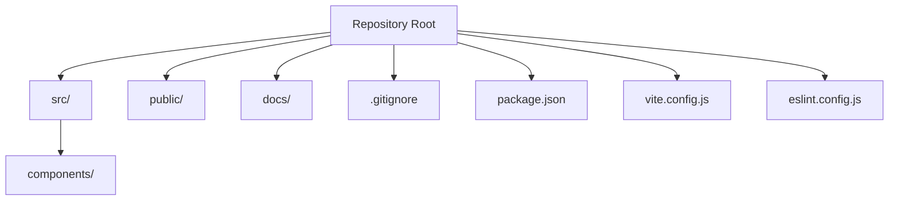
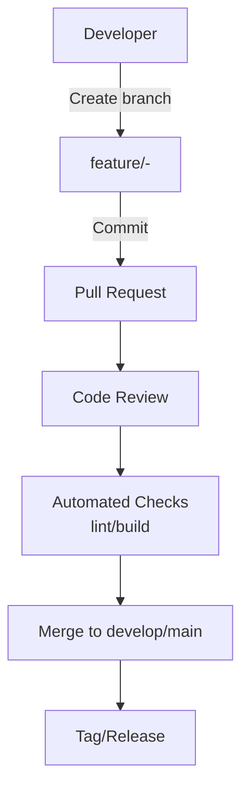
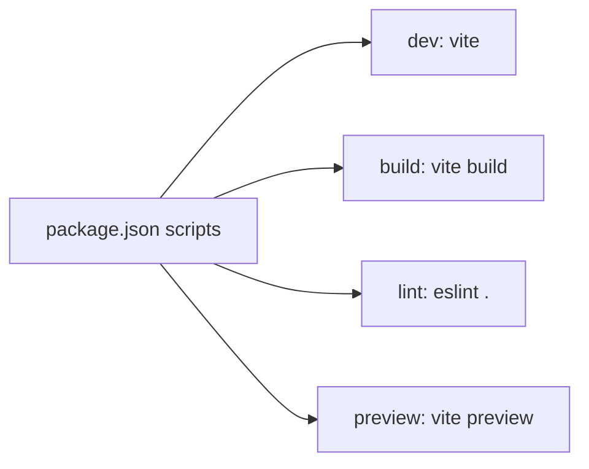

# Git Workflow & Version Control

<cite>
**Referenced Files in This Document**   
- [.gitignore](file://.gitignore)
- [README.md](file://README.md)
- [package.json](file://package.json)
</cite>

## Table of Contents
1. [Introduction](#introduction)
2. [Project Structure](#project-structure)
3. [Core Components](#core-components)
4. [Architecture Overview](#architecture-overview)
5. [Detailed Component Analysis](#detailed-component-analysis)
6. [Dependency Analysis](#dependency-analysis)
7. [Performance Considerations](#performance-considerations)
8. [Troubleshooting Guide](#troubleshooting-guide)
9. [Conclusion](#conclusion)

## Introduction
This document defines the Git workflow and version control best practices for the OptiCode project. It covers branching strategy, commit message conventions, pull request processes, .gitignore rules, feature branch guidelines, hotfix procedures, release management, code review expectations, merge strategies, and conflict resolution approaches. The goal is to make collaboration smooth and maintain a clean, predictable history.

## Project Structure
OptiCode is a React + Vite application with components under src/components, configuration files at the root, and documentation under docs. The repository includes standard build artifacts and dependencies that should not be committed.

**Diagram sources**
- [.gitignore:1-25](file://.gitignore#L1-L25)
- [package.json:1-31](file://package.json#L1-L31)

**Section sources**
- [.gitignore:1-25](file://.gitignore#L1-L25)
- [package.json:1-31](file://package.json#L1-L31)

## Core Components
- Branching model: main, develop, feature/*, hotfix/*, release/*
- Commit messages: Conventional Commits style (e.g., feat:, fix:, chore:)
- Pull requests: Small, focused changes; require reviews and CI checks
- .gitignore: Exclude logs, node_modules, dist, editor settings, local env files
- Scripts: dev, build, lint, preview via package.json

**Section sources**
- [.gitignore:1-25](file://.gitignore#L1-L25)
- [package.json:6-10](file://package.json#L6-L10)

## Architecture Overview
The following diagram shows how contributors interact with the repository and how changes flow through branches into main.

[No sources needed since this diagram shows conceptual workflow, not actual code structure]

## Detailed Component Analysis

### Branching Strategy
- main: Stable production branch. Only merged from release or approved hotfix branches.
- develop: Integration branch for features. Merged into main during releases.
- feature/*: Isolated work for new features or enhancements. Naming: feature/<ticket-id>-<short-description>.
- hotfix/*: Emergency fixes targeting main. Naming: hotfix/<ticket-id>-<short-description>.
- release/*: Pre-release candidates for testing and final validation before tagging.

Guidelines:
- Keep branches short-lived and frequently rebased onto the target branch.
- Avoid committing directly to main or develop unless explicitly required by process.
- Delete branches after merging to keep the repository tidy.

**Section sources**
- [package.json:6-10](file://package.json#L6-L10)

### Commit Message Conventions
Use Conventional Commits to make history readable and automatable:
- Types: feat, fix, docs, style, refactor, perf, test, build, ci, chore, revert
- Format: type(scope): description
- Examples:
  - feat(components): add contact form component
  - fix(app): resolve header link navigation issue
  - chore(deps): update Tailwind CSS to latest
  - docs(readme): add contribution guidelines

Rules:
- Use imperative mood in descriptions.
- Keep subject lines concise (under 72 characters).
- Add body text when necessary to explain motivation and context.
- Reference issues/tickets where applicable.

**Section sources**
- [package.json:6-10](file://package.json#L6-L10)

### Pull Request Process
- Create a PR from your feature branch to the target branch (develop or main).
- Ensure all automated checks pass (lint, build).
- Request at least one reviewer.
- Address feedback promptly and keep PRs small and focused.
- Squash or rebase as appropriate to maintain a clean history.
- Merge only after approval and successful CI.

Best practices:
- Link related issues and tickets in the PR description.
- Include screenshots or demos for UI changes.
- Update tests if behavior changes.

**Section sources**
- [package.json:6-10](file://package.json#L6-L10)

### .gitignore Configuration
Do not commit:
- Logs and debug files (*.log, npm-debug.log*, yarn-debug.log*, pnpm-debug.log*, lerna-debug.log*)
- Dependencies (node_modules)
- Build outputs (dist, dist-ssr)
- Local environment files (*.local)
- Editor directories and files (.vscode/* except extensions.json, .idea, .DS_Store, *.suo, *.ntvs*, *.njsproj, *.sln, *.sw?)

Rationale:
- Keeps the repository lean and avoids platform-specific noise.
- Prevents accidental exposure of local configurations.

**Section sources**
- [.gitignore:1-25](file://.gitignore#L1-L25)

### Feature Branch Guidelines
- Start from develop (or main if no develop exists).
- Name branches descriptively: feature/<ticket-id>-<short-description>.
- Keep commits atomic and meaningful.
- Rebase onto the target branch before opening a PR.
- Run linters and tests locally before pushing.

**Section sources**
- [package.json:6-10](file://package.json#L6-L10)

### Hotfix Procedures
- Create from main: hotfix/<ticket-id>-<short-description>.
- Apply minimal changes to resolve the issue.
- Open a PR to main with urgent label.
- After merge, backport to develop if needed.
- Tag a patch release immediately.

**Section sources**
- [package.json:6-10](file://package.json#L6-L10)

### Release Management
- Use release/* branches for pre-release validation.
- Tag versions on main after successful QA.
- Follow semantic versioning (MAJOR.MINOR.PATCH).
- Publish changelog entries derived from commit types.

**Section sources**
- [package.json:6-10](file://package.json#L6-L10)

### Code Review Processes
- Require at least one approving review.
- Check for readability, correctness, performance, and security implications.
- Validate adherence to commit conventions and branch naming.
- Ensure CI passes and tests are updated.

**Section sources**
- [package.json:6-10](file://package.json#L6-L10)

### Merge Strategies
- Prefer squash merges for feature branches to keep history linear.
- Use rebase-and-merge for hotfixes to preserve exact changes.
- Avoid merge commits on main unless necessary for auditability.

**Section sources**
- [package.json:6-10](file://package.json#L6-L10)

### Conflict Resolution Approaches
- Resolve conflicts early and often by syncing with the target branch.
- Communicate with teammates when conflicts involve shared logic.
- Test thoroughly after resolving conflicts.
- Use clear commit messages describing conflict resolutions.

**Section sources**
- [package.json:6-10](file://package.json#L6-L10)

## Dependency Analysis
OptiCode uses Vite for development and builds, ESLint for linting, and React ecosystem packages. These tools influence the workflow:
- dev script runs the development server with HMR.
- build script produces optimized assets.
- lint script enforces code quality.
- preview script serves the built output locally.

**Diagram sources**
- [package.json:6-10](file://package.json#L6-L10)

**Section sources**
- [package.json:6-10](file://package.json#L6-L10)

## Performance Considerations
- Keep PRs small to reduce review time and risk.
- Avoid large binary files or unnecessary generated assets in commits.
- Leverage .gitignore to prevent bloating the repository.
- Run lint and build locally to catch issues early.

[No sources needed since this section provides general guidance]

## Troubleshooting Guide
Common issues and resolutions:
- Accidental commits of node_modules or dist: Remove them from staging and amend the commit; ensure .gitignore is correct.
- Conflicts after long-running branches: Rebase onto the target branch and resolve conflicts incrementally.
- Lint failures: Run the lint script and fix reported issues before pushing.
- Build failures: Verify dependencies and run the build script locally to diagnose errors.

**Section sources**
- [.gitignore:1-25](file://.gitignore#L1-L25)
- [package.json:6-10](file://package.json#L6-L10)

## Conclusion
Adopting these Git workflow practices will help OptiCode maintain a clean, collaborative, and efficient development process. Clear branching, consistent commit messages, structured pull requests, and strict .gitignore usage ensure a reliable history and smoother releases. New contributors should follow these guidelines to integrate seamlessly with the team.

[No sources needed since this section summarizes without analyzing specific files]