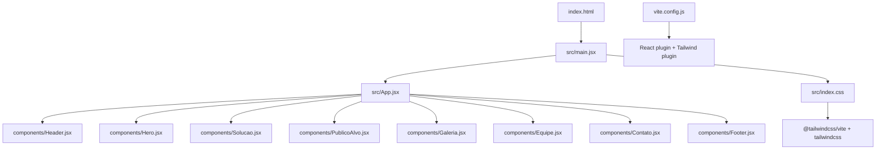
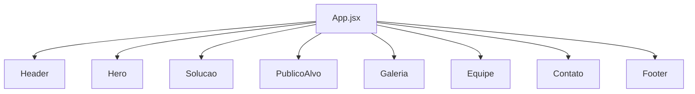
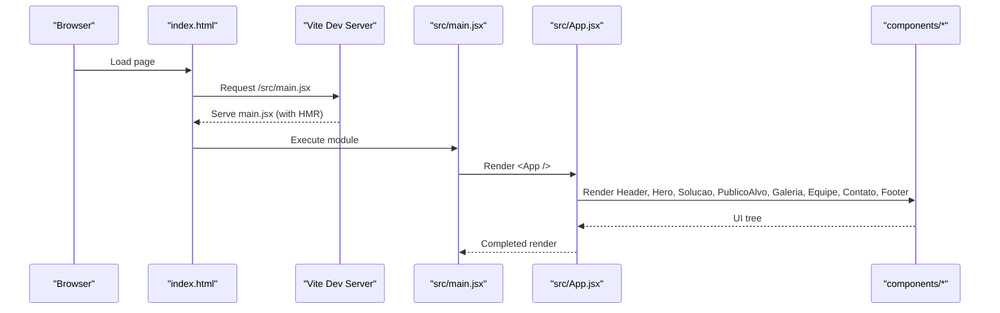
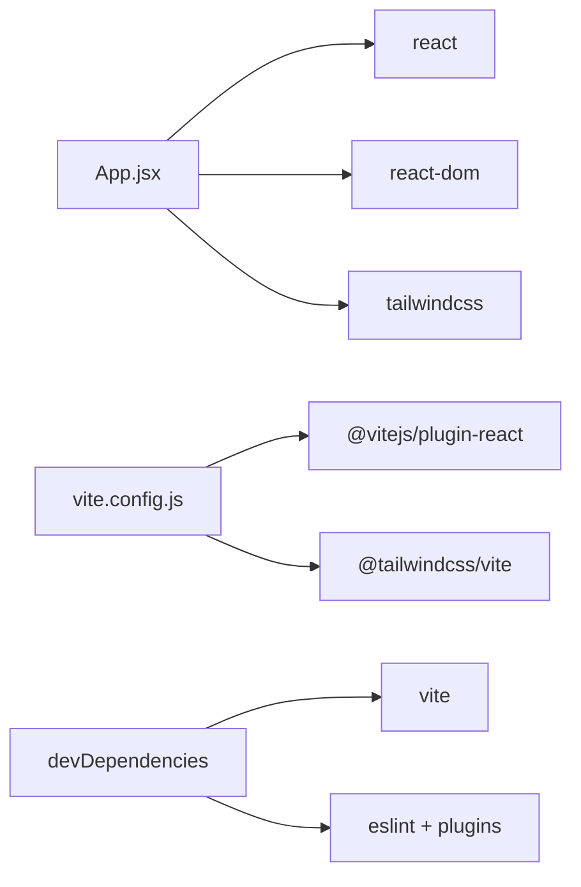

# Getting Started

<cite>
**Referenced Files in This Document**
- [README.md](file://README.md)
- [package.json](file://package.json)
- [vite.config.js](file://vite.config.js)
- [index.html](file://index.html)
- [src/main.jsx](file://src/main.jsx)
- [src/App.jsx](file://src/App.jsx)
- [src/index.css](file://src/index.css)
- [eslint.config.js](file://eslint.config.js)
</cite>

## Table of Contents
1. [Introduction](#introduction)
2. [Project Structure](#project-structure)
3. [Core Components](#core-components)
4. [Architecture Overview](#architecture-overview)
5. [Detailed Component Analysis](#detailed-component-analysis)
6. [Dependency Analysis](#dependency-analysis)
7. [Performance Considerations](#performance-considerations)
8. [Troubleshooting Guide](#troubleshooting-guide)
9. [Conclusion](#conclusion)

## Introduction
OptiCode is a React application scaffolded with Vite and styled with Tailwind CSS. It provides a minimal, modern development setup with hot module replacement (HMR), ESLint rules for React hooks and refresh, and a component-based structure under src/components.

This guide helps you:
- Install dependencies using npm or yarn
- Start the development server with Vite
- Build for production
- Navigate the project structure and understand how components are composed
- Resolve common setup issues

Technology stack highlights:
- React 19.2.8
- Vite 8.3.0
- Tailwind CSS 4.3.3

**Section sources**
- [README.md:1-17](file://README.md#L1-L17)
- [package.json:12-29](file://package.json#L12-L29)

## Project Structure
At a high level:
- index.html is the HTML entry point that mounts the app into a root div and loads the JS entry.
- src/main.jsx creates the React root and renders App inside StrictMode.
- src/App.jsx composes page sections from reusable components.
- src/components holds all UI components (Header, Hero, Solucao, PublicoAlvo, Galeria, Equipe, Contato, Footer, etc.).
- src/index.css imports Tailwind CSS v4 via @import "tailwindcss".
- vite.config.js enables React and Tailwind plugins.
- eslint.config.js configures linting for JS/JSX files.

**Diagram sources**
- [index.html:9-12](file://index.html#L9-L12)
- [src/main.jsx:1-11](file://src/main.jsx#L1-L11)
- [src/App.jsx:1-26](file://src/App.jsx#L1-L26)
- [src/index.css:1-1](file://src/index.css#L1-L1)
- [vite.config.js:1-10](file://vite.config.js#L1-L10)

**Section sources**
- [index.html:1-14](file://index.html#L1-L14)
- [src/main.jsx:1-11](file://src/main.jsx#L1-L11)
- [src/App.jsx:1-26](file://src/App.jsx#L1-L26)
- [src/index.css:1-1](file://src/index.css#L1-L1)
- [vite.config.js:1-10](file://vite.config.js#L1-L10)

## Core Components
The top-level App composes the following page sections:
- Header
- Hero
- Solucao
- PublicoAlvo
- Galeria
- Equipe
- Contato
- Footer

These components live under src/components and are imported by App.jsx to build the full page.

**Diagram sources**
- [src/App.jsx:1-26](file://src/App.jsx#L1-L26)

**Section sources**
- [src/App.jsx:1-26](file://src/App.jsx#L1-L26)

## Architecture Overview
The runtime bootstrap flow:
1. The browser loads index.html.
2. index.html includes /src/main.jsx as an ES module.
3. main.jsx creates a React root and renders App inside StrictMode.
4. App renders the composed set of components.
5. Vite serves modules during development; Tailwind styles are applied via index.css.

**Diagram sources**
- [index.html:9-12](file://index.html#L9-L12)
- [src/main.jsx:1-11](file://src/main.jsx#L1-L11)
- [src/App.jsx:1-26](file://src/App.jsx#L1-L26)

## Detailed Component Analysis
- Entry point: index.html defines the root element and loads the JS entry.
- Bootstrap: src/main.jsx initializes React and mounts App.
- Composition: src/App.jsx composes the page from multiple components.
- Styling: src/index.css imports Tailwind CSS v4.
- Build/dev tooling: vite.config.js enables React and Tailwind plugins; eslint.config.js sets up linting for JS/JSX.

Navigation tips:
- To change the page layout, edit src/App.jsx to add/remove/reorder components.
- To modify a section’s UI, open the corresponding file under src/components.
- To adjust global styles or Tailwind configuration, start from src/index.css and the Tailwind integration in vite.config.js.

**Section sources**
- [index.html:1-14](file://index.html#L1-L14)
- [src/main.jsx:1-11](file://src/main.jsx#L1-L11)
- [src/App.jsx:1-26](file://src/App.jsx#L1-L26)
- [src/index.css:1-1](file://src/index.css#L1-L1)
- [vite.config.js:1-10](file://vite.config.js#L1-L10)
- [eslint.config.js:1-22](file://eslint.config.js#L1-L22)

## Dependency Analysis
Key dependencies and roles:
- react/react-dom: UI library and DOM rendering.
- vite: Fast dev server and build tool.
- @vitejs/plugin-react: Enables JSX and React-specific optimizations.
- tailwindcss/@tailwindcss/vite: Tailwind CSS v4 integration with Vite.
- react-icons: Icon library used across components.
- eslint and related plugins: Linting and React hooks/refresh rules.

**Diagram sources**
- [package.json:12-29](file://package.json#L12-L29)
- [vite.config.js:1-10](file://vite.config.js#L1-L10)

**Section sources**
- [package.json:1-31](file://package.json#L1-L31)
- [vite.config.js:1-10](file://vite.config.js#L1-L10)

## Performance Considerations
- Development server: Vite provides fast startup and HMR out of the box. Keep the number of heavy imports in main entry small to speed up initial load.
- Production builds: Use the provided build script to generate optimized assets.
- React StrictMode: Enabled in development to help catch potential issues early.
- Tailwind CSS v4: Integrated via Vite plugin; ensure unused styles are purged in production builds automatically by the Tailwind pipeline.

[No sources needed since this section provides general guidance]

## Troubleshooting Guide
Common setup issues and solutions:
- Node.js version mismatch: Ensure your Node.js version is compatible with Vite 8.x and the React 19 toolchain. If installation fails due to native modules or engine constraints, upgrade Node.js to a recent LTS release.
- Port already in use: If the dev server cannot start because port 5173 is occupied, stop the conflicting process or configure Vite to use another port.
- Tailwind not applying styles: Verify that src/index.css contains the Tailwind import and that vite.config.js includes the Tailwind plugin. Also confirm that your components use valid Tailwind utility classes.
- ESLint errors: Run the lint script to identify issues. Fix reported problems or adjust rules in eslint.config.js if necessary.
- Missing dependencies: If you see “Cannot find module” errors, reinstall dependencies with your package manager.
- Clean install procedure: Remove node_modules and lockfiles, then reinstall dependencies to resolve corrupted installs.

Scripts available:
- Development server: run the dev script to start Vite with HMR.
- Build: run the build script to create a production bundle.
- Preview: run the preview script to serve the built output locally.
- Lint: run the lint script to check code quality.

**Section sources**
- [package.json:6-10](file://package.json#L6-L10)
- [eslint.config.js:1-22](file://eslint.config.js#L1-L22)
- [vite.config.js:1-10](file://vite.config.js#L1-L10)
- [src/index.css:1-1](file://src/index.css#L1-L1)

## Conclusion
You now have everything needed to set up OptiCode, run the development server, and build for production. The project uses React 19.2.8, Vite 8.3.0, and Tailwind CSS 4.3.3, with a clear component-based structure under src/components. Start by installing dependencies, running the dev server, and exploring the components referenced by App.jsx. When ready, build and preview the production output.

[No sources needed since this section summarizes without analyzing specific files]