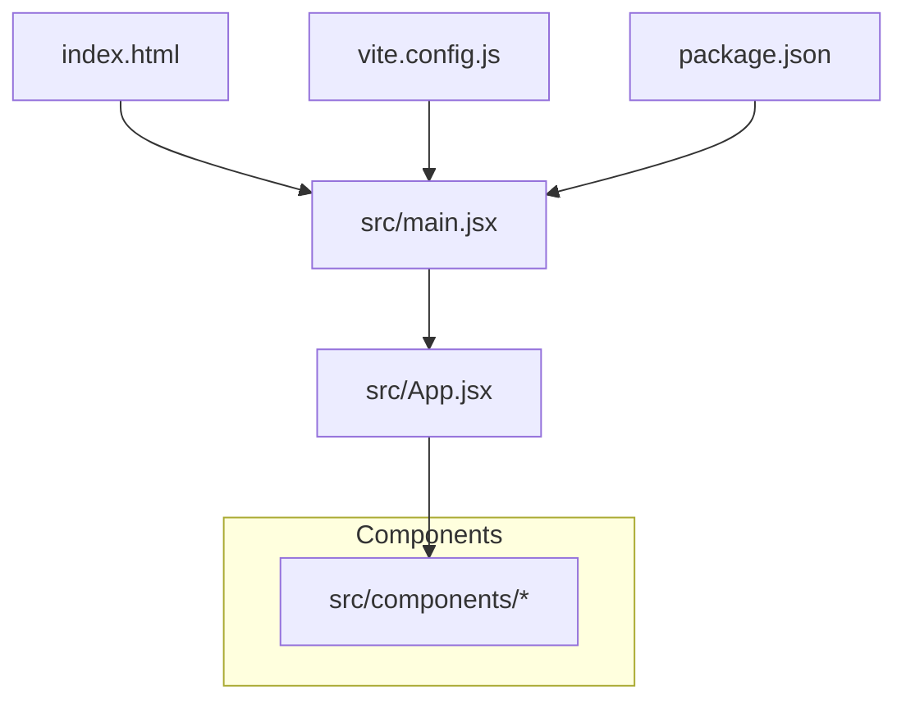
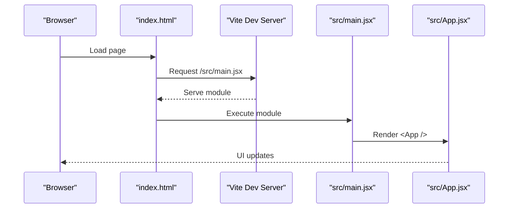

# Getting Started

<cite>
**Referenced Files in This Document**
- [README.md](file://README.md)
- [package.json](file://package.json)
- [vite.config.js](file://vite.config.js)
- [index.html](file://index.html)
- [src/main.jsx](file://src/main.jsx)
</cite>

## Table of Contents
1. [Introduction](#introduction)
2. [Prerequisites](#prerequisites)
3. [Installation](#installation)
4. [Development Server](#development-server)
5. [Build and Preview](#build-and-preview)
6. [Project Structure Overview](#project-structure-overview)
7. [How the App Boots](#how-the-app-boots)
8. [Troubleshooting](#troubleshooting)
9. [Next Steps](#next-steps)

## Introduction
OptiCode is a React + Vite project scaffolded with Tailwind CSS and ESLint. It provides a minimal, fast setup for building modern web applications with hot module replacement (HMR), a simple build pipeline, and sensible defaults for development and production.

This guide helps you install dependencies, run the development server, build the app, and understand the basic structure so you can start contributing quickly.

## Prerequisites
- Node.js: Use a recent LTS version compatible with Vite 8.x and React 19.x. If you encounter compatibility issues, try upgrading to the latest stable Node.js release.
- npm or yarn: Either package manager works. The scripts are standard and will work with both.

Notes:
- The project uses ES modules ("type": "module" in package.json).
- Tailwind CSS v4 is configured via the Vite plugin.

**Section sources**
- [package.json:1-30](file://package.json#L1-L30)
- [README.md:1-17](file://README.md#L1-L17)

## Installation
Follow these steps to set up the project locally:

1. Open your terminal and navigate to the project root.
2. Install dependencies:
   - Using npm:
     - npm ci
     - Or npm install
   - Using yarn:
     - yarn install
3. Verify installation by running the development server (see next section).

Tips:
- Prefer npm ci in CI environments for deterministic installs.
- If you see permission errors on macOS/Linux, avoid using sudo; fix permissions instead.

**Section sources**
- [package.json:6-11](file://package.json#L6-L11)

## Development Server
Start the local development server with HMR enabled:

- npm:
  - npm run dev
- yarn:
  - yarn dev

What happens:
- Vite starts a local dev server (typically at http://localhost:5173).
- Changes to source files trigger instant updates in the browser.
- Tailwind CSS classes are processed automatically.

Stopping the server:
- Press Ctrl+C in the terminal where the server is running.

**Section sources**
- [package.json:6-11](file://package.json#L6-L11)

## Build and Preview
Build the app for production:

- npm:
  - npm run build
- yarn:
  - yarn build

Output:
- A production-ready bundle is generated in the dist directory.

Preview the production build locally:

- npm:
  - npm run preview
- yarn:
  - yarn preview

This serves the built assets locally so you can verify performance and behavior before deployment.

**Section sources**
- [package.json:6-11](file://package.json#L6-L11)

## Project Structure Overview
Here’s how the codebase is organized:

- public/: Static assets served as-is (e.g., images).
- src/: Application source code.
  - components/: Reusable UI components (React components).
  - main.jsx: Entry point that mounts the React app into the DOM.
  - index.css: Global styles (Tailwind directives live here).
  - App.jsx: Root component composing the application layout.
- index.html: HTML shell that loads the React entry script.
- vite.config.js: Vite configuration including plugins (React and Tailwind).
- package.json: Scripts, dependencies, and metadata.

Navigation tips:
- Start from src/main.jsx to understand how the app boots.
- Explore src/components/ to find UI building blocks.
- Adjust global styles in src/index.css.
- Configure Vite plugins and options in vite.config.js.

**Diagram sources**
- [index.html:1-14](file://index.html#L1-L14)
- [src/main.jsx:1-11](file://src/main.jsx#L1-L11)
- [vite.config.js:1-10](file://vite.config.js#L1-L10)
- [package.json:1-30](file://package.json#L1-L30)

**Section sources**
- [index.html:1-14](file://index.html#L1-L14)
- [src/main.jsx:1-11](file://src/main.jsx#L1-L11)
- [vite.config.js:1-10](file://vite.config.js#L1-L10)
- [package.json:1-30](file://package.json#L1-L30)

## How the App Boots
The runtime flow is straightforward:

1. Browser loads index.html.
2. The HTML includes a script tag that imports src/main.jsx as an ES module.
3. main.jsx creates a React root and renders the App component inside StrictMode.
4. Vite handles module resolution, HMR, and asset loading during development.

**Diagram sources**
- [index.html:9-12](file://index.html#L9-L12)
- [src/main.jsx:1-11](file://src/main.jsx#L1-L11)

**Section sources**
- [index.html:9-12](file://index.html#L9-L12)
- [src/main.jsx:1-11](file://src/main.jsx#L1-L11)

## Troubleshooting
Common setup issues and resolutions:

- Node.js version mismatch
  - Symptom: Errors about unsupported syntax or incompatible packages.
  - Fix: Upgrade to a recent Node.js LTS version. Vite 8.x and React 19.x generally require newer Node.js versions.

- Port already in use
  - Symptom: Dev server fails to start due to port conflicts.
  - Fix: Stop other processes using the same port or configure a different port in vite.config.js.

- Tailwind not applying styles
  - Symptom: Tailwind classes have no effect.
  - Fix: Ensure Tailwind is imported in src/index.css and that @tailwindcss/vite is enabled in vite.config.js.

- Module resolution or import errors
  - Symptom: “Cannot find module” or similar errors.
  - Fix: Run npm ci or yarn install again; ensure all dependencies are installed.

- ESLint warnings/errors
  - Symptom: Linting failures when running npm run lint or yarn lint.
  - Fix: Follow ESLint suggestions or adjust eslint.config.js rules as needed.

- Build fails in CI
  - Symptom: Production build errors in automated environments.
  - Fix: Pin Node.js version in CI, use npm ci, and ensure environment variables match local builds.

**Section sources**
- [package.json:1-30](file://package.json#L1-L30)
- [vite.config.js:1-10](file://vite.config.js#L1-L10)

## Next Steps
- Explore the components under src/components/ to learn how the UI is composed.
- Customize the theme and styles in src/index.css (Tailwind directives).
- Add new pages or features by creating components and wiring them into App.jsx.
- Configure deployment targets (static hosting, CDN, etc.) after running npm run build.

[No sources needed since this section provides general guidance]