# Project Overview

<cite>
**Referenced Files in This Document**
- [README.md](file://README.md)
- [package.json](file://package.json)
- [vite.config.js](file://vite.config.js)
- [index.html](file://index.html)
- [src/main.jsx](file://src/main.jsx)
- [src/App.jsx](file://src/App.jsx)
- [src/components/Header.jsx](file://src/components/Header.jsx)
- [src/components/Hero.jsx](file://src/components/Hero.jsx)
- [src/components/Solucao.jsx](file://src/components/Solucao.jsx)
- [src/components/PublicoAlvo.jsx](file://src/components/PublicoAlvo.jsx)
- [src/components/Galeria.jsx](file://src/components/Galeria.jsx)
- [src/components/Equipe.jsx](file://src/components/Equipe.jsx)
- [src/components/Contato.jsx](file://src/components/Contato.jsx)
- [src/components/Footer.jsx](file://src/components/Footer.jsx)
</cite>

## Table of Contents
1. [Introduction](#introduction)
2. [Project Structure](#project-structure)
3. [Core Components](#core-components)
4. [Architecture Overview](#architecture-overview)
5. [Detailed Component Analysis](#detailed-component-analysis)
6. [Dependency Analysis](#dependency-analysis)
7. [Performance Considerations](#performance-considerations)
8. [Troubleshooting Guide](#troubleshooting-guide)
9. [Conclusion](#conclusion)

## Introduction
OptiCode is a single-page marketing landing page for the JOVI smartphone product, built with React and Vite and styled with Tailwind CSS. The application presents a cohesive user experience through clearly defined sections: hero, solutions, target audience (students), gallery, team, and contact. It emphasizes responsive design patterns and component-based architecture to showcase product features visually and accessibly.

For beginners, this project demonstrates how to structure a modern React app with reusable components and section-based layouts. For experienced developers, it provides a clean entry point into the codebase, showing how Vite plugins integrate with React and Tailwind, and how components compose the full page.

## Project Structure
The project follows a feature-oriented organization under src/components, where each major section of the landing page is implemented as a dedicated component. The root App component composes these sections into a single-page layout. Styling uses Tailwind CSS via the Vite plugin, and assets such as images and videos are referenced from public paths.

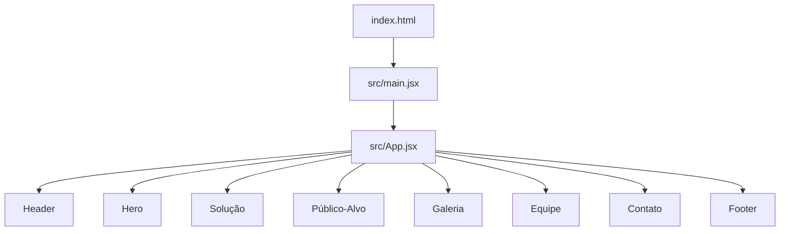

**Diagram sources**
- [index.html:1-200](file://index.html#L1-L200)
- [src/main.jsx:1-11](file://src/main.jsx#L1-L11)
- [src/App.jsx:1-26](file://src/App.jsx#L1-L26)

Key files and responsibilities:
- index.html: HTML shell that mounts the React app.
- src/main.jsx: Entry point that renders the App component inside StrictMode.
- src/App.jsx: Root component composing all sections.
- vite.config.js: Configures Vite with React and Tailwind plugins.
- package.json: Defines scripts and dependencies including React, ReactDOM, Vite, Tailwind, and react-icons.

**Section sources**
- [README.md:1-17](file://README.md#L1-L17)
- [package.json:1-31](file://package.json#L1-L31)
- [vite.config.js:1-10](file://vite.config.js#L1-L10)
- [src/main.jsx:1-11](file://src/main.jsx#L1-L11)
- [src/App.jsx:1-26](file://src/App.jsx#L1-L26)

## Core Components
This section outlines the main components that build the landing page. Each component encapsulates a specific section or UI element, promoting reusability and maintainability.

- Header: Navigation bar with links to sections and a mobile menu toggle.
- Hero: Prominent hero area with video background, headline, call-to-action buttons, and benefit highlights.
- Solução: Solutions grid showcasing camera, AI post-processing, reliability, shutter lag improvements, and focus performance.
- Público-Alvo: Target audience section focused on students, highlighting study support, capture efficiency, and performance.
- Galeria: Photo gallery demonstrating device details and usage scenarios.
- Equipe: Team introduction cards with roles and descriptions.
- Contato: Contact section with contact info and a form composed of reusable input fields.
- Footer: Site footer with navigation columns, brand tagline, and contact details.

These components work together to deliver a complete, responsive user experience across devices.

**Section sources**
- [src/components/Header.jsx:1-77](file://src/components/Header.jsx#L1-L77)
- [src/components/Hero.jsx:1-67](file://src/components/Hero.jsx#L1-L67)
- [src/components/Solucao.jsx:1-74](file://src/components/Solucao.jsx#L1-L74)
- [src/components/PublicoAlvo.jsx:1-88](file://src/components/PublicoAlvo.jsx#L1-L88)
- [src/components/Galeria.jsx:1-55](file://src/components/Galeria.jsx#L1-L55)
- [src/components/Equipe.jsx:1-75](file://src/components/Equipe.jsx#L1-L75)
- [src/components/Contato.jsx:1-112](file://src/components/Contato.jsx#L1-L112)
- [src/components/Footer.jsx:1-127](file://src/components/Footer.jsx#L1-L127)

## Architecture Overview
The application follows a standard React + Vite architecture:
- Build tooling: Vite with @vitejs/plugin-react and @tailwindcss/vite.
- Styling: Tailwind CSS utility classes applied throughout components.
- Icons: react-icons used consistently across sections.
- Routing: Single-page navigation using anchor links to section IDs.

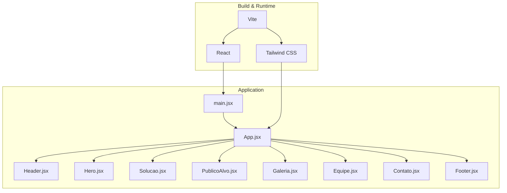

**Diagram sources**
- [vite.config.js:1-10](file://vite.config.js#L1-L10)
- [src/main.jsx:1-11](file://src/main.jsx#L1-L11)
- [src/App.jsx:1-26](file://src/App.jsx#L1-L26)

## Detailed Component Analysis

### Header
Purpose: Provides top-level navigation and brand identity. Uses HeaderLink components for consistent link styling and includes a mobile menu button.

Responsibilities:
- Render logo and brand name.
- Provide anchor links to key sections.
- Support accessibility attributes for menu toggling.

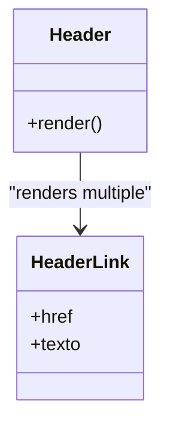

**Diagram sources**
- [src/components/Header.jsx:1-77](file://src/components/Header.jsx#L1-L77)

**Section sources**
- [src/components/Header.jsx:1-77](file://src/components/Header.jsx#L1-L77)

### Hero
Purpose: Captures attention with a video background, headline, subtitle, CTAs, and benefit highlights.

Responsibilities:
- Display a looping, muted video banner.
- Present primary messaging and calls to action.
- Showcase benefits using icons and labels.

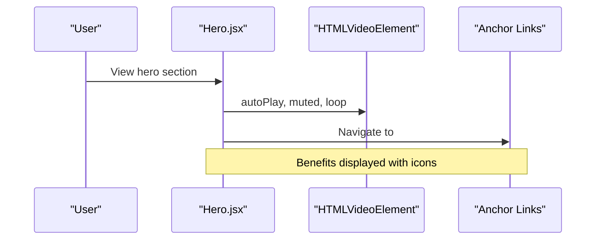

**Diagram sources**
- [src/components/Hero.jsx:1-67](file://src/components/Hero.jsx#L1-L67)

**Section sources**
- [src/components/Hero.jsx:1-67](file://src/components/Hero.jsx#L1-L67)

### Solução
Purpose: Highlights core product solutions in a grid layout.

Responsibilities:
- Present solution cards with icons, titles, and descriptions.
- Emphasize camera assistance, AI post-processing, reliability, shutter lag reduction, and focus speed.

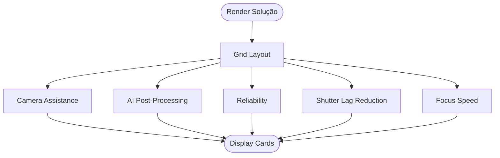

**Diagram sources**
- [src/components/Solucao.jsx:1-74](file://src/components/Solucao.jsx#L1-L74)

**Section sources**
- [src/components/Solucao.jsx:1-74](file://src/components/Solucao.jsx#L1-L74)

### Público-Alvo
Purpose: Communicates the student-focused value proposition and use cases.

Responsibilities:
- Introduce the target audience and rationale.
- Highlight study support, efficient capture, and performance.

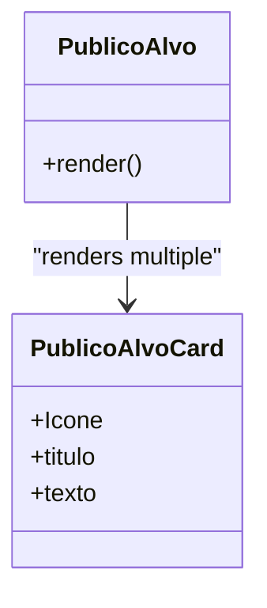

**Diagram sources**
- [src/components/PublicoAlvo.jsx:1-88](file://src/components/PublicoAlvo.jsx#L1-L88)

**Section sources**
- [src/components/PublicoAlvo.jsx:1-88](file://src/components/PublicoAlvo.jsx#L1-L88)

### Galeria
Purpose: Showcases product visuals and usage scenarios.

Responsibilities:
- Display a prominent hero image and additional photos.
- Use a reusable photo card component for consistency.

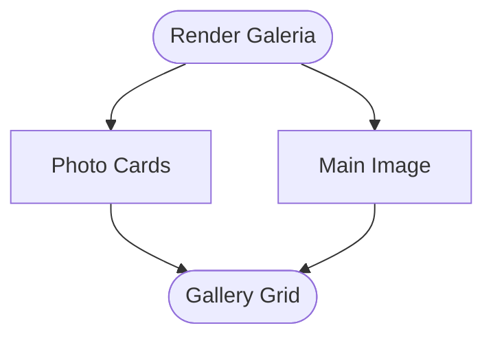

**Diagram sources**
- [src/components/Galeria.jsx:1-55](file://src/components/Galeria.jsx#L1-L55)

**Section sources**
- [src/components/Galeria.jsx:1-55](file://src/components/Galeria.jsx#L1-L55)

### Equipe
Purpose: Introduces the team behind the project with role descriptions.

Responsibilities:
- Render team member cards with images, names, roles, and descriptions.

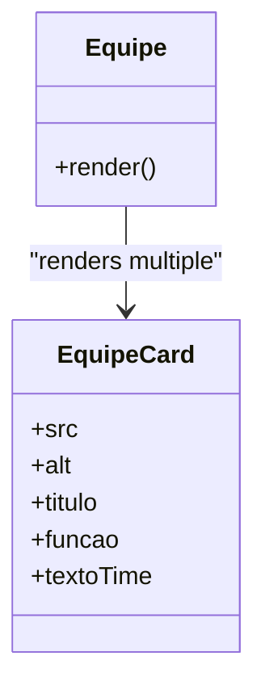

**Diagram sources**
- [src/components/Equipe.jsx:1-75](file://src/components/Equipe.jsx#L1-L75)

**Section sources**
- [src/components/Equipe.jsx:1-75](file://src/components/Equipe.jsx#L1-L75)

### Contato
Purpose: Provides contact information and a message form.

Responsibilities:
- Display email, location, and hours.
- Compose form inputs using a reusable field component.
- Include a submit button.

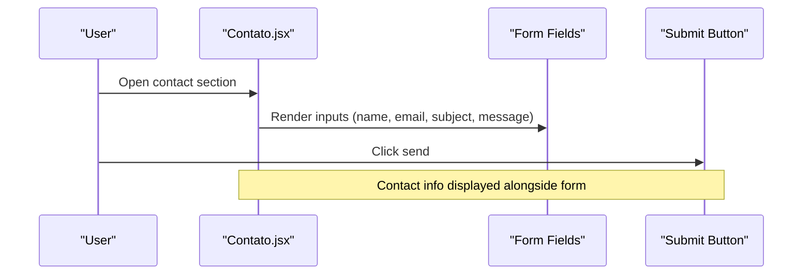

**Diagram sources**
- [src/components/Contato.jsx:1-112](file://src/components/Contato.jsx#L1-L112)

**Section sources**
- [src/components/Contato.jsx:1-112](file://src/components/Contato.jsx#L1-L112)

### Footer
Purpose: Consolidates site navigation, branding, and contact details.

Responsibilities:
- Render navigation columns and project links.
- Display brand tagline and contact information.
- Include copyright notice.

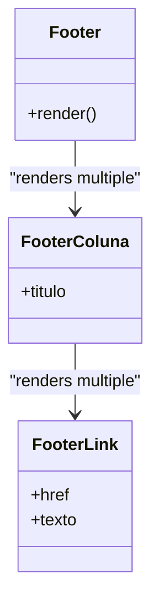

**Diagram sources**
- [src/components/Footer.jsx:1-127](file://src/components/Footer.jsx#L1-L127)

**Section sources**
- [src/components/Footer.jsx:1-127](file://src/components/Footer.jsx#L1-L127)

## Dependency Analysis
High-level dependency relationships among components and external libraries:

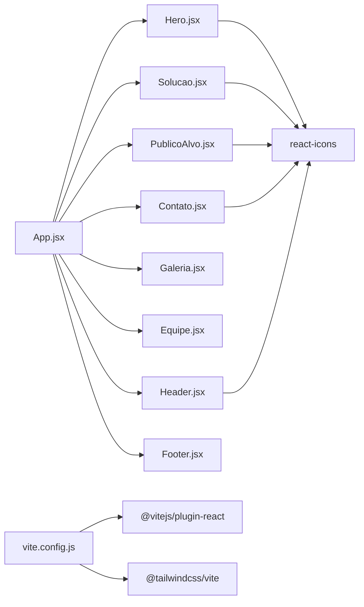

**Diagram sources**
- [src/App.jsx:1-26](file://src/App.jsx#L1-L26)
- [vite.config.js:1-10](file://vite.config.js#L1-L10)
- [package.json:12-18](file://package.json#L12-L18)

**Section sources**
- [src/App.jsx:1-26](file://src/App.jsx#L1-L26)
- [package.json:12-18](file://package.json#L12-L18)
- [vite.config.js:1-10](file://vite.config.js#L1-L10)

## Performance Considerations
- Asset loading: Hero uses a looping video; ensure appropriate optimization and fallbacks for mobile networks.
- Image assets: Gallery images should be optimized and lazy-loaded if expanded.
- Icon library: react-icons is included; consider tree-shaking or selective imports to reduce bundle size.
- Styling: Tailwind utilities are applied directly; keep class usage minimal and consistent to avoid style bloat.
- Build configuration: Vite’s React and Tailwind plugins are configured; verify that unused styles are purged in production builds.

[No sources needed since this section provides general guidance]

## Troubleshooting Guide
Common issues and resolutions:
- Missing assets: Ensure images and videos referenced in components exist under public paths and are correctly linked.
- Tailwind not applying: Confirm the Tailwind plugin is enabled in vite.config.js and that index.css imports Tailwind directives if required by your setup.
- Icons not rendering: Verify react-icons is installed and imported correctly in components.
- Navigation anchors: Section IDs must match anchor href values (e.g., #inicio, #solucao, #publico-alvo, #galerias, #equipe, #contato).

**Section sources**
- [src/components/Hero.jsx:10-17](file://src/components/Hero.jsx#L10-L17)
- [src/components/Galeria.jsx:23-48](file://src/components/Galeria.jsx#L23-L48)
- [vite.config.js:1-10](file://vite.config.js#L1-L10)
- [package.json:12-18](file://package.json#L12-L18)

## Conclusion
OptiCode delivers a polished, single-page marketing experience for the JOVI smartphone, organized around clear sections and reusable components. Built with React, Vite, and Tailwind CSS, it balances visual appeal with maintainable code structure. Beginners can learn how to compose a landing page from modular components, while experienced developers can leverage the straightforward architecture to extend features, refine styling, and optimize performance.

[No sources needed since this section summarizes without analyzing specific files]