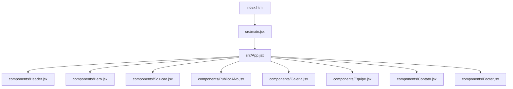
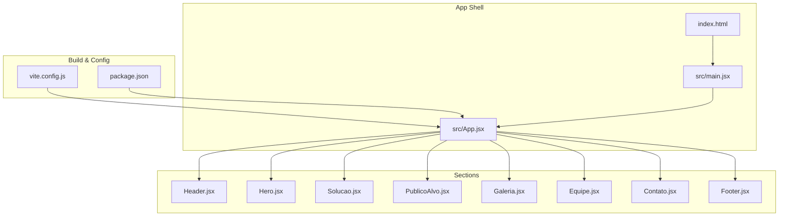
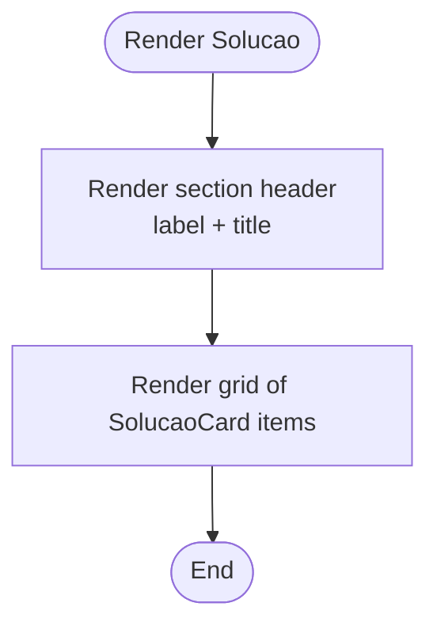
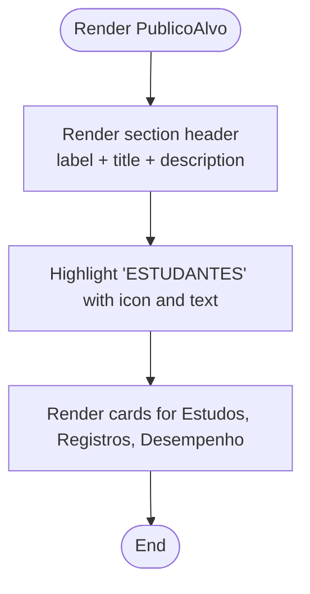
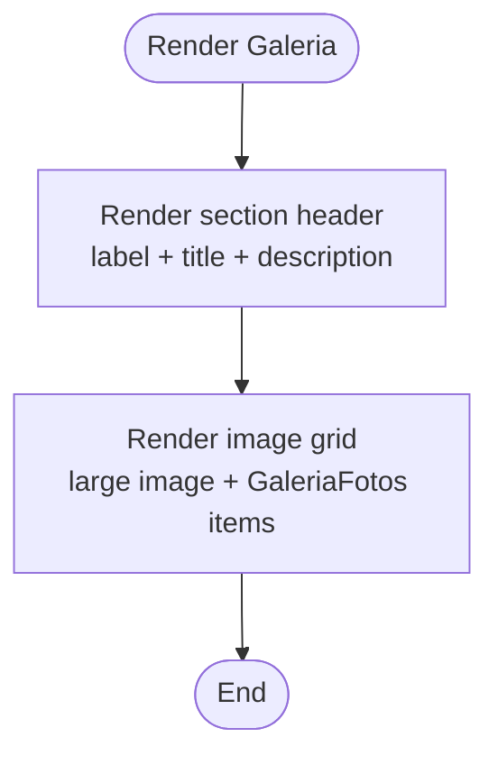
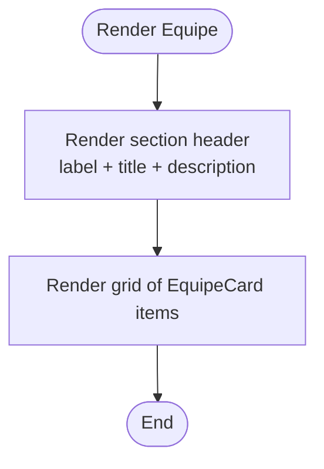
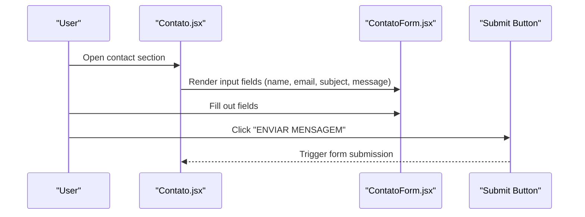
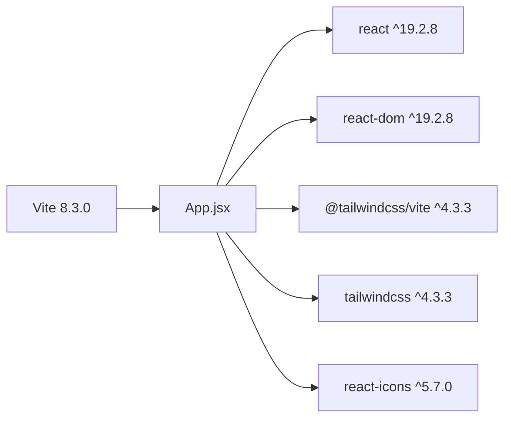

# Project Overview

<cite>
**Referenced Files in This Document**
- [README.md](file://README.md)
- [package.json](file://package.json)
- [vite.config.js](file://vite.config.js)
- [index.html](file://index.html)
- [src/main.jsx](file://src/main.jsx)
- [src/App.jsx](file://src/App.jsx)
- [src/components/Header.jsx](file://src/components/Header.jsx)
- [src/components/Hero.jsx](file://src/components/Hero.jsx)
- [src/components/Solucao.jsx](file://src/components/Solucao.jsx)
- [src/components/PublicoAlvo.jsx](file://src/components/PublicoAlvo.jsx)
- [src/components/Galeria.jsx](file://src/components/Galeria.jsx)
- [src/components/Equipe.jsx](file://src/components/Equipe.jsx)
- [src/components/Contato.jsx](file://src/components/Contato.jsx)
- [src/components/Footer.jsx](file://src/components/Footer.jsx)
</cite>

## Table of Contents
1. [Introduction](#introduction)
2. [Project Structure](#project-structure)
3. [Core Components](#core-components)
4. [Architecture Overview](#architecture-overview)
5. [Detailed Component Analysis](#detailed-component-analysis)
6. [Dependency Analysis](#dependency-analysis)
7. [Performance Considerations](#performance-considerations)
8. [Troubleshooting Guide](#troubleshooting-guide)
9. [Conclusion](#conclusion)

## Introduction
OptiCode is a single-page promotional website for the JOVI smartphone product. It showcases key features, explains who benefits most from the device, displays visual highlights, introduces the project team, and provides a contact form to reach the team. The site is built as a React application using Vite for fast development and Tailwind CSS for styling.

Purpose:
- Present the JOVI smartphone’s value proposition and capabilities.
- Communicate the target audience (students).
- Provide a clear path for users to contact the team.

Target audience:
- Students and academic users who rely on smartphones for study, content capture, and productivity.

Contact functionality:
- A dedicated section with contact details and a form to send messages.

[No sources needed since this section summarizes without analyzing specific files]

## Project Structure
The project follows a component-based architecture where each major page area is implemented as a reusable React component. The root App component composes these sections into a single-page layout.

Key directories and files:
- src/components: UI components for each section (Header, Hero, Solucao, PublicoAlvo, Galeria, Equipe, Contato, Footer).
- public/imagens: Static images used by the gallery and team sections.
- vite.config.js: Vite configuration enabling React and Tailwind plugins.
- package.json: Dependencies including React, Vite, Tailwind CSS, and React Icons.

**Diagram sources**
- [index.html:1-20](file://index.html#L1-L20)
- [src/main.jsx:1-20](file://src/main.jsx#L1-L20)
- [src/App.jsx:1-26](file://src/App.jsx#L1-L26)

**Section sources**
- [src/App.jsx:1-26](file://src/App.jsx#L1-L26)
- [vite.config.js:1-10](file://vite.config.js#L1-L10)
- [package.json:1-31](file://package.json#L1-L31)

## Core Components
This section outlines the main sections that compose the website. Each component renders a semantic <section> with a unique id for navigation and accessibility.

- Header: Top navigation bar linking to sections.
- Hero: Primary hero banner introducing the product.
- Solucao: Highlights core solutions/features of the smartphone.
- PublicoAlvo: Describes the target audience and use cases.
- Galeria: Visual showcase of the smartphone and its features.
- Equipe: Introduces the project team members.
- Contato: Contact information and message form.
- Footer: Site footer with links and additional info.

Practical examples:
- Solucao: Presents feature cards such as photography, post-processing, file reliability, shutter lag reduction, and quick focus.
- PublicoAlvo: Explains how students benefit from improved study access, camera efficiency, and performance.
- Galeria: Displays multiple images showcasing the device and usage scenarios.
- Equipe: Shows team member cards with roles and descriptions.
- Contato: Provides email, location, hours, and a form to send messages.

**Section sources**
- [src/components/Solucao.jsx:1-74](file://src/components/Solucao.jsx#L1-L74)
- [src/components/PublicoAlvo.jsx:1-88](file://src/components/PublicoAlvo.jsx#L1-L88)
- [src/components/Galeria.jsx:1-55](file://src/components/Galeria.jsx#L1-L55)
- [src/components/Equipe.jsx:1-75](file://src/components/Equipe.jsx#L1-L75)
- [src/components/Contato.jsx:1-112](file://src/components/Contato.jsx#L1-L112)

## Architecture Overview
The application uses a simple, scalable component composition pattern:
- Entry point: index.html loads the app via src/main.jsx.
- Root component: src/App.jsx composes all top-level sections.
- Section components: Each section is self-contained and styled with Tailwind utility classes.
- Styling: Tailwind CSS v4 is enabled through @tailwindcss/vite plugin.
- Build tooling: Vite provides dev server, HMR, and production builds.

**Diagram sources**
- [vite.config.js:1-10](file://vite.config.js#L1-L10)
- [package.json:1-31](file://package.json#L1-L31)
- [index.html:1-20](file://index.html#L1-L20)
- [src/main.jsx:1-20](file://src/main.jsx#L1-L20)
- [src/App.jsx:1-26](file://src/App.jsx#L1-L26)

## Detailed Component Analysis

### Solucao (Solution)
Purpose:
- Showcases the smartphone’s core solutions and improvements.

Structure:
- Section header with label and title.
- Grid of solution cards, each with an icon, title, and description.

Implementation notes:
- Uses react-icons for visual cues.
- Renders multiple SolucaoCard instances with distinct icons and copy.

**Diagram sources**
- [src/components/Solucao.jsx:1-74](file://src/components/Solucao.jsx#L1-L74)

**Section sources**
- [src/components/Solucao.jsx:1-74](file://src/components/Solucao.jsx#L1-L74)

### PublicoAlvo (Target Audience)
Purpose:
- Defines the primary audience (students) and their use cases.

Structure:
- Section header with label, title, and descriptive paragraph.
- Large icon and text block emphasizing “ESTUDANTES”.
- Grid of cards covering studies, records, and performance.

Implementation notes:
- Uses react-icons to illustrate key areas.
- Emphasizes student-centric benefits.

**Diagram sources**
- [src/components/PublicoAlvo.jsx:1-88](file://src/components/PublicoAlvo.jsx#L1-L88)

**Section sources**
- [src/components/PublicoAlvo.jsx:1-88](file://src/components/PublicoAlvo.jsx#L1-L88)

### Galeria (Gallery)
Purpose:
- Visually presents the smartphone and related features.

Structure:
- Section header with label, title, and short description.
- Image grid with one large image and several smaller ones.

Implementation notes:
- Uses static images under public/imagens.
- Includes a helper component GaleriaFotos for repeated image blocks.

**Diagram sources**
- [src/components/Galeria.jsx:1-55](file://src/components/Galeria.jsx#L1-L55)

**Section sources**
- [src/components/Galeria.jsx:1-55](file://src/components/Galeria.jsx#L1-L55)

### Equipe (Team)
Purpose:
- Introduces the team behind OptiCode.

Structure:
- Section header with label, title, and description.
- Grid of team member cards with photo, name, role, and brief bio.

Implementation notes:
- Uses static images for avatars.
- Each card conveys role and contribution.

**Diagram sources**
- [src/components/Equipe.jsx:1-75](file://src/components/Equipe.jsx#L1-L75)

**Section sources**
- [src/components/Equipe.jsx:1-75](file://src/components/Equipe.jsx#L1-L75)

### Contato (Contact)
Purpose:
- Provides contact information and a form to send messages.

Structure:
- Section header with label, title, and description.
- Left column with contact details (email, location, hours).
- Right column with a form composed of ContatoForm fields and a submit button.

Implementation notes:
- Uses react-icons for contact metadata.
- Form fields are rendered via a shared ContatoForm component.

**Diagram sources**
- [src/components/Contato.jsx:1-112](file://src/components/Contato.jsx#L1-L112)

**Section sources**
- [src/components/Contato.jsx:1-112](file://src/components/Contato.jsx#L1-L112)

### Conceptual Overview
For beginners:
- The website is a single page divided into sections that explain what the JOVI smartphone offers, who it’s for, how it looks, who made it, and how to get in touch.
- Navigation typically scrolls between sections like Solucao, PublicoAlvo, Galeria, Equipe, and Contato.

For experienced developers:
- The app follows a flat component tree rooted at App.jsx.
- Sections are stateless presentational components focused on rendering structured content.
- Styling is handled via Tailwind utility classes; no global CSS frameworks beyond Tailwind.

[No sources needed since this section doesn't analyze specific files]

## Dependency Analysis
Technology stack:
- React 19.2.8 and React DOM 19.2.8 for UI rendering.
- Vite 8.3.0 as the build tool and dev server.
- Tailwind CSS 4.3.3 with @tailwindcss/vite plugin for styling.
- React Icons 5.7.0 for consistent iconography across sections.

**Diagram sources**
- [package.json:12-18](file://package.json#L12-L18)
- [package.json:19-29](file://package.json#L19-L29)
- [vite.config.js:1-10](file://vite.config.js#L1-L10)

**Section sources**
- [package.json:1-31](file://package.json#L1-L31)
- [vite.config.js:1-10](file://vite.config.js#L1-L10)

## Performance Considerations
- Use lazy loading for heavy assets (images) in Galeria to improve initial load time.
- Keep component trees shallow; current structure is already lightweight and modular.
- Prefer static imports for icons used across sections; avoid dynamic imports unless necessary.
- Leverage Vite’s HMR during development for faster iteration.

[No sources needed since this section provides general guidance]

## Troubleshooting Guide
Common issues and resolutions:
- Images not loading: Ensure paths under public/imagens match the references in Galeria and Equipe. Verify that the public directory is correctly served by Vite.
- Tailwind styles not applied: Confirm @tailwindcss/vite plugin is included in vite.config.js and that Tailwind directives are present in the CSS entry.
- Icons missing: Verify react-icons is installed and imported correctly in components.
- Build errors: Check ESLint rules and ensure dependencies versions align with package.json.

**Section sources**
- [vite.config.js:1-10](file://vite.config.js#L1-L10)
- [package.json:1-31](file://package.json#L1-L31)

## Conclusion
OptiCode is a well-structured, component-driven promotional site for the JOVI smartphone. It clearly communicates the product’s value, targets students, visually showcases the device, introduces the team, and enables user contact. The tech stack (React, Vite, Tailwind CSS, React Icons) supports rapid development and clean, maintainable code.

[No sources needed since this section summarizes without analyzing specific files]