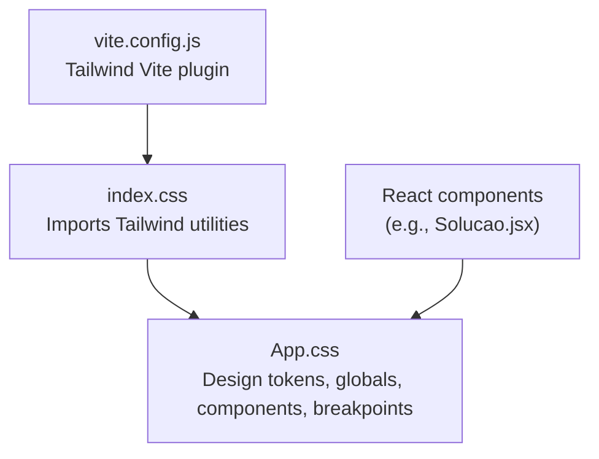
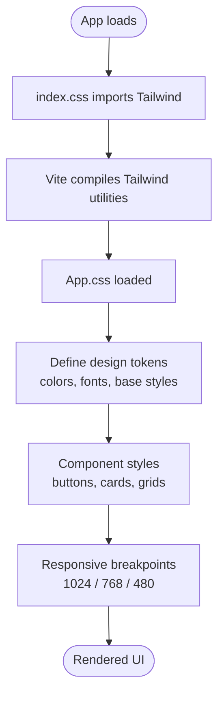
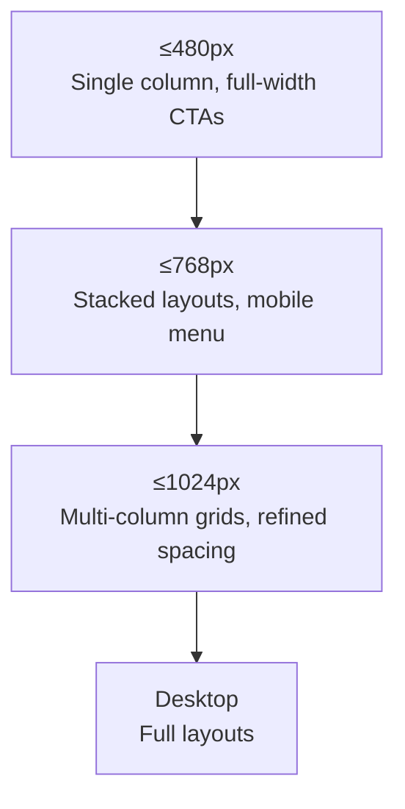
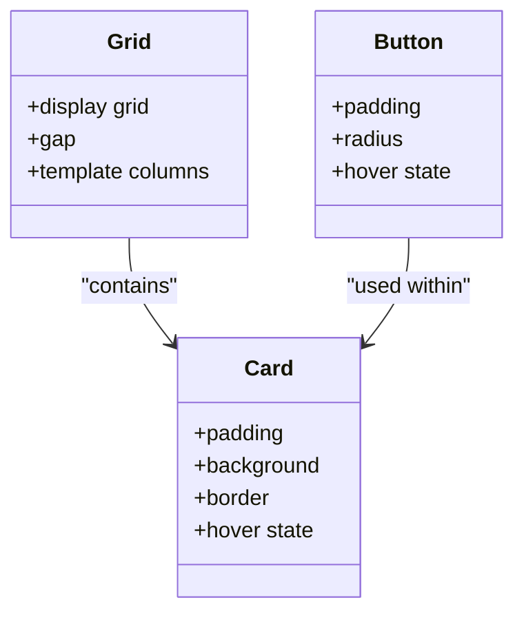
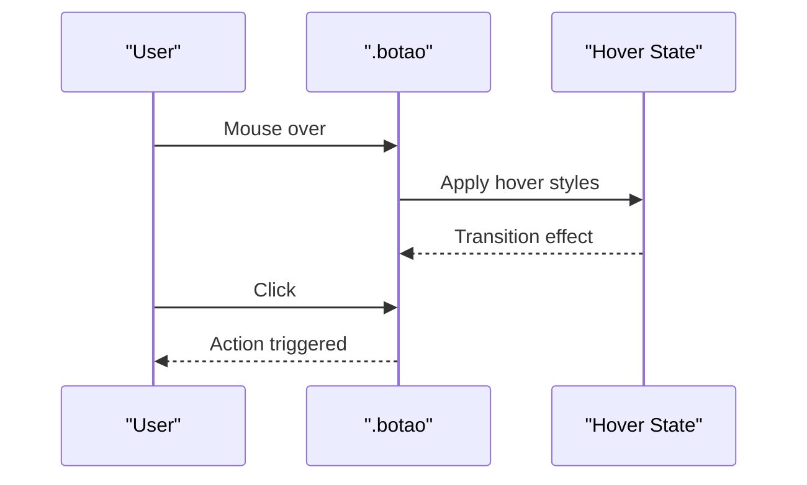
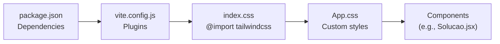

# Styling & Design System

<cite>
**Referenced Files in This Document**
- [App.css](file://src/App.css)
- [index.css](file://src/index.css)
- [vite.config.js](file://vite.config.js)
- [package.json](file://package.json)
- [Solucao.jsx](file://src/components/Solucao.jsx)
- [01-redesign-hero.md](file://docs/01-redesign-hero.md)
</cite>

## Table of Contents
1. [Introduction](#introduction)
2. [Project Structure](#project-structure)
3. [Core Components](#core-components)
4. [Architecture Overview](#architecture-overview)
5. [Detailed Component Analysis](#detailed-component-analysis)
6. [Dependency Analysis](#dependency-analysis)
7. [Performance Considerations](#performance-considerations)
8. [Troubleshooting Guide](#troubleshooting-guide)
9. [Conclusion](#conclusion)

## Introduction
This document explains the OptiCode design system, focusing on how Tailwind CSS utilities and custom CSS work together to deliver a consistent, responsive, and accessible user interface. It covers the color palette, typography, spacing conventions, visual principles, responsive breakpoints, hover effects, animations, cross-browser considerations, and scalable styling practices for React components such as cards, grids, and interactive elements.

The project follows a mobile-first approach: base styles define the smallest screen behavior, and media queries progressively enhance layouts for larger screens. Tailwind is imported at the entry point and in the main stylesheet, while App.css centralizes custom design tokens, component styles, and responsive rules.

## Project Structure
The styling architecture is split across three key files:
- index.css: imports Tailwind’s utility layer.
- App.css: defines design tokens, global resets, layout primitives, component styles, and responsive breakpoints.
- vite.config.js: enables Tailwind via the Vite plugin so utilities are available during build.

**Diagram sources**
- [index.css:1](file://src/index.css#L1)
- [App.css:1-17](file://src/App.css#L1-L17)
- [vite.config.js:1-10](file://vite.config.js#L1-L10)
- [Solucao.jsx:1-46](file://src/components/Solucao.jsx#L1-L46)

**Section sources**
- [index.css:1](file://src/index.css#L1)
- [App.css:1-17](file://src/App.css#L1-L17)
- [vite.config.js:1-10](file://vite.config.js#L1-L10)

## Core Components
OptiCode’s styling is organized around reusable building blocks:
- Global tokens and reset: CSS variables for colors and fonts; box-sizing reset; body defaults.
- Layout primitives: grid containers, section wrappers, and spacing utilities.
- Interactive elements: buttons, links, form inputs with focus/hover states.
- Section-specific modules: hero, solutions grid, audience cards, gallery, team, contact, footer.

Key responsibilities:
- App.css holds all custom styles and responsive rules.
- Tailwind provides utility classes for rapid composition where appropriate.
- Components reference semantic class names (e.g., .grid, .card, .botao) rather than inline styles.

**Section sources**
- [App.css:7-32](file://src/App.css#L7-L32)
- [App.css:319-347](file://src/App.css#L319-L347)
- [App.css:395-439](file://src/App.css#L395-L439)

## Architecture Overview
The design system separates concerns between Tailwind utilities and custom CSS:
- Tailwind utilities are enabled globally through index.css and processed by Vite.
- Custom CSS in App.css defines the brand system, layout patterns, and component variants.
- Media queries implement a mobile-first strategy with breakpoints at 1024px, 768px, and 480px.

**Diagram sources**
- [index.css:1](file://src/index.css#L1)
- [App.css:7-32](file://src/App.css#L7-L32)
- [App.css:1063-1295](file://src/App.css#L1063-L1295)
- [vite.config.js:1-10](file://vite.config.js#L1-L10)

## Detailed Component Analysis

### Color Palette and Visual Principles
- Dark theme foundation: deep navy/black backgrounds with high-contrast light text.
- Accent color: vibrant blue used for highlights, borders, and interactive states.
- Neutral tones: soft whites and grays for readability and hierarchy.
- Brand consistency: gradients and subtle glows reinforce depth without clutter.

Guidelines:
- Use CSS variables for brand colors to ensure consistency.
- Maintain sufficient contrast ratios for accessibility.
- Limit accent usage to interactive or emphasis contexts.

**Section sources**
- [App.css:7-17](file://src/App.css#L7-L17)
- [App.css:25-32](file://src/App.css#L25-L32)
- [App.css:179-192](file://src/App.css#L179-L192)

### Typography Choices
- Primary font: Montserrat for body and UI text.
- Logo font: Poppins for branding elements.
- Fluid headings: clamp-based sizing scales smoothly across viewports.
- Hierarchy: bold headings, medium-weight subtitles, readable paragraph line-heights.

Guidelines:
- Prefer variable font weights from the same family for cohesion.
- Use clamp() for fluid typography to reduce breakpoint complexity.
- Keep line-height generous for readability on dark backgrounds.

**Section sources**
- [App.css:1-2](file://src/App.css#L1-L2)
- [App.css:15-16](file://src/App.css#L15-L16)
- [App.css:210-232](file://src/App.css#L210-L232)

### Spacing Conventions
- Consistent padding/margins for sections and cards.
- Grid gaps standardized per layout type.
- Mobile-first spacing reduces to compact values on small screens.

Guidelines:
- Define spacing tokens if scaling further.
- Reuse gap and padding utilities consistently across components.

**Section sources**
- [App.css:350-365](file://src/App.css#L350-L365)
- [App.css:395-402](file://src/App.css#L395-L402)
- [App.css:1288-1295](file://src/App.css#L1288-L1295)

### Responsive Design Approach (Mobile-First)
Breakpoints:
- ≤1024px: Adjust multi-column grids and reflow complex sections.
- ≤768px: Switch to stacked layouts, enable mobile menu, simplify grids.
- ≤480px: Full-width CTAs, single-column grids, reduced icon sizes.

Principles:
- Base styles target small screens.
- Media queries progressively enhance for larger viewports.
- Navigation collapses into a toggleable menu on mobile.

**Diagram sources**
- [App.css:1063-1295](file://src/App.css#L1063-L1295)

**Section sources**
- [App.css:1063-1295](file://src/App.css#L1063-L1295)

### Cards and Grids
- Solution cards: uniform card container with hover elevation and border highlight.
- Audience cards: centered content with vertical dividers on desktop, stacking on mobile.
- Team cards: profile image circle, role label, description text.
- Gallery grid: asymmetric layout with large feature image and smaller tiles.

Patterns:
- Use .grid and .card classes for consistent structure.
- Apply hover transforms and shadows sparingly for feedback.
- Ensure images use object-fit to maintain aspect ratio.

**Diagram sources**
- [App.css:395-439](file://src/App.css#L395-L439)
- [App.css:319-347](file://src/App.css#L319-L347)

**Section sources**
- [App.css:395-439](file://src/App.css#L395-L439)
- [App.css:550-602](file://src/App.css#L550-L602)
- [App.css:683-759](file://src/App.css#L683-L759)
- [App.css:618-667](file://src/App.css#L618-L667)

### Interactive Elements (Buttons, Links, Forms)
- Buttons: solid and outlined variants with smooth transitions and subtle lift/shadow on hover.
- Links: uppercase navigation links with underline animation on hover.
- Form inputs: dark background, bordered, focus glow, placeholder styling.

Best practices:
- Use transition properties for smooth state changes.
- Provide clear focus indicators for accessibility.
- Avoid heavy animations that impact performance.

**Diagram sources**
- [App.css:319-347](file://src/App.css#L319-L347)
- [App.css:124-145](file://src/App.css#L124-L145)
- [App.css:858-894](file://src/App.css#L858-L894)

**Section sources**
- [App.css:319-347](file://src/App.css#L319-L347)
- [App.css:124-145](file://src/App.css#L124-L145)
- [App.css:858-894](file://src/App.css#L858-L894)

### Hero Section
- Background video with overlay gradient for legibility.
- Fluid heading and subtitle using clamp().
- Pill-shaped CTAs with solid and outline variants.
- Benefits list with muted icons and uppercase labels.

Design notes:
- Gradient ensures text remains readable over dynamic backgrounds.
- Clamp-based typography adapts without extra breakpoints.
- Pill buttons align with Apple-inspired minimalism.

**Section sources**
- [App.css:147-243](file://src/App.css#L147-L243)
- [01-redesign-hero.md:46-74](file://docs/01-redesign-hero.md#L46-L74)

### Footer
- Multi-column grid layout with social icons and link lists.
- Social icons have hover fill and lift effect.
- Bottom bar centers copyright and legal text on mobile.

**Section sources**
- [App.css:905-1061](file://src/App.css#L905-L1061)

## Dependency Analysis
Styling dependencies flow from configuration to runtime:
- package.json declares Tailwind and Vite plugins.
- vite.config.js enables Tailwind processing.
- index.css imports Tailwind utilities.
- App.css builds upon Tailwind with custom tokens and components.
- React components consume styled classes.

**Diagram sources**
- [package.json:12-17](file://package.json#L12-L17)
- [vite.config.js:1-10](file://vite.config.js#L1-L10)
- [index.css:1](file://src/index.css#L1)
- [App.css:1-4](file://src/App.css#L1-L4)
- [Solucao.jsx:1-46](file://src/components/Solucao.jsx#L1-L46)

**Section sources**
- [package.json:12-17](file://package.json#L12-L17)
- [vite.config.js:1-10](file://vite.config.js#L1-L10)
- [index.css:1](file://src/index.css#L1)
- [App.css:1-4](file://src/App.css#L1-L4)
- [Solucao.jsx:1-46](file://src/components/Solucao.jsx#L1-L46)

## Performance Considerations
- Tailwind v4 with Vite plugin generates optimized utility CSS at build time.
- Prefer CSS variables and minimal overrides to keep bundle size low.
- Use transform and opacity for animations to leverage GPU acceleration.
- Avoid excessive box-shadow and blur effects on large areas.
- Compress and lazy-load background videos/images.
- Minimize repaint-heavy properties like width/height during animations.

[No sources needed since this section provides general guidance]

## Troubleshooting Guide
Common issues and resolutions:
- Tailwind utilities not applied:
  - Ensure index.css imports Tailwind and vite.config.js includes the Tailwind plugin.
- Styles not updating:
  - Clear dev server cache and rebuild after changing App.css.
- Hover/focus states not visible:
  - Verify focus outlines and color contrast; avoid removing outlines without providing alternatives.
- Responsive layout breaks:
  - Check media query order and specificity; confirm breakpoints match intended device widths.
- Video hero readability:
  - Confirm overlay gradient exists and text color contrasts against background.

**Section sources**
- [index.css:1](file://src/index.css#L1)
- [vite.config.js:1-10](file://vite.config.js#L1-L10)
- [App.css:179-192](file://src/App.css#L179-L192)
- [App.css:1063-1295](file://src/App.css#L1063-L1295)

## Conclusion
OptiCode’s design system combines Tailwind utilities with a well-structured custom CSS layer in App.css. The mobile-first responsive strategy, consistent color and typography tokens, and thoughtful interaction patterns create a cohesive, scalable UI. By following the guidelines here—using semantic classes, maintaining design tokens, applying restrained animations, and leveraging Tailwind’s build-time optimization—you can extend the system confidently across new components and features.